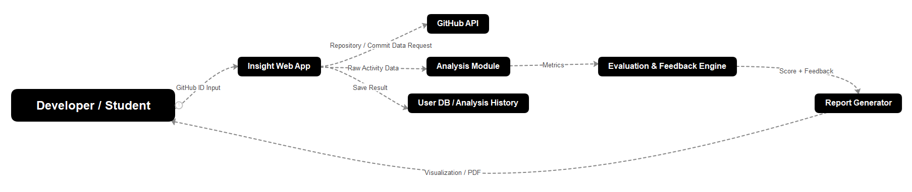

# GitHub Activity Insight
**GitHub 기반 개발자 실력 분석 및 피드백 웹 시스템**

| 정보 항목 | 내용 |
| :--- | :--- |
| Student No | 22212046 |
| Name | 안효원 |
| E-Mail | gydnjs3505@gmail.com |

**영남대학교 (Yeungnam University)**

---

### [ Revision history ]

| Revision date | Version # | Description | Author |
| :--- | :--- | :--- | :--- |
| 03/18/2026 | 1.00 | First draft | 안효원 |
| 03/20/2026 | 1.01 | Base conceptualization structure | 안효원 |
| 03/22/2026 | 1.02 | Business value, operation flow, risk analysis enriched | 안효원 |

---

### Contents

1. **Business purpose**
2. **System context diagram**
3. **Use case list**
4. **Concept of operation**
5. **Problem statement**
6. **Glossary**
7. **References**

---

## 1. Business purpose

GitHub는 개발자의 프로젝트 경험, 협업 흔적, 기술 스택 변화가 모두 축적되는 대표 플랫폼이다. 하지만 많은 사용자들이 자신의 활동을 정량적으로만 확인하고, 어떤 방향으로 포트폴리오를 개선해야 하는지에 대한 해석은 얻지 못하고 있다.

취업 준비생과 주니어 개발자는 특히 "내 GitHub가 실제로 어떤 역량을 보여주는가"를 판단하기 어렵다. 저장소 수, 커밋 수 같은 단일 지표는 활동량만 보여줄 뿐, 기술 다양성, 협업 성숙도, 지속성 같은 중요한 요소를 충분히 설명하지 못한다.

GitHub Activity Insight는 이 문제를 해결하기 위해 설계되었다. 본 시스템은 GitHub 데이터를 수집하고 분석하여, 개발자 유형과 강점/개선 포인트를 함께 제시하는 해석 기반 피드백을 제공한다.

**주요 목표:**
- **객관적 분석 제공:** 활동 데이터를 단순 집계가 아닌 의미 있는 지표로 변환
- **실행 가능한 피드백:** 개선 우선순위와 구체적 액션 제안
- **성과 확인 가능성:** 분석 이력을 통해 개선 전후 추세 비교
- **타겟 고객:** 취업 준비생, 개인 개발자, 포트폴리오 개선이 필요한 사용자

---

## 2. System context diagram

시스템은 사용자, GitHub API, 분석 엔진, 리포트 생성 모듈을 연결하는 웹 기반 분석 플랫폼이다.

**Data flow (요약):**
1. User가 GitHub ID를 입력한다.
2. Web App이 GitHub API에서 저장소/커밋/협업 데이터를 수집한다.
3. Analysis Module이 정규화 및 지표 계산을 수행한다.
4. Evaluation Engine이 유형 분류와 점수 산출, 피드백 생성 작업을 수행한다.
5. Report Generator가 대시보드와 PDF 결과를 제공한다.

**외부/내부 구성 요소:**
- **User:** GitHub ID 입력, 결과 조회, 리포트 다운로드 수행
- **Insight Web App:** 입력 처리, 요청 라우팅, 결과 시각화
- **GitHub API:** Repository, commit, language, contributor 데이터 제공
- **Analysis Module:** 정규화, 파생 지표 계산, 데이터 품질 검증
- **Evaluation Engine:** 점수화, 개발자 유형 분류, 개선 제안 생성
- **Server Storage:** 분석 이력 저장 및 재분석 비교 데이터 제공

---

## 3. Use case list

### 1) Connect GitHub Profile

| 항목 | 내용 |
| :--- | :--- |
| Actor | User |
| Description | GitHub ID를 입력하고 분석 요청을 시작한다. |

### 2) Collect Activity Data

| 항목 | 내용 |
| :--- | :--- |
| Actor | System |
| Description | GitHub API에서 저장소, 커밋, 언어, 협업 데이터를 수집한다. |

### 3) Analyze Developer Activity

| 항목 | 내용 |
| :--- | :--- |
| Actor | System |
| Description | 활동 패턴, 언어 비율, 프로젝트 규모 지표를 계산한다. |

### 4) Evaluate Competency

| 항목 | 내용 |
| :--- | :--- |
| Actor | System |
| Description | 활동성/협업성/기술 다양성 기반 역량 점수를 산출한다. |

### 5) Provide Personalized Feedback

| 항목 | 내용 |
| :--- | :--- |
| Actor | System, User |
| Description | 개발자 유형 분류 결과와 개선 방향을 사용자에게 제공한다. |

### 6) Generate Report

| 항목 | 내용 |
| :--- | :--- |
| Actor | User |
| Description | 분석 결과를 대시보드 및 PDF 형태로 확인한다. |

---

## 4. Concept of operation

각 기능은 Purpose, Approach, Dynamics, Goals 기준으로 정의한다.

### 1) Connect GitHub Profile

| 항목 | 내용 |
| :--- | :--- |
| Purpose | 분석 대상 식별 |
| Approach | GitHub ID 입력값 검증 후 분석 토큰 발급 |
| Dynamics | 분석 시작 버튼 클릭 시 |
| Goals | 오류 없는 요청 생성 |

### 2) Collect Activity Data

| 항목 | 내용 |
| :--- | :--- |
| Purpose | 원천 데이터 확보 |
| Approach | GitHub API 호출, 페이징/재시도 처리, 정규화 전 저장 |
| Dynamics | 요청 생성 직후 자동 실행 |
| Goals | 안정적인 데이터 수집 |

### 3) Analyze Developer Activity

| 항목 | 내용 |
| :--- | :--- |
| Purpose | 지표 생성 |
| Approach | 언어 비율, 프로젝트 수/규모, 커밋 주기 계산 |
| Dynamics | 수집 완료 후 자동 실행 |
| Goals | 핵심 지표 테이블 생성 |

### 4) Evaluate Competency

| 항목 | 내용 |
| :--- | :--- |
| Purpose | 역량 해석 |
| Approach | 가중치 기반 점수화 및 개발자 유형 분류 |
| Dynamics | 지표 생성 직후 실행 |
| Goals | 설명 가능한 점수 결과 제공 |

### 5) Provide Personalized Feedback

| 항목 | 내용 |
| :--- | :--- |
| Purpose | 개선 행동 제시 |
| Approach | 점수 약점 구간을 개선 액션으로 매핑 |
| Dynamics | 평가 완료 후 실행 |
| Goals | 사용자별 행동 가이드 제공 |

### 6) Generate Report

| 항목 | 내용 |
| :--- | :--- |
| Purpose | 결과 재사용성 확보 |
| Approach | 대시보드 렌더링 및 PDF 내보내기 |
| Dynamics | 사용자 요청 시 |
| Goals | 공유 가능한 리포트 생성 |

**운영 시나리오 (End-to-End):**
1. 사용자가 GitHub ID를 입력한다.
2. 시스템이 공개 데이터 수집 및 전처리를 수행한다.
3. 지표를 계산해 역량 점수와 개발자 유형을 생성한다.
4. 개선 우선순위를 포함한 피드백 카드를 제시한다.
5. 사용자가 PDF 리포트를 내려받아 포트폴리오 개선에 활용한다.

---

## 5. Problem statement

본 프로젝트는 단순 통계 대시보드가 아니라, 데이터 해석과 성장 가이드를 함께 제공하는 분석 시스템을 목표로 한다. 이를 위해 정확도, 신뢰도, 설명 가능성을 동시에 고려해야 한다.

**MVP 범위:**
1. GitHub ID 기반 분석 요청
2. 저장소/커밋/언어/협업 데이터 수집
3. 활동성 및 기술 스택 지표 산출
4. 역량 점수 및 유형 분류
5. 개인 맞춤형 피드백과 PDF 리포트 생성

**제약 및 문제 정의:**
1. GitHub API rate limit 제약으로 대량 요청 시 지연 가능성이 있다.
2. 공개 데이터 중심 분석 특성상 비공개 프로젝트 활동은 반영이 어렵다.
3. 단일 지표 해석은 왜곡 가능성이 있어 복합 지표 설계가 필요하다.
4. 사용자마다 활동 맥락이 달라 동일 점수라도 해석 차이가 발생할 수 있다.
5. 피드백이 추상적이면 실제 행동 변화로 이어지기 어렵다.

**대응 전략:**
- 캐시 및 재시도 정책으로 API 실패/지연을 완화한다.
- 점수와 함께 근거 지표를 제공해 설명 가능성을 높인다.
- 개선 액션을 우선순위 기반 체크리스트로 제시한다.
- 분석 이력 비교를 통해 변화 추세 중심 피드백을 제공한다.

---

## 6. Glossary

| 용어 | 설명 |
| :--- | :--- |
| Activity Metric | 커밋 빈도, 프로젝트 수, 언어 비율 등 활동 정량 지표 |
| Collaboration Index | PR, issue, contributor 관련 협업 수준 지표 |
| Technical Stack Profile | 프로젝트 언어/도메인 기반 기술 성향 분류 결과 |
| Scoring Model | 여러 지표를 통합해 점수로 환산하는 규칙 세트 |
| Explainability | 점수 산출 이유를 사용자에게 이해 가능하게 제공하는 특성 |
| Insight Report | 분석 결과와 피드백을 담은 웹/문서 형태 결과물 |
| Rate Limit | API 호출 횟수 제한 정책 |
| Normalization | 서로 다른 형식 데이터를 비교 가능한 구조로 변환하는 과정 |

---

## 7. References

1. GitHub, "REST API Documentation," GitHub Docs. Available: https://docs.github.com/en/rest (accessed: 2026-03-22).
2. GitHub, "GraphQL API Documentation," GitHub Docs. Available: https://docs.github.com/en/graphql (accessed: 2026-03-22).
3. E. Kalliamvakou et al., "The Promises and Perils of Mining GitHub Data," Empirical Software Engineering, Springer.
4. C. Bird et al., "The Promises and Perils of Mining GitHub," Proceedings of the International Working Conference on Mining Software Repositories (MSR).
5. OpenSSF, "Open Source Project Security Baseline." Available: https://baseline.openssf.org (accessed: 2026-03-22).
