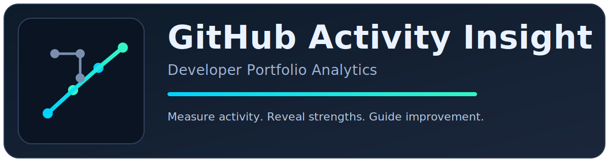
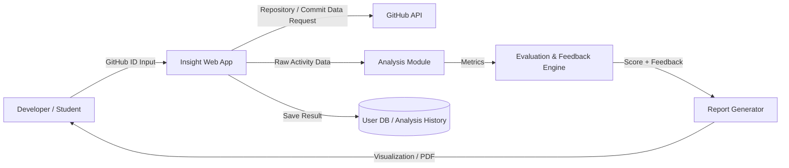

# GitHub Activity Insight

**GitHub 기반 개발자 실력 분석 및 피드백 웹 시스템**

| 정보 항목 | 내용 |
| :--- | :--- |
| Student No | 22212046 |
| Name | 안효원 |
| E-Mail | gydnjs3505@gmail.com |

**영남대학교 (Yeungnam University)**

---

### [ Revision history ]

| Revision date | Version # | Description | Author |
| :--- | :--- | :--- | :--- |
| 03/18/2026 | 1.00 | First draft | 안효원 |
| 03/20/2026 | 1.01 | Base conceptualization structure | 안효원 |
| 03/22/2026 | 1.02 | Business value, operation flow, risk analysis enriched | 안효원 |

---

### Contents

1. **Business purpose**
2. **System context diagram**
3. **Use case list**
4. **Concept of operation**
5. **Problem statement**
6. **Glossary**
7. **References**

---

## 1. Business purpose

### 1) Project background

- GitHub는 개발자의 프로젝트 경험, 협업 흔적, 기술 스택 변화가 모두 축적되는 대표적인 개발 플랫폼이다.
- 취업 준비생과 주니어 개발자는 GitHub를 포트폴리오로 활용하지만, 자신의 활동이 실제로 어떤 역량을 보여주는지 객관적으로 파악하기 어렵다.
- 기존 GitHub 통계 도구는 저장소 수, 커밋 수, 사용 언어 비율 등 정량 정보는 제공하지만, 그 수치가 의미하는 강점과 약점, 개선 방향까지 설명하지는 못한다.
- 채용 담당자 역시 GitHub 프로필을 해석할 때 단순 활동량 위주로 평가하는 경우가 많아, 개발자의 협업 능력, 지속성, 기술 다양성, 문제 해결 역량을 종합적으로 판단하기 어렵다.
- 이러한 한계를 해결하기 위해 GitHub 활동 데이터를 수집하고 해석하여 개발자의 역량을 분석하고 구체적인 피드백을 제공하는 GitHub Activity Insight 시스템이 필요하다.

**핵심 필요성:**

- 개발자는 자신의 GitHub 활동이 어떤 역량으로 보이는지 객관적으로 확인할 수 있어야 한다.
- 단순 통계가 아니라 의미 있는 평가 기준과 해석 결과가 함께 제공되어야 한다.
- 사용자는 분석 결과를 바탕으로 포트폴리오 개선 방향을 구체적으로 파악할 수 있어야 한다.
- 분석 이력을 통해 개선 전후의 변화를 추적할 수 있어야 한다.

### 2) Goal

- GitHub 활동 데이터를 기반으로 개발자의 역량을 분석하고 시각화된 피드백을 제공하는 웹 시스템을 개발한다.
- 저장소, 커밋, 언어, 협업 활동 등의 데이터를 수집하여 활동성, 기술 스택 다양성, 협업도, 지속성 등의 지표를 산출한다.
- 분석 결과를 바탕으로 개발자 유형 분류, 강점 및 약점 도출, 객관적인 역량 점수, 실행 가능한 개선 피드백을 제공한다.
- 웹 애플리케이션, GitHub API 연동 모듈, 분석 및 평가 엔진, 결과 저장용 데이터베이스로 구성된 시스템 구조를 설계한다.

### 3) Target Market

- GitHub를 포트폴리오로 활용하는 취업 준비생과 주니어 개발자를 주요 대상으로 한다.
- 자신의 개발 이력과 협업 활동을 정리하고 개선하고자 하는 개인 개발자를 포함한다.
- 지원자의 GitHub 활동을 참고 자료로 활용하려는 채용 담당자 및 멘토링 목적의 교육자도 잠재 사용자로 고려한다.

---

## 2. System context diagram

시스템은 Developer/Student의 입력을 받아 GitHub 데이터를 분석하고, 점수 및 피드백 리포트를 생성하는 구조로 동작한다.

- Developer / Student: GitHub ID를 입력하고 분석 결과를 조회하는 사용자
- Insight Web App: 입력 처리, 데이터 요청, 결과 저장을 담당하는 웹 애플리케이션
- GitHub API: 저장소/커밋 활동 데이터 제공 외부 API
- Analysis Module: Raw Activity Data를 지표(Metrics)로 변환하는 분석 모듈
- Evaluation & Feedback Engine: 지표 기반 점수 산정 및 피드백 생성 엔진
- Report Generator: 점수/피드백을 시각화 및 PDF 형태로 제공하는 모듈
- User DB / Analysis History: 분석 결과 및 이력 저장소
- GitHub ID Input: 사용자가 분석을 시작하기 위해 입력하는 GitHub 식별자
- Repository / Commit Data Request: 웹 앱이 GitHub API에 보내는 데이터 요청
- Raw Activity Data: GitHub API 응답에서 추출된 원천 활동 데이터
- Metrics: 분석 모듈이 산출한 정량 지표
- Score + Feedback: 평가 엔진이 생성한 점수 및 개선 가이드
- Visualization / PDF: 최종 사용자에게 제공되는 대시보드/문서 결과

---

## 3. Use case list

### 1) GitHub ID Input

| 항목 | 내용 |
| :--- | :--- |
| Actor | User |
| Description | 사용자가 GitHub ID를 입력해 분석을 시작한다. User가 입력을 수행하고 GithubProfile이 식별자를 보관하며 AnalysisRequest가 요청 상태를 생성한다. |

### 2) Repository / Commit Data Request

| 항목 | 내용 |
| :--- | :--- |
| Actor | System |
| Description | Insight Web App이 GitHub API에 저장소/커밋 데이터 요청을 보낸다. AnalysisRequest가 요청 범위를 제공하고 GithubApiClient가 API 호출을 수행한다. |

### 3) Raw Activity Data Processing

| 항목 | 내용 |
| :--- | :--- |
| Actor | System |
| Description | 수신한 Raw Activity Data를 분석 가능한 형태로 가공한다. ActivityCollector가 데이터셋을 통합하고 DataNormalizer가 정규화한다. |

### 4) Metrics Generation

| 항목 | 내용 |
| :--- | :--- |
| Actor | System |
| Description | Analysis Module이 핵심 지표(Metrics)를 산출한다. MetricCalculator가 활동성/언어 비율 지표를 계산한다. |

### 5) Score + Feedback Generation

| 항목 | 내용 |
| :--- | :--- |
| Actor | System |
| Description | Evaluation & Feedback Engine이 Metrics를 기반으로 점수와 피드백을 생성한다. CompetencyScorer가 점수화하고 FeedbackGenerator가 개선 가이드를 생성한다. |

### 6) Save Result

| 항목 | 내용 |
| :--- | :--- |
| Actor | System |
| Description | Insight Web App이 분석 결과를 User DB / Analysis History에 저장한다. ReportAssembler가 저장용 결과 구조를 조합한다. |

### 7) Visualization / PDF Output

| 항목 | 내용 |
| :--- | :--- |
| Actor | User |
| Description | Report Generator가 사용자에게 시각화 화면과 PDF 결과를 제공한다. ReportAssembler가 출력 형식으로 최종 조합한다. |

---

## 4. Concept of operation

각 기능은 Purpose, Approach, Dynamics, Goals 기준으로 정의한다.

### 1) GitHub ID Input

| 항목 | 내용 |
| :--- | :--- |
| Purpose | 분석 대상 식별 |
| Approach | 사용자가 GitHub ID를 입력하면 User가 입력 이벤트를 생성하고 GithubProfile이 계정을 식별하며 AnalysisRequest가 요청 객체를 생성한다. |
| Dynamics | 분석 시작 버튼 클릭 시 |
| Goals | 오류 없는 요청 생성 |

### 2) Repository / Commit Data Request

| 항목 | 내용 |
| :--- | :--- |
| Purpose | 원천 데이터 확보 |
| Approach | AnalysisRequest가 요청 파라미터를 제공하고 GithubApiClient가 GitHub API에 repository/commit 데이터 요청을 전송한다. |
| Dynamics | 요청 생성 직후 자동 실행 |
| Goals | 분석 대상 활동 데이터 수집 시작 |

### 3) Raw Activity Data Processing

| 항목 | 내용 |
| :--- | :--- |
| Purpose | 원천 데이터 가공 |
| Approach | ActivityCollector가 응답 데이터를 통합하고 DataNormalizer가 분석 가능한 형식으로 정규화한다. |
| Dynamics | 데이터 수집 완료 후 실행 |
| Goals | 지표 계산을 위한 정제 데이터셋 확보 |

### 4) Metrics Generation

| 항목 | 내용 |
| :--- | :--- |
| Purpose | 정량 지표 산출 |
| Approach | MetricCalculator가 활동성, 언어 비율 등 핵심 Metrics를 계산해 Evaluation 단계로 전달한다. |
| Dynamics | 데이터 정규화 완료 후 실행 |
| Goals | 평가 엔진 입력 지표 생성 |

### 5) Score + Feedback Generation

| 항목 | 내용 |
| :--- | :--- |
| Purpose | 역량 평가 결과 생성 |
| Approach | CompetencyScorer가 Metrics를 점수화하고 FeedbackGenerator가 개선 피드백을 생성한다. |
| Dynamics | Metrics 전달 직후 실행 |
| Goals | Score + Feedback 결과 확보 |

### 6) Save Result

| 항목 | 내용 |
| :--- | :--- |
| Purpose | 분석 결과 이력화 |
| Approach | Insight Web App이 ReportAssembler로 결과 구조를 정리한 뒤 User DB / Analysis History에 저장한다. |
| Dynamics | Score + Feedback 생성 직후 실행 |
| Goals | 재조회/비교 가능한 결과 저장 |

### 7) Visualization / PDF Output

| 항목 | 내용 |
| :--- | :--- |
| Purpose | 사용자 결과 제공 |
| Approach | Report Generator가 저장된 결과를 시각화 화면으로 렌더링하고 PDF로 변환해 사용자에게 제공한다. |
| Dynamics | 사용자 조회/다운로드 요청 시 |
| Goals | 해석 가능한 최종 결과 전달 |

---

## 5. Problem statement

본 프로젝트는 선택적 기능 및 비기능 요구사항 만족, 아키텍처 설계, 그리고 지속 가능한 운영을 위한 다양한 도전 과제를 갖고 있다. 

GitHub 활동 데이터를 수집하여 개발자 역량을 분석하고 피드백을 제공하는 시스템을 구축하기 위해서는 데이터 수집 안정성, 평가 모델의 공정성, 결과 설명 가능성, 서비스 응답 성능을 동시에 만족해야 하며, 이들 간의 균형을 맞추는 것이 핵심 난제다.

**GitHub Activity Insight의 Problem Statement는 다음과 같다:**

1. **데이터 수집 신뢰성 문제:** GitHub API rate limit, 일시적 네트워크 오류, 페이징 누락으로 인해 데이터 불완전성이 발생할 수 있으며, 이는 분석 결과의 정확성을 저해한다.

2. **데이터 대표성 한계:** 공개 저장소 중심 분석 특성상 비공개 활동, 사내 협업 이력, 코드 리뷰 품질 등이 반영되지 않아 결과가 편향될 수 있다.

3. **평가 모델 공정성 문제:** 언어/도메인/프로젝트 유형이 다른 사용자에게 단일 가중치를 적용하면 특정 사용자군(예: 특정 언어 전공자)에 불리한 평가 결과가 나올 수 있다.

4. **설명 가능성 부족 위험:** 점수만 제시하면 사용자는 결과를 신뢰하기 어렵고, 개선 행동으로 연결되지 않아 서비스 가치가 감소한다.

5. **확장성 문제:** 사용자가 증가할수록 동시 분석 요청 처리, API 호출량, 리포트 생성 대기시간이 급격히 증가하며, 이는 서비스 응답 성능 저하로 이어진다.

6. **개인정보 및 보안 문제:** GitHub ID, 분석 이력, 리포트 파일 저장 과정에서 접근 제어가 미흡하면 개인정보 유출 및 무단 접근 위험이 발생한다.

**비기능 요구사항(NFRs):**

| 구분 | 요구사항 | 목표 기준 |
| :--- | :--- | :--- |
| 성능 (Performance) | 분석 결과 조회 응답 시간 | 일반 조회 요청 평균 2초 이내 |
| 성능 (Performance) | 1회 분석 완료 시간 | 공개 저장소 30개 기준 60초 이내 |
| 가용성 (Availability) | 서비스 운영 가능 시간 | 월간 가용성 99.5% 이상 |
| 신뢰성 (Reliability) | 데이터 수집 실패 복구 | 실패 요청 자동 재시도 3회, 실패 로그 100% 기록 |
| 확장성 (Scalability) | 동시 사용자 처리 | 동시 분석 요청 100건 이상에서 기능 저하 없이 처리 |
| 보안 (Security) | 사용자 데이터 보호 | 전송 구간 TLS 적용, 저장 데이터 최소화 및 접근 권한 분리 |
| 사용성 (Usability) | 결과 이해 용이성 | 점수마다 근거 지표와 개선 액션 1개 이상 제공 |
| 유지보수성 (Maintainability) | 모델/지표 변경 용이성 | 지표 산출 모듈 분리로 규칙 변경 시 핵심 코드 수정 범위 최소화 |

**대응 전략:**
1. 캐시, 백오프 재시도, 비동기 큐를 적용해 수집 실패 및 지연을 완화한다.
2. 점수 산정 로직과 근거 지표를 함께 표시하여 결과 해석 가능성을 높인다.
3. 가중치 튜닝 및 기준선 검증 절차를 도입해 평가 편향을 지속적으로 점검한다.
4. 병목 구간(API 수집, 분석, 리포트 생성)을 분리하고 단계별 모니터링 지표를 운영한다.
5. 최소 수집 원칙, 접근 권한 통제, 로그 감사 정책으로 보안 리스크를 관리한다.

**핵심 문제 정의 요약:**
본 프로젝트의 본질적 문제는 "제한된 공개 데이터만으로도 신뢰 가능한 역량 진단과 실행 가능한 피드백을 어떻게 안정적이고 빠르게 제공할 것인가"에 있다. 따라서 기능 구현 자체보다 데이터 품질 관리, 모델 신뢰성 확보, NFR 충족을 함께 달성하는 설계가 프로젝트 성공의 기준이 된다.

---

## 6. Glossary

| 용어 | 설명 |
| :--- | :--- |
| Activity Metric | 커밋 빈도, 프로젝트 수, 언어 비율 등 활동 정량 지표 |
| Collaboration Index | PR, issue, contributor 관련 협업 수준 지표 |
| Technical Stack Profile | 프로젝트 언어/도메인 기반 기술 성향 분류 결과 |
| Scoring Model | 여러 지표를 통합해 점수로 환산하는 규칙 세트 |
| Explainability | 점수 산출 이유를 사용자에게 이해 가능하게 제공하는 특성 |
| Insight Report | 분석 결과와 피드백을 담은 웹/문서 형태 결과물 |
| Rate Limit | API 호출 횟수 제한 정책 |
| Normalization | 서로 다른 형식 데이터를 비교 가능한 구조로 변환하는 과정 |

---

## 7. References

1. GitHub, "REST API Documentation," GitHub Docs. Available: https://docs.github.com/en/rest (accessed: 2026-03-22).
2. GitHub, "GraphQL API Documentation," GitHub Docs. Available: https://docs.github.com/en/graphql (accessed: 2026-03-22).
3. E. Kalliamvakou et al., "The Promises and Perils of Mining GitHub Data," Empirical Software Engineering, Springer.
4. C. Bird et al., "The Promises and Perils of Mining GitHub," Proceedings of the International Working Conference on Mining Software Repositories (MSR).
5. OpenSSF, "Open Source Project Security Baseline." Available: https://baseline.openssf.org (accessed: 2026-03-22).
