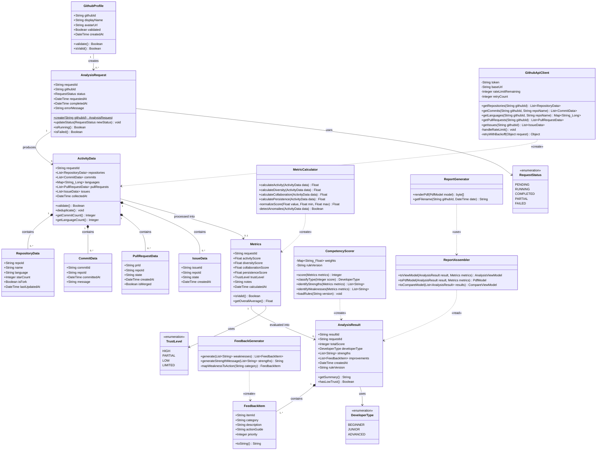

# GitHub Activity Insight

GitHub 기반 개발자 실력 분석 및 피드백 웹 시스템

| 정보 항목 | 내용 |
| :--- | :--- |
| Student No | 22212046 |
| Name | 안효원 |
| E-Mail | [gydnjs3505@gmail.com](mailto:gydnjs3505@gmail.com) |

영남대학교 (Yeungnam University)

---

## Revision history

| Revision date | Version # | Description | Author |
| :--- | :--- | :--- | :--- |
| 2026-05-11 | 1.0 | Initial draft | 안효원 |
| 2026-05-11 | 1.1 | Added class diagram and descriptions | 안효원 |

---

## Contents

[1. Introduction](#1-introduction)
[2. Class Diagram](#2-class-diagram)
[3. Sequence Diagram](#3-sequence-diagram)
[4. State Machine Diagram](#4-state-machine-diagram)
[5. Implementation requirements](#5-implementation-requirements)
[6. Glossary](#6-glossary)
[7. References](#7-references)

---

## 1. Introduction

### 1.1 주제 선정 배경

GitHub는 개발자의 프로젝트 경험, 협업 이력, 기술 스택 변화가 모두 축적되는 대표적인 개발 플랫폼이다. 취업 준비생과 주니어 개발자는 GitHub를 포트폴리오로 활용하지만, 기존 GitHub 통계 도구는 저장소 수, 커밋 수, 사용 언어 비율 등 단순 정량 정보만 제공할 뿐, 그 수치가 의미하는 강점과 약점 또는 개선 방향까지 설명하지 못한다. 프로젝트 개발자인 나 역시 "내 GitHub 활동이 실제로 어떤 역량으로 보이는지", "무엇을 어떻게 보완해야 하는지"를 파악하기 어려운 불편함을 직접 경험하였고, 이를 해소하기 위해 본 주제를 선정하였다.

### 1.2 문제 정의

본 프로젝트가 해결하고자 하는 핵심 문제는 다음과 같다.

- **역량 해석 불가:** 기존 통계 도구는 활동량 수치만 제공하며, 활동성·기술 다양성·협업도·지속성을 종합한 역량 해석을 제공하지 않는다.
- **개선 방향 부재:** 점수나 통계만으로는 어떤 부분을 어떻게 개선해야 하는지 구체적인 행동 지침을 도출하기 어렵다.
- **평가 불투명성:** 결과의 산출 근거가 명확히 제시되지 않으면 사용자가 결과를 신뢰하기 어렵고, 실질적인 개선 행동으로 연결되지 않는다.
- **이력 추적 불가:** 포트폴리오를 개선한 이후 어느 지표가 얼마나 향상되었는지 시계열로 비교할 수 있는 수단이 없다.

### 1.3 해결 접근 방식

GitHub Activity Insight는 위 문제를 다음 방식으로 해결한다.

- **데이터 수집:** GitHub REST API를 통해 저장소, 커밋 로그, 언어 통계, Pull Request·Issue 참여 이력 등 원천 활동 데이터를 수집한다.
- **지표 계산(Metrics):** 수집 데이터를 정규화하여 활동성, 기술 다양성, 협업도, 지속성의 4개 핵심 지표를 0–100 척도로 산출한다.
- **점수 및 피드백 생성:** 지표에 가중치를 적용하여 종합 역량 점수를 계산하고, Developer Type(Beginner/Junior/Advanced)을 분류한 뒤, 약점별 맞춤형 개선 액션 아이템을 생성한다.
- **결과 저장 및 이력 비교:** 분석 결과를 데이터베이스에 저장하여 재조회·이력 비교가 가능하게 하고, PDF 출력 기능으로 포트폴리오 자료로 활용할 수 있도록 한다.

시스템은 웹 애플리케이션, GitHub API 연동 모듈, 분석·평가 엔진, 리포트 생성기, 결과 저장소로 구성되며, 각 모듈을 분리하여 지표 산출 규칙 변경 시 핵심 코드 수정 범위를 최소화한다.

### 1.4 주 타겟층

| 대상 | 활용 목적 |
| :--- | :--- |
| 취업 준비생 / 주니어 개발자 | GitHub 포트폴리오를 객관적으로 점검하고 개선 방향을 파악 |
| 개인 개발자 | 자신의 개발 이력과 협업 활동 패턴을 정리하고 성장 추이 확인 |
| 채용 담당자 / 교육 멘토 | 지원자·교육생의 GitHub 활동을 정량 근거와 함께 참고 자료로 활용 |

### 1.5 설계 단계의 목표

본 문서는 시스템의 설계(Design) 단계 산출물로서, Analysis 단계에서 도출한 유스케이스(UC-01~UC-08)와 도메인 모델을 구체적인 소프트웨어 구조로 전환한다. 설계 단계의 목표는 다음과 같다.

- 도메인 클래스 간 관계, 속성, 오퍼레이션을 클래스 다이어그램으로 명세하여 구현 청사진을 확립한다.
- 핵심 유스케이스 시나리오에 대한 시퀀스 다이어그램으로 객체 간 협력 흐름을 정의한다.
- AnalysisRequest 생명주기(PENDING → RUNNING → COMPLETED / FAILED)를 상태 머신 다이어그램으로 명세한다.
- 구현 시 준수해야 할 기술 제약 및 비기능 요구사항을 구현 요구사항으로 정리하여 개발자가 직접 참조할 기준선을 마련한다.

### 1.6 범위(Scope)

- **In Scope:** 클래스 다이어그램, 시퀀스 다이어그램, 상태 머신 다이어그램 작성, 구현 요구사항 및 기술 제약 정의
- **Out of Scope:** 실제 알고리즘 파라미터 수치 결정, 인프라 배포 아키텍처 상세 설계, 데이터베이스 물리 스키마 및 구현 코드 작성

본 문서의 구성은 다음과 같다. 2장에서는 시스템의 정적 구조를 표현하는 클래스 다이어그램을 제시하고, 3장에서는 주요 유스케이스 시나리오에 대한 시퀀스 다이어그램으로 동적 흐름을 정의한다. 4장에서는 AnalysisRequest의 상태 전이를 상태 머신 다이어그램으로 명세하며, 5장에서는 구현 시 준수해야 할 기술 요구사항 및 제약 조건을 정리한다.

---

## 2. Class Diagram

### 2.1 Class Diagram

본 절에서는 GitHub Activity Insight 시스템의 정적 구조를 설계 수준 4의 클래스 다이어그램으로 제시한다. 각 클래스의 속성은 가시성(`+` public, `-` private), 타입을 명시하며, 메서드는 매개변수명·타입·반환 타입을 완전한 시그니처로 표현한다. 도메인 엔티티 클래스(데이터 보관)와 서비스 클래스(처리 로직)를 구분하고, 컴포지션(`*--`), 연관(`-->`), 의존(`..>`)으로 클래스 간 구조적 관계를 표현한다.

[그림 2-1] Class Diagram (Design Level 4)

---

### 2.2 Class Descriptions

#### 2.2.1 도메인 엔티티 클래스

도메인 엔티티 클래스는 시스템의 핵심 데이터를 보관하며, 분석 흐름의 각 단계에서 생성·갱신·참조된다.

---

##### GithubProfile

클래스 개요

| 항목 | 내용 |
| :--- | :--- |
| 역할 | 분석 대상 GitHub 계정 정보를 저장하고 입력된 GitHub ID의 유효성을 관리한다. |
| 참여 UC | UC-01 (GitHub ID 입력) |
| 관계 | GithubProfile(1) → AnalysisRequest(0..*) |

속성

| 이름 | 가시성 | 타입 | 기본값 | 설명 |
| :--- | :---: | :--- | :--- | :--- |
| githubId | + | String | - | GitHub 계정 식별자. 영문·숫자·하이픈 형식. 시스템 전체 식별 키. |
| displayName | + | String | "" | GitHub 프로필 표시 이름. API 조회 결과로 설정. |
| avatarUrl | + | String | "" | GitHub 아바타 이미지 URL. |
| validated | + | Boolean | false | GitHub API를 통한 계정 존재 확인 여부. true일 때만 AnalysisRequest 생성 허용. |
| createdAt | + | DateTime | now() | 객체 생성 시각. |

오퍼레이션

| 이름 | 시그니처 | 반환 타입 | 설명 |
| :--- | :--- | :---: | :--- |
| validate | validate() | Boolean | GitHub API를 호출하여 계정 존재 여부를 확인하고 validated를 설정한다. 성공 시 true 반환. |
| isValid | isValid() | Boolean | validated=true이고 githubId 형식(영문·숫자·하이픈)이 유효하면 true 반환. |

---

##### AnalysisRequest

클래스 개요

| 항목 | 내용 |
| :--- | :--- |
| 역할 | 분석 요청의 생명주기를 추적하는 중심 엔티티. PENDING → RUNNING → COMPLETED/FAILED 상태 전이를 관리한다. |
| 참여 UC | UC-02 (분석 요청 생성), UC-03~05 (상태 전이) |
| 관계 | GithubProfile(1) → AnalysisRequest(0..*), AnalysisRequest(1) → ActivityData(0..1) |

속성

| 이름 | 가시성 | 타입 | 기본값 | 설명 |
| :--- | :---: | :--- | :--- | :--- |
| requestId | + | String | UUID.generate() | 요청 고유 식별자. UUID 형식으로 자동 생성. |
| githubId | + | String | - | 분석 대상 GitHub ID. GithubProfile 연결 키. |
| status | + | RequestStatus | PENDING | 현재 처리 상태. |
| requestedAt | + | DateTime | now() | 요청 생성 시각. |
| completedAt | + | DateTime | null | 완료 또는 실패 확정 시각. |
| errorMessage | + | String | null | 실패 시 오류 원인 메시지. |

오퍼레이션

| 이름 | 시그니처 | 반환 타입 | 설명 |
| :--- | :--- | :---: | :--- |
| create | create(String githubId) | AnalysisRequest | requestId를 발급하고 status=PENDING으로 초기화한 인스턴스를 반환한다. 정적 팩토리 메서드. |
| updateStatus | updateStatus(RequestStatus newStatus) | void | 상태를 전이하고 COMPLETED·FAILED·PARTIAL 전이 시 completedAt을 기록한다. |
| isRunning | isRunning() | Boolean | status가 PENDING 또는 RUNNING이면 true 반환. |
| isFailed | isFailed() | Boolean | status가 FAILED이면 true 반환. |

---

##### ActivityData

클래스 개요

| 항목 | 내용 |
| :--- | :--- |
| 역할 | GitHub API에서 수집된 원천 활동 데이터를 통합 보관한다. 지표 계산의 입력 데이터 구조. |
| 참여 UC | UC-03 (GitHub 데이터 수집), UC-04 (지표 계산 입력) |
| 관계 | AnalysisRequest(1) → ActivityData(0..1), ActivityData(1) *-- RepositoryData/CommitData/PullRequestData/IssueData(0..*), ActivityData(1) → Metrics(0..1) |

속성

| 이름 | 가시성 | 타입 | 기본값 | 설명 |
| :--- | :---: | :--- | :--- | :--- |
| requestId | + | String | - | 연결된 AnalysisRequest 식별자. |
| repositories | + | List\<RepositoryData\> | [] | 조회된 저장소 목록. |
| commits | + | List\<CommitData\> | [] | 저장소별 커밋 이력(최대 1년). |
| languages | + | Map\<String, Long\> | {} | 언어명 → 바이트 수 매핑. |
| pullRequests | + | List\<PullRequestData\> | [] | PR 참여 이력. |
| issues | + | List\<IssueData\> | [] | Issue 참여 이력. |
| collectedAt | + | DateTime | null | 수집 완료 시각. |

오퍼레이션

| 이름 | 시그니처 | 반환 타입 | 설명 |
| :--- | :--- | :---: | :--- |
| validate | validate() | Boolean | 최소 저장소 수(1개 이상), 커밋 수(1건 이상) 임계값 충족 여부를 반환한다. |
| deduplicate | deduplicate() | void | commitId·repoId 기준 중복 항목을 제거한다. |
| getCommitCount | getCommitCount() | Integer | commits 리스트 전체 크기를 반환한다. |
| getLanguageCount | getLanguageCount() | Integer | languages 맵의 키 수(언어 종류 수)를 반환한다. |

---

##### RepositoryData

클래스 개요

| 항목 | 내용 |
| :--- | :--- |
| 역할 | 개별 저장소의 메타데이터를 보관한다. ActivityData의 컴포지션 구성요소. |
| 참여 UC | UC-03 (수집 대상), UC-04 (다양성·지속성 지표 계산 입력) |
| 관계 | ActivityData(1) *-- RepositoryData(0..*) |

속성

| 이름 | 가시성 | 타입 | 기본값 | 설명 |
| :--- | :---: | :--- | :--- | :--- |
| repoId | + | String | - | 저장소 고유 식별자(owner/reponame 형식). |
| name | + | String | - | 저장소 이름. |
| language | + | String | null | 주요 언어. GitHub API 반환값 사용. |
| starCount | + | Integer | 0 | 스타 수. 프로젝트 활용도 참고 지표. |
| isFork | + | Boolean | false | Fork 여부. 독립 프로젝트 수 산정에 사용. |
| lastUpdatedAt | + | DateTime | - | 마지막 커밋·업데이트 시각. 지속성 지표 계산에 활용. |

오퍼레이션

해당 없음 (순수 데이터 보관 클래스).

---

##### CommitData

클래스 개요

| 항목 | 내용 |
| :--- | :--- |
| 역할 | 개별 커밋 정보를 보관한다. 활동성·지속성 지표 계산의 기본 단위. |
| 참여 UC | UC-03 (수집 대상), UC-04 (활동성·지속성 지표 계산 입력) |
| 관계 | ActivityData(1) *-- CommitData(0..*) |

속성

| 이름 | 가시성 | 타입 | 기본값 | 설명 |
| :--- | :---: | :--- | :--- | :--- |
| commitId | + | String | - | 커밋 SHA 식별자. 중복 제거 기준 키. |
| repoId | + | String | - | 소속 저장소 식별자. |
| committedAt | + | DateTime | - | 커밋 작성 시각. 빈도·갭 분석에 사용. |
| message | + | String | "" | 커밋 메시지. 봇 커밋 이상치 탐지에 활용. |

오퍼레이션

해당 없음 (순수 데이터 보관 클래스).

---

##### PullRequestData

클래스 개요

| 항목 | 내용 |
| :--- | :--- |
| 역할 | PR 참여 이력을 보관한다. 협업도 지표 계산에 사용. |
| 참여 UC | UC-03 (수집 대상), UC-04 (협업도 지표 계산 입력) |
| 관계 | ActivityData(1) *-- PullRequestData(0..*) |

속성

| 이름 | 가시성 | 타입 | 기본값 | 설명 |
| :--- | :---: | :--- | :--- | :--- |
| prId | + | String | - | PR 고유 식별자. |
| repoId | + | String | - | 소속 저장소 식별자. |
| state | + | String | - | PR 상태(open / closed / merged). |
| createdAt | + | DateTime | - | PR 생성 시각. |
| isMerged | + | Boolean | false | 병합 여부. 협업 기여 품질 판단에 활용. |

오퍼레이션

해당 없음 (순수 데이터 보관 클래스).

---

##### IssueData

클래스 개요

| 항목 | 내용 |
| :--- | :--- |
| 역할 | Issue 참여 이력을 보관한다. 협업도 지표 계산에 사용. |
| 참여 UC | UC-03 (수집 대상), UC-04 (협업도 지표 계산 입력) |
| 관계 | ActivityData(1) *-- IssueData(0..*) |

속성

| 이름 | 가시성 | 타입 | 기본값 | 설명 |
| :--- | :---: | :--- | :--- | :--- |
| issueId | + | String | - | Issue 고유 식별자. |
| repoId | + | String | - | 소속 저장소 식별자. |
| state | + | String | - | Issue 상태(open / closed). |
| createdAt | + | DateTime | - | Issue 생성 시각. |

오퍼레이션

해당 없음 (순수 데이터 보관 클래스).

---

##### Metrics

클래스 개요

| 항목 | 내용 |
| :--- | :--- |
| 역할 | ActivityData로부터 산출된 4개 핵심 지표를 0–100 척도로 보관하며 신뢰도 레벨을 함께 관리한다. |
| 참여 UC | UC-04 (지표 계산 결과), UC-05 (점수·피드백 생성 입력) |
| 관계 | ActivityData(1) → Metrics(0..1), Metrics(1) → AnalysisResult(0..1) |

속성

| 이름 | 가시성 | 타입 | 기본값 | 설명 |
| :--- | :---: | :--- | :--- | :--- |
| requestId | + | String | - | 연결된 AnalysisRequest 식별자. |
| activityScore | + | Float | 0.0 | 활동성 지표. 커밋 빈도·저장소 업데이트 빈도 기반(0–100). |
| diversityScore | + | Float | 0.0 | 기술 다양성 지표. 언어 수·프로젝트 유형 다양도 기반(0–100). |
| collaborationScore | + | Float | 0.0 | 협업도 지표. PR·Issue 참여율·Fork 활동 기반(0–100). |
| persistenceScore | + | Float | 0.0 | 지속성 지표. 활동 기간·갭 분석·연속성 기반(0–100). |
| trustLevel | + | TrustLevel | HIGH | 데이터 완전성 기반 신뢰도. |
| notes | + | String | "" | 이상치 필터링 적용 여부 및 부분 계산 항목 메모. |
| calculatedAt | + | DateTime | null | 지표 계산 완료 시각. |

오퍼레이션

| 이름 | 시그니처 | 반환 타입 | 설명 |
| :--- | :--- | :---: | :--- |
| isValid | isValid() | Boolean | 4개 지표가 모두 0.0 이상 100.0 이하 유효 범위인지 확인하여 반환한다. |
| getOverallAverage | getOverallAverage() | Float | 4개 지표의 단순 평균값 (activity+diversity+collaboration+persistence)/4 를 반환한다. |

---

##### AnalysisResult

클래스 개요

| 항목 | 내용 |
| :--- | :--- |
| 역할 | 분석의 최종 산출물. 종합 역량 점수, 개발자 유형, 강점/개선 항목을 저장한다. |
| 참여 UC | UC-05 (생성), UC-06 (결과 조회), UC-07 (PDF 다운로드), UC-08 (이력 비교) |
| 관계 | Metrics(1) → AnalysisResult(0..1), AnalysisResult(1) *-- FeedbackItem(1..*) |

속성

| 이름 | 가시성 | 타입 | 기본값 | 설명 |
| :--- | :---: | :--- | :--- | :--- |
| resultId | + | String | UUID.generate() | 결과 고유 식별자. |
| requestId | + | String | - | 연결된 AnalysisRequest 식별자. |
| totalScore | + | Integer | 0 | 종합 역량 점수(0–100). 4개 지표 가중 평균. |
| developerType | + | DeveloperType | - | 점수 구간 기반 개발자 유형. |
| strengths | + | List\<String\> | [] | 강점으로 식별된 지표 카테고리 목록(2–3개). |
| improvements | + | List\<FeedbackItem\> | [] | 약점별 맞춤형 개선 액션 목록(3–5개). |
| createdAt | + | DateTime | now() | 결과 생성 시각. |
| ruleVersion | + | String | "1.0" | 적용된 평가 규칙 버전. 이력 비교 시 버전 차이 식별에 사용. |

오퍼레이션

| 이름 | 시그니처 | 반환 타입 | 설명 |
| :--- | :--- | :---: | :--- |
| getSummary | getSummary() | String | developerType + totalScore를 결합한 한 줄 요약 문자열(예: "Junior Developer – 62/100")을 반환한다. |
| hasLowTrust | hasLowTrust() | Boolean | 연결된 Metrics의 trustLevel이 LOW 또는 LIMITED이면 true 반환. 대시보드 경고 표시에 사용. |

---

##### FeedbackItem

클래스 개요

| 항목 | 내용 |
| :--- | :--- |
| 역할 | 개별 개선 액션 아이템을 표현한다. AnalysisResult.improvements 목록의 구성요소. |
| 참여 UC | UC-05 (FeedbackGenerator 생성), UC-06 (결과 조회 표시) |
| 관계 | AnalysisResult(1) *-- FeedbackItem(1..*) |

속성

| 이름 | 가시성 | 타입 | 기본값 | 설명 |
| :--- | :---: | :--- | :--- | :--- |
| itemId | + | String | UUID.generate() | 피드백 항목 고유 식별자. |
| category | + | String | - | 지표 카테고리(activity / diversity / collaboration / persistence). |
| description | + | String | - | 약점 내용 설명. |
| actionGuide | + | String | - | 구체적인 개선 행동 지침. |
| priority | + | Integer | 1 | 개선 우선순위(1 = 최우선, 숫자가 클수록 낮은 우선순위). |

오퍼레이션

| 이름 | 시그니처 | 반환 타입 | 설명 |
| :--- | :--- | :---: | :--- |
| toString | toString() | String | "[category] actionGuide" 형식의 문자열을 반환한다. 로그·디버깅 목적. |

---

#### 2.2.2 서비스 클래스

서비스 클래스는 도메인 엔티티를 생성·변환·처리하는 로직을 담당하며 직접 데이터를 보관하지 않는다.

---

##### GithubApiClient

클래스 개요

| 항목 | 내용 |
| :--- | :--- |
| 역할 | GitHub REST API 호출을 캡슐화한다. Rate Limit 대응 및 exponential backoff 재시도 로직을 내부적으로 처리한다. |
| 참여 UC | UC-03 (GitHub 데이터 수집) |
| 관계 | GithubApiClient ..> ActivityData : «create» |

속성

| 이름 | 가시성 | 타입 | 기본값 | 설명 |
| :--- | :---: | :--- | :--- | :--- |
| token | - | String | - | GitHub API 인증 토큰. 외부 노출 금지. 환경 변수로 주입. |
| baseUrl | - | String | "<https://api.github.com>" | API 기본 URL. |
| rateLimitRemaining | - | Integer | 5000 | 현재 잔여 API 요청 가능 횟수. 응답 헤더에서 갱신. |
| retryCount | - | Integer | 0 | 현재 재시도 횟수 카운터. 최대값 3. |

오퍼레이션

| 이름 | 시그니처 | 반환 타입 | 설명 |
| :--- | :--- | :---: | :--- |
| getRepositories | getRepositories(String githubId) | List\<RepositoryData\> | 저장소 목록을 pagination 처리하여 반환한다. |
| getCommits | getCommits(String githubId, String repoName) | List\<CommitData\> | 특정 저장소의 커밋 로그(최대 1년 범위)를 반환한다. |
| getLanguages | getLanguages(String githubId, String repoName) | Map\<String, Long\> | 저장소의 언어별 바이트 통계를 반환한다. |
| getPullRequests | getPullRequests(String githubId) | List\<PullRequestData\> | PR 참여 이력을 반환한다. |
| getIssues | getIssues(String githubId) | List\<IssueData\> | Issue 참여 이력을 반환한다. |
| handleRateLimit | handleRateLimit() | void | rateLimitRemaining을 확인하고 임계값(10 이하) 도달 시 reset 시각까지 대기한다. |
| retryWithBackoff | retryWithBackoff(Object request) | Object | 실패 요청에 exponential backoff(3초 → 6초 → 12초)를 적용하여 최대 3회 재시도한다. 초과 시 예외를 던진다. |

---

##### MetricCalculator

클래스 개요

| 항목 | 내용 |
| :--- | :--- |
| 역할 | ActivityData를 입력받아 4개 핵심 지표를 계산하고 Metrics 객체를 생성한다. |
| 참여 UC | UC-04 (지표 계산) |
| 관계 | MetricCalculator ..> Metrics : «create» |

속성

해당 없음 (상태를 보관하지 않는 순수 계산 클래스).

오퍼레이션

| 이름 | 시그니처 | 반환 타입 | 설명 |
| :--- | :--- | :---: | :--- |
| calculateActivity | calculateActivity(ActivityData data) | Float | 커밋 빈도(주당 평균 커밋 수)·저장소 업데이트 빈도를 기반으로 활동성 점수(0–100)를 계산한다. |
| calculateDiversity | calculateDiversity(ActivityData data) | Float | 사용 언어 수·Fork 제외 프로젝트 유형 다양도를 기반으로 기술 다양성 점수(0–100)를 계산한다. |
| calculateCollaboration | calculateCollaboration(ActivityData data) | Float | PR 병합 비율·Issue 참여율·Fork 활동 비율을 기반으로 협업도 점수(0–100)를 계산한다. |
| calculatePersistence | calculatePersistence(ActivityData data) | Float | 전체 활동 기간(월 수)·최대 공백 기간·연속 활동 주 수를 기반으로 지속성 점수(0–100)를 계산한다. |
| normalizeScore | normalizeScore(Float value, Float min, Float max) | Float | (value - min) / (max - min) * 100 공식으로 원시 값을 0–100 범위로 선형 정규화한다. |
| detectAnomalies | detectAnomalies(ActivityData data) | Boolean | 커밋 메시지 패턴(예: "[bot]", 동일 메시지 반복)으로 봇 커밋을 탐지한다. 탐지 시 Metrics.notes에 기록하고 true 반환. |

---

##### CompetencyScorer

클래스 개요

| 항목 | 내용 |
| :--- | :--- |
| 역할 | Metrics를 입력받아 종합 역량 점수를 계산하고 Developer Type 분류 및 강점/약점을 식별한다. |
| 참여 UC | UC-05 (점수 및 피드백 생성) |
| 관계 | CompetencyScorer ..> AnalysisResult : «create» |

속성

| 이름 | 가시성 | 타입 | 기본값 | 설명 |
| :--- | :---: | :--- | :--- | :--- |
| weights | - | Map\<String, Float\> | {activity:0.25, diversity:0.25, collaboration:0.25, persistence:0.25} | 각 지표별 가중치. loadRules() 호출 시 버전별 값으로 교체. |
| ruleVersion | - | String | "1.0" | 현재 적용 중인 평가 규칙 버전. |

오퍼레이션

| 이름 | 시그니처 | 반환 타입 | 설명 |
| :--- | :--- | :---: | :--- |
| score | score(Metrics metrics) | Integer | 4개 지표에 weights를 적용한 가중 평균으로 종합 점수(0–100 정수)를 계산한다. |
| classifyType | classifyType(Integer score) | DeveloperType | 0–39 → BEGINNER, 40–69 → JUNIOR, 70–100 → ADVANCED로 분류하여 반환한다. |
| identifyStrengths | identifyStrengths(Metrics metrics) | List\<String\> | 각 지표 중 70.0 이상인 카테고리를 강점 목록으로 반환한다. |
| identifyWeaknesses | identifyWeaknesses(Metrics metrics) | List\<String\> | 각 지표 중 40.0 미만인 카테고리를 약점 목록으로 반환한다. |
| loadRules | loadRules(String version) | void | 지정 버전의 평가 규칙(가중치·임계값)을 로드한다. 미일치 시 기본값(동등 가중치 0.25)을 유지하고 경고를 기록한다. |

---

##### FeedbackGenerator

클래스 개요

| 항목 | 내용 |
| :--- | :--- |
| 역할 | 약점 지표 목록으로부터 맞춤형 FeedbackItem 목록을 생성한다. |
| 참여 UC | UC-05 (피드백 생성) |
| 관계 | FeedbackGenerator ..> FeedbackItem : «create» |

속성

해당 없음 (상태를 보관하지 않는 순수 생성 클래스).

오퍼레이션

| 이름 | 시그니처 | 반환 타입 | 설명 |
| :--- | :--- | :---: | :--- |
| generate | generate(List\<String\> weaknesses) | List\<FeedbackItem\> | 약점 카테고리 목록을 입력받아 카테고리별 FeedbackItem(3–5개)을 생성하여 반환한다. |
| generateStrengthMessage | generateStrengthMessage(List\<String\> strengths) | String | 강점 목록을 요약한 긍정적 피드백 메시지 문자열을 반환한다. |
| mapWeaknessToAction | mapWeaknessToAction(String category) | FeedbackItem | 지표 카테고리를 규칙 테이블에서 조회하여 구체적인 FeedbackItem(description + actionGuide)으로 변환한다. |

---

##### ReportAssembler

클래스 개요

| 항목 | 내용 |
| :--- | :--- |
| 역할 | AnalysisResult와 Metrics를 UI 렌더링 또는 PDF 생성용 ViewModel로 변환한다. |
| 참여 UC | UC-06 (결과 조회), UC-07 (PDF 다운로드), UC-08 (이력 비교) |
| 관계 | ReportAssembler ..> AnalysisResult : «read», ReportGenerator ..> ReportAssembler : «use» |

속성

해당 없음 (변환 전용 클래스).

오퍼레이션

| 이름 | 시그니처 | 반환 타입 | 설명 |
| :--- | :--- | :---: | :--- |
| toViewModel | toViewModel(AnalysisResult result, Metrics metrics) | AnalysisViewModel | 결과 대시보드 렌더링용 ViewModel(점수, 지표 그래프 데이터, 피드백 목록, 신뢰도 배지 포함)을 반환한다. |
| toPdfModel | toPdfModel(AnalysisResult result, Metrics metrics) | PdfModel | PDF 템플릿 바인딩용 모델(타임스탬프, GitHub ID, 점수, 피드백, ruleVersion 포함)을 반환한다. |
| toCompareModel | toCompareModel(List\<AnalysisResult\> results) | CompareViewModel | 복수의 AnalysisResult를 시계열 비교 뷰용 모델(지표 변화 추이 포함)로 변환한다. UC-08 지원. |

---

##### ReportGenerator

클래스 개요

| 항목 | 내용 |
| :--- | :--- |
| 역할 | PdfModel을 PDF 바이너리로 렌더링한다. UC-07의 PDF 생성 로직을 담당한다. |
| 참여 UC | UC-07 (PDF 리포트 다운로드) |
| 관계 | ReportGenerator ..> ReportAssembler : «use» |

속성

해당 없음 (렌더링 전용 클래스).

오퍼레이션

| 이름 | 시그니처 | 반환 타입 | 설명 |
| :--- | :--- | :---: | :--- |
| renderPdf | renderPdf(PdfModel model) | byte[] | PDF 템플릿에 PdfModel을 바인딩하여 PDF 바이너리를 반환한다. 실패 시 최대 3회 재시도하고 초과 시 예외를 던진다. |
| getFilename | getFilename(String githubId, DateTime date) | String | `{githubId}_Analysis_{YYYYMMDD}.pdf` 형식의 파일명 문자열을 반환한다. |

---

#### 2.2.3 열거형 (Enumeration)

[표 2-17] Enumeration 목록

| 열거형 | 값 | 가시성 | 설명 |
| :--- | :--- | :---: | :--- |
| RequestStatus | PENDING | + | 분석 요청 생성 완료, 처리 대기 중 |
| RequestStatus | RUNNING | + | 데이터 수집 또는 분석 처리 진행 중 |
| RequestStatus | COMPLETED | + | 분석 정상 완료 |
| RequestStatus | PARTIAL | + | 일부 데이터 누락 또는 오류로 부분 완료 |
| RequestStatus | FAILED | + | 분석 실패, 재시도 초과 또는 치명적 오류 |
| TrustLevel | HIGH | + | 데이터 완전성 90% 이상, 높은 신뢰도 |
| TrustLevel | PARTIAL | + | 일부 데이터 누락, 부분 신뢰도 |
| TrustLevel | LOW | + | 주요 데이터 부족, 낮은 신뢰도 |
| TrustLevel | LIMITED | + | 이상치 필터링 또는 임계값 미달로 제한적 신뢰도 |
| DeveloperType | BEGINNER | + | 종합 점수 0–39 구간 |
| DeveloperType | JUNIOR | + | 종합 점수 40–69 구간 |
| DeveloperType | ADVANCED | + | 종합 점수 70–100 구간 |

---

## 3. Sequence Diagram

---

## 4. State Machine Diagram

---

## 5. Implementation requirements

---

## 6. Glossary

---

## 7. References
