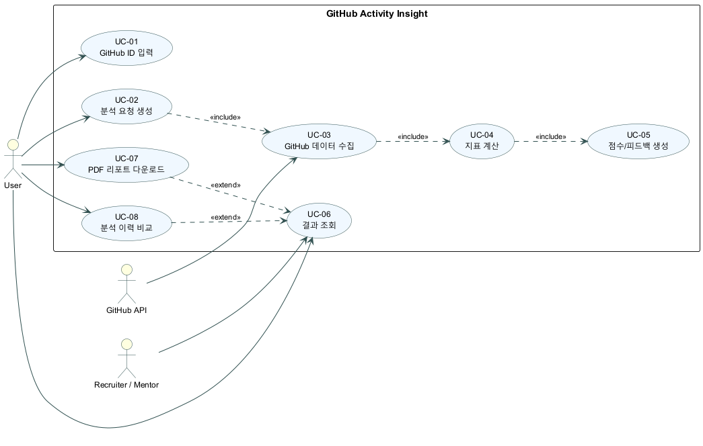
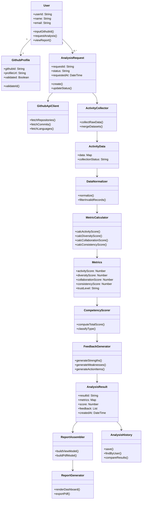
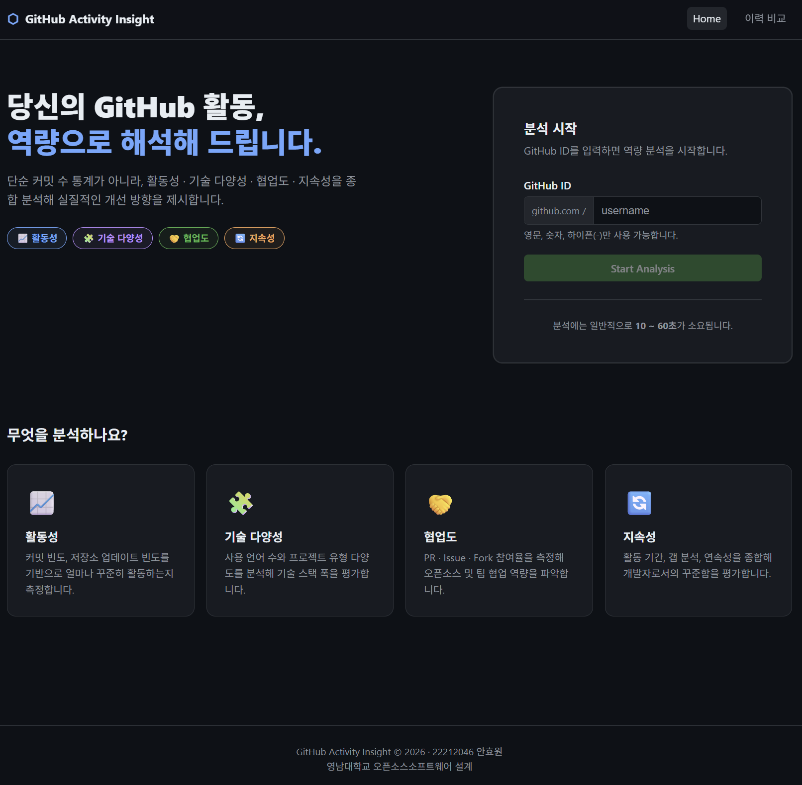
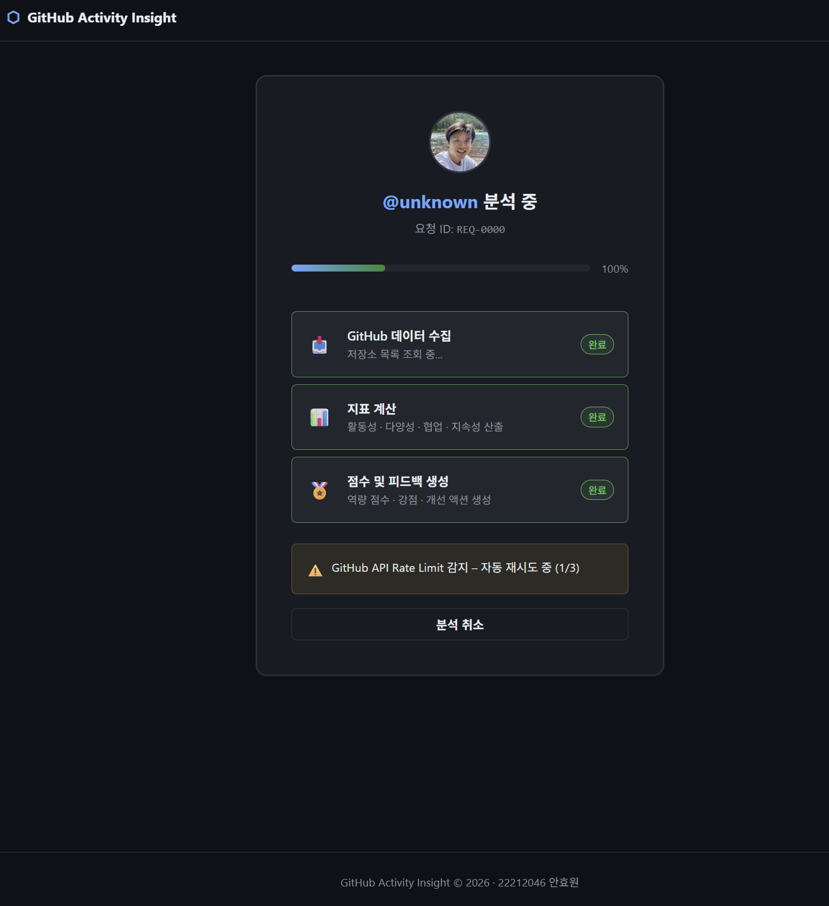
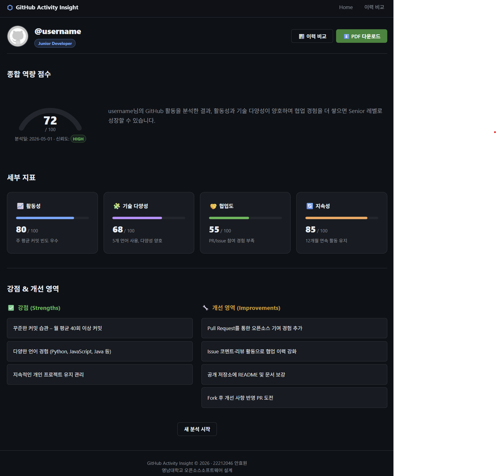
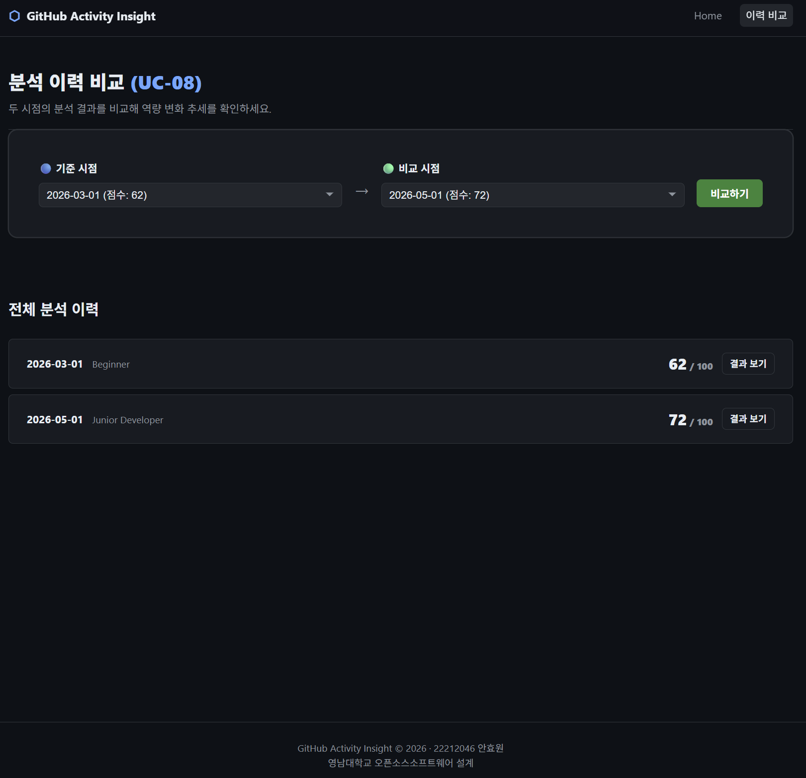

# GitHub Activity Insight

**GitHub 기반 개발자 실력 분석 및 피드백 웹 시스템**

| 정보 항목 | 내용 |
| :--- | :--- |
| Student No | 22212046 |
| Name | 안효원 |
| E-Mail | gydnjs3505@gmail.com |

**영남대학교 (Yeungnam University)**

---

### [ Revision history ]

| Revision date | Version # | Description | Author |
| :--- | :--- | :--- | :--- |
| 03/31/2026 | 1.00 | Initial analysis draft | 안효원 |
| 03/31/2026 | 1.10 | Use case/domain/UI details supplemented | 안효원 |
| 04/04/2026 | 1.20 | Use case description details added | 안효원 |
| 04/22/2026 | 1.30 | Use case diagram UML notation refined | 안효원 |
| 05/01/2026 | 1.31 | Use case actor wording unified by UML boundary rule | 안효원 |
| 05/05/2026 | 1.32 | Quality review: domain model enriched, UC scenarios clarified, BRs concretized, Glossary and References expanded | 안효원 |

---

### Contents

1. **Introduction**
2. **Use case analysis**
3. **Domain analysis**
4. **User Interface Prototype**
5. **Glossary**
6. **References**

---

## 1. Introduction

GitHub Activity Insight는 GitHub 활동 데이터를 기반으로 개발자의 역량을 분석하고, 해석 가능한 피드백을 제공하는 웹 시스템이다. 본 문서는 시스템의 분석(Analysis) 단계 산출물로서, 핵심 유스케이스, 도메인 클래스, 사용자 인터페이스 초안을 정의한다. Conceptualization 단계에서 정의한 문제의식(정량 통계만으로는 역량 해석이 어려움)을 바탕으로, 본 단계에서는 기능 요구를 사용자 관점과 시스템 관점에서 구체화하여 이후 설계 및 구현 단계의 기준선을 마련한다.

프로젝트의 주요 특징은 다음과 같다.

- 유용성: 단순 활동량이 아닌 활동성, 기술 다양성, 협업도, 지속성을 종합 분석해 실질적 개선 방향을 제시한다.
- 중요성: 취업 준비생과 주니어 개발자가 GitHub 포트폴리오를 객관적으로 점검하고 보완할 수 있는 근거를 제공한다.
- 확장성: GitHub API 연동 모듈, 분석 모듈, 피드백 엔진, 리포트 생성기를 분리한 구조로 기능 확장이 용이하다.
- 추적 가능성: 분석 결과를 저장하고 이력을 비교할 수 있어 개선 전후 변화 확인이 가능하다.

본 분석 단계의 범위(Scope)는 다음과 같다.

- In Scope: GitHub ID 입력부터 데이터 수집, 지표 계산, 점수/피드백 생성, 결과 조회/비교/PDF 출력까지의 기능 흐름 정의
- In Scope: 핵심 도메인 클래스와 클래스 간 관계 식별, 사용자 화면 구조 및 시나리오 정의
- Out of Scope: 실제 알고리즘 파라미터 튜닝, 인프라 배포 아키텍처, 상세 DB 스키마 및 구현 코드

분석 단계 산출물의 목표는 기능 요구를 구조화하여 설계(Design) 단계에서 바로 상세 설계로 이어질 수 있도록 하는 데 있다.

---

## 2. Use case analysis

### 2.1 Use case diagram

아래의 그림은 GitHub Activity Insight 시스템의 주요 유스케이스와 액터 간의 관계를 나타낸 Use Case Diagram이다.

> **다이어그램 열람 불가 시:** [UseCaseDiagram.jar](UseCaseDiagram.jar)를 PlantUML로 실행하여 원본을 확인한다.  
> 실행 방법: `java -jar plantuml.jar UseCaseDiagram.jar`

### 2.2 Use case description

**Actors**

> 표기 원칙: Use Case의 Actor는 시스템 경계 밖의 외부 주체만 포함하며, 내부 모듈/컴포넌트는 Actor로 표기하지 않는다.

| Actor | 유형 | 참여 Use Case |
| :--- | :--- | :--- |
| User | Primary | UC-01, UC-02, UC-06, UC-07, UC-08 |
| GitHub API | Secondary | UC-03 |
| Recruiter / Mentor | Secondary | UC-06 |

**Use Case 관계**

| From | To | 유형 | 설명 |
| :--- | :--- | :--- | :--- |
| UC-02 | UC-03 | «include» | 분석 요청 생성 시 데이터 수집 필수 실행 |
| UC-03 | UC-04 | «include» | 데이터 수집 완료 후 지표 계산 필수 실행 |
| UC-04 | UC-05 | «include» | 지표 계산 완료 후 점수/피드백 생성 필수 실행 |
| UC-07 | UC-06 | «extend» | 결과 조회 화면에서 PDF 다운로드 선택적 실행 |
| UC-08 | UC-06 | «extend» | 결과 조회 화면에서 이력 비교 선택적 실행 |

#### UC-01 GitHub ID 입력

**GENERAL CHARACTERISTICS**

| 항목 | 내용 |
| :--- | :--- |
| Summary | User가 분석을 시작하기 위해 GitHub ID를 입력하고 유효성을 검증한다. |
| Scope | GitHub Activity Insight |
| Level | User Level |
| Author | 안효원 |
| Last Update | 2026-04-28 |
| Status | Analysis |
| Primary Actor | User |
| Preconditions | 시스템 접속 가능 상태여야 하고, Home 화면 로드 완료 상태여야 한다. |
| Trigger | User가 Home 화면에서 GitHub ID 입력을 시작할 때 |
| Success Post Condition | system이 유효한 GithubProfile을 생성하고 validated=true로 설정한 뒤 [Start Analysis] 버튼을 활성화한다. |
| Failed Post Condition | system이 입력 오류 상태를 유지하고 분석 요청 단계로 진행하지 않는다. |

**MAIN SUCCESS SCENARIO**

| Step | Action |
| :--- | :--- |
| S | User가 GitHub ID 분석을 시작하려고 한다. |
| 1 | User가 Home 화면의 GitHub ID 입력 필드에 값을 입력한다. |
| 2 | System이 입력 형식을 검증한다(영문/숫자/하이픈). |
| 3 | System이 GitHub API를 통해 ID 존재 여부를 확인한다. |
| 4 | System이 GithubProfile 객체를 생성하고 validated=true로 설정한다. |
| 5 | System이 Home 화면에서 [Start Analysis] 버튼을 활성화하고 클릭 대기 상태로 변경한다. |

**EXTENSION SCENARIOS**

| Step | Branching Action |
| :--- | :--- |
| 2a | 입력 형식 오류인 경우 |
| 2a.1 | System이 유효하지 않은 형식 오류 메시지를 표시한다. |
| 2a.2 | System이 재입력 가이드(영문/숫자/하이픈만 가능)를 제공한다. |
| 2a.3 | User가 수정 후 재입력한다. |
| 3a | GitHub ID가 존재하지 않는 경우 |
| 3a.1 | System이 GitHub에서 찾을 수 없음 메시지를 표시한다. |
| 3a.2 | System이 GitHub ID 확인 링크를 제공한다. |
| 3a.3 | User가 ID 확인 후 재입력한다. |

**RELATED INFORMATION**

| 항목 | 내용 |
| :--- | :--- |
| Performance | 3초 이내 (형식 검증 + API 확인) |
| Frequency | 사용자당 분석 시작 시 1회 |
| Concurrency | 동시 입력 제한 없음 (형식 검증만 수행, 서버 요청 전)|
| Due Date | N/A |

#### UC-02 분석 요청 생성

**GENERAL CHARACTERISTICS**

| 항목 | 내용 |
| :--- | :--- |
| Summary | User가 분석 실행을 요청하면 요청 객체를 생성하고 큐에 등록한다. |
| Scope | GitHub Activity Insight |
| Level | User Level |
| Author | 안효원 |
| Last Update | 2026-04-28 |
| Status | Analysis |
| Primary Actor | User |
| Secondary Actor | (None) |
| Trigger | User가 [Start Analysis] 버튼을 클릭할 때 |
| Preconditions | system이 GithubProfile.validated=true 상태를 확인하고 AnalysisRequest.status 중복 체크(BR-03)를 완료한다. |
| Success Post Condition | system이 AnalysisRequest 객체를 생성하고 requestId를 발급하며 status=PENDING으로 저장한 뒤 비동기 처리를 시작한다. |
| Failed Post Condition | system이 요청 생성 실패 팝업을 표시하고 User에게 명확한 사유와 조치 방법을 안내한다. |

**MAIN SUCCESS SCENARIO**

| Step | Action |
| :--- | :--- |
| S | User가 분석 요청을 생성하려고 한다. |
| 1 | System이 중복 RUNNING 요청 여부를 확인한다. |
| 2 | System이 분석 요청 큐 상태를 확인한다. |
| 3 | System이 AnalysisRequest 객체를 생성한다(requestId 생성, status=PENDING). |
| 4 | System이 requestedAt 타임스탬프를 기록한다. |
| 5 | System이 Progress 화면을 표시한다. |
| 6 | System이 UC-03 데이터 수집 비동기 태스크를 큐에 등록한다. |
| 7 | System이 User에게 추적 ID 및 예상 완료 시간을 통보한다. |

**EXTENSION SCENARIOS**

| Step | Branching Action |
| :--- | :--- |
| 1a | 동일 사용자 RUNNING 요청이 이미 있는 경우 |
| 1a.1 | System이 분석 진행 중 메시지를 표시한다. |
| 1a.2 | System이 기존 요청의 진행률 화면을 제시한다. |
| 1a.3 | User는 완료 대기 또는 취소를 선택한다. |
| 2a | 요청 큐가 포화된 경우 |
| 2a.1 | System이 대기열 등록 메시지를 표시한다. |
| 2a.2 | System이 예상 대기 시간 및 큐 위치를 안내한다. |
| 2a.3 | User는 대기 또는 나중에 재시도를 선택한다. |

**RELATED INFORMATION**

| 항목 | 내용 |
| :--- | :--- |
| Performance | 2초 이내 (요청 생성 + 큐 등록) |
| Frequency | 사용자당 RUNNING 상태 요청 1건 제한 (BR-03 준수) |
| Concurrency | 멀티테넌트 환경에서 큐 공유, 우선순위 관리 필요 |
| Total Analysis Time | 예상 완료 시간: 20-40초 (저장소 수/커밋량에 따라 변동, UC-03~05 순차 처리) |
| Due Date | N/A |

#### UC-03 GitHub 데이터 수집

**GENERAL CHARACTERISTICS**

| 항목 | 내용 |
| :--- | :--- |
| Summary | 시스템이 GitHub API에서 분석용 활동 데이터를 수집한다. |
| Scope | GitHub Activity Insight |
| Level | System Level |
| Author | 안효원 |
| Last Update | 2026-04-28 |
| Status | Analysis |
| Primary Actor | System |
| Secondary Actor | GitHub API |
| Trigger | AnalysisRequest.status = PENDING로 큐 처리 시작할 때 |
| Preconditions | system이 GitHub API 토큰이 유효한지 확인하고 네트워크 연결이 정상인지 확인한다. |
| Success Post Condition | system이 ActivityData 객체를 생성하고 원천 데이터를 성공적으로 수집 완료한 뒤 UC-04로 진행한다. |
| Failed Post Condition | system이 AnalysisRequest.status를 FAILED로 설정하고 부분 수집 데이터를 저장한 뒤 사용자에게 오류 알림을 제공한다. |

**MAIN SUCCESS SCENARIO**

| Step | Action |
| :--- | :--- |
| S | System이 사용자의 GitHub 활동 데이터를 수집한다. |
| 1 | System이 AnalysisRequest.status를 RUNNING으로 업데이트한다. |
| 2 | System이 GitHub API를 통해 저장소 목록을 조회한다(pagination 처리). |
| 3 | System이 각 저장소별 커밋 로그를 조회한다(max 1년). |
| 4 | System이 각 저장소별 언어 통계를 조회한다. |
| 5 | System이 협업 활동(Pull Request, Issue)을 조회한다. |
| 6 | System이 수집 데이터 검증 및 중복 제거를 수행한다. |
| 7 | System이 ActivityData 객체에 원천 데이터를 저장한다. |
| 8 | System이 진행 상태를 UI Progress 화면에 반영한다. |

**EXTENSION SCENARIOS**

| Step | Branching Action |
| :--- | :--- |
| 2-5a | API Rate Limit에 도달한 경우 |
| 2-5a.1 | System이 rate limit 헤더를 확인한다. |
| 2-5a.2 | System이 exponential backoff(3초 -> 6초 -> 12초)를 적용한다. |
| 2-5a.3 | System이 최대 3회 재시도한다. |
| 2-5a.4 | 재시도 초과 시 오류 처리 분기로 이동한다. |
| 2-5b | API 오류 또는 네트워크 타임아웃이 발생한 경우 |
| 2-5b.1 | System이 부분 데이터 처리 지속 또는 중단을 결정한다. |
| 2-5b.2 | System이 AnalysisRequest.status를 PARTIAL 또는 FAILED로 업데이트한다. |
| 2-5b.3 | System이 오류 로그를 기록하고 User에게 재시도 옵션을 제공한다. |

**RELATED INFORMATION**

| 항목 | 내용 |
| :--- | :--- |
| Performance | 5-30초 (저장소 수/커밋량에 따라 변동) |
| Frequency | 분석 요청마다 1회 |
| Concurrency | GitHub API 제한(60 req/min auth) 고려 스케줄링 |
| Due Date | N/A |

#### UC-04 지표 계산

**GENERAL CHARACTERISTICS**

| 항목 | 내용 |
| :--- | :--- |
| Summary | 수집 데이터를 정규화하고 4개 핵심 지표를 계산한다. |
| Scope | GitHub Activity Insight |
| Level | System Level |
| Author | 안효원 |
| Last Update | 2026-04-28 |
| Status | Analysis |
| Primary Actor | System |
| Secondary Actor | (None) |
| Trigger | UC-03 완료 후 ActivityData 객체 생성 시 UC-04 자동 시작 |
| Preconditions | ActivityData 객체 존재, 최소 기본 데이터 임계값 충족 |
| Success Post Condition | system이 Metrics 객체를 생성하고 4개 지표 계산과 신뢰도 레벨 설정을 완료한 뒤 UC-05로 진행한다. |
| Failed Post Condition | system이 데이터 불충분으로 지표 계산을 중단하고 AnalysisRequest.status를 FAILED로 설정한다. |

**MAIN SUCCESS SCENARIO**

| Step | Action |
| :--- | :--- |
| S | System이 수집된 활동 데이터로부터 4개 핵심 지표를 계산한다. |
| 1 | System이 ActivityData를 정규화한다(타임스탬프, 데이터 유형별 분류). |
| 2 | System이 활동성 지표를 계산한다(커밋 빈도, 저장소 업데이트 빈도). |
| 3 | System이 다양성 지표를 계산한다(사용 언어 수, 프로젝트 유형 다양도). |
| 4 | System이 협업도 지표를 계산한다(PR 참여율, Issue 참여율, Fork 활동). |
| 5 | System이 지속성 지표를 계산한다(활동 기간, 갭 분석, 연속성). |
| 6 | System이 각 지표를 0-100으로 정규화한다. |
| 7 | System이 Metrics 객체를 생성하고 지표값을 저장한다. |
| 8 | System이 데이터 완전성 기반 신뢰도 점수를 계산한다. |

**EXTENSION SCENARIOS**

| Step | Branching Action |
| :--- | :--- |
| 1a | 데이터 일부 누락이 있는 경우 |
| 1a.1 | System이 누락 필드를 식별한다. |
| 1a.2 | System이 가능한 지표만 부분 계산한다(무시 지표 표시). |
| 1a.3 | System이 신뢰도를 PARTIAL 또는 LOW로 설정한다. |
| 1a.4 | System이 Metrics.trustLevel = LIMITED 경고 플래그를 저장한다. |
| 2-5b | 데이터 이상치 또는 비정상 분포가 감지된 경우 |
| 2-5b.1 | System이 이상치 필터링(예: 봇 활동 탐지)을 수행한다. |
| 2-5b.2 | System이 조정된 값으로 지표를 재계산한다. |
| 2-5b.3 | System이 필터링 사실을 Metrics.notes에 기록한다. |

**RELATED INFORMATION**

| 항목 | 내용 |
| :--- | :--- |
| Performance | 1-3초 (데이터량 선형 비례) |
| Frequency | 분석 요청마다 1회 |
| Concurrency | 내부 배치 처리 기준 |
| Due Date | N/A |

#### UC-05 점수 및 피드백 생성

**GENERAL CHARACTERISTICS**

| 항목 | 내용 |
| :--- | :--- |
| Summary | 지표를 종합 점수로 환산하고 강점/약점/개선 액션 피드백을 생성한다. |
| Scope | GitHub Activity Insight |
| Level | System Level |
| Author | 안효원 |
| Last Update | 2026-04-28 |
| Status | Analysis |
| Primary Actor | System |
| Secondary Actor | (None) |
| Trigger | Metrics 산출 완료 |
| Preconditions | Metrics 객체 유효, 평가 규칙 버전 로딩 완료 |
| Success Post Condition | system이 AnalysisResult를 생성하고(Score 0-100, 종합 평가, 강점/약점, 개선 액션) 저장 완료 후 사용자에게 분석 완료 알림을 전송한다. |
| Failed Post Condition | system이 점수 생성 실패를 기록하고 사용자에게 기술적 오류를 알린다. |

**MAIN SUCCESS SCENARIO**

| Step | Action |
| :--- | :--- |
| S | System이 지표로부터 역량 점수 및 피드백을 생성한다. |
| 1 | System이 평가 규칙 세트를 로드한다(현재 버전). |
| 2 | System이 각 Metrics 항목에 가중치를 적용한다(기본: 각 25%). |
| 3 | System이 종합 역량 점수를 계산한다(0-100, BR-04 준수). |
| 4 | System이 점수에 따라 Developer Type을 분류한다(Beginner/Junior/Advanced). |
| 5 | System이 지표별 강점/약점을 임계값 기준으로 식별한다. |
| 6 | System이 약점별 맞춤형 개선 액션 아이템(3-5개)을 생성한다. |
| 7 | System이 강점 강조 메시지를 생성한다. |
| 8 | System이 AnalysisResult 객체를 생성하여 Score + Feedback을 저장한다. |

**EXTENSION SCENARIOS**

| Step | Branching Action |
| :--- | :--- |
| 1a | 평가 규칙 버전 불일치가 발생한 경우 |
| 1a.1 | System이 최신 버전 규칙 로드 실패를 감지한다. |
| 1a.2 | System이 기본 규칙 세트(동등 가중치 25%)를 적용한다. |
| 1a.3 | System이 버전 미스매치 로그를 기록하고 경고를 표시한다. |
| 6a | 신뢰도 부족으로 피드백 품질 저하 우려가 있는 경우 |
| 6a.1 | System이 Metrics.trustLevel을 확인한다. |
| 6a.2 | System이 trustLevel이 LOW이면 보수적 피드백을 생성한다. |
| 6a.3 | 피드백에 데이터 제한으로 인한 부분 분석 경고를 추가한다. |

**RELATED INFORMATION**

| 항목 | 내용 |
| :--- | :--- |
| Performance | 0.5-1초 (규칙 적용 및 생성) |
| Frequency | 분석 요청마다 1회 |
| Concurrency | 내부 규칙 엔진 처리 기준 |
| Due Date | N/A |

#### UC-06 결과 조회

**GENERAL CHARACTERISTICS**

| 항목 | 내용 |
| :--- | :--- |
| Summary | 사용자 또는 검토자가 분석 결과 대시보드를 조회한다. |
| Scope | GitHub Activity Insight |
| Level | User Level |
| Author | 안효원 |
| Last Update | 2026-04-28 |
| Status | Analysis |
| Primary Actor | User |
| Secondary Actor | Recruiter / Mentor |
| Trigger | actor가 결과 페이지 URL에 진입하거나 메뉴를 선택한다. |
| Preconditions | system이 최소 1건 이상의 완료된 AnalysisResult 존재 여부를 확인하고 사용자 권한을 검증한다. |
| Success Post Condition | system이 Result Dashboard 렌더링을 완료하고 actor가 종합 평가와 피드백을 확인한다. |
| Failed Post Condition | system이 결과 조회를 중단하고 actor에게 분석 시작 또는 관리자 문의 경로를 안내한다. |

**MAIN SUCCESS SCENARIO**

| Step | Action |
| :--- | :--- |
| S | User가 분석 결과 대시보드를 조회한다. |
| 1 | System이 User의 최신 AnalysisResult를 조회한다. |
| 2 | System이 ReportAssembler로 ViewModel을 생성한다. |
| 3 | System이 Result Dashboard 화면을 렌더링한다. |
| 4 | System이 종합 역량 점수를 시각화한다(게이지 또는 카드). |
| 5 | System이 4개 지표(활동성/다양성/협업도/지속성)를 그래프/카드로 표시한다. |
| 6 | System이 강점(Strengths) 섹션을 렌더링한다(2-3개 항목). |
| 7 | System이 약점/개선영역(Improvements) 섹션을 렌더링한다(3-5개 액션). |
| 8 | System이 메타 정보(분석 일시, 신뢰도 레벨)를 표시한다. |

**EXTENSION SCENARIOS**

| Step | Branching Action |
| :--- | :--- |
| 1a | 분석 결과가 없는 경우 |
| 1a.1 | System이 분석 결과 없음 메시지를 표시한다. |
| 1a.2 | System이 지금 분석 시작 버튼(Home 이동)을 제공한다. |
| 1a.3 | User가 분석 시작 또는 이전 분석 재요청을 선택한다. |
| 4-7b | 신뢰도가 LOW인 결과인 경우 |
| 4-7b.1 | System이 부분 분석 신뢰도 배지를 표시한다. |
| 4-7b.2 | System이 각 지표 옆에 신뢰도 낮음 주석을 추가한다. |
| 4-7b.3 | System이 데이터 부족 제한 안내 문구를 표시한다. |
| 1c | 권한 부족인 경우 |
| 1c.1 | System이 접근을 거부한다. |
| 1c.2 | System이 공유 권한 없음 메시지를 표시한다. |

**RELATED INFORMATION**

| 항목 | 내용 |
| :--- | :--- |
| Performance | 2초 이내 (데이터 조회 + 렌더링) |
| Frequency | 사용자당 다회 조회 가능 |
| Concurrency | 72시간 캐시 활용으로 조회 성능 향상 |
| Due Date | N/A |

#### UC-07 PDF 리포트 다운로드

**GENERAL CHARACTERISTICS**

| 항목 | 내용 |
| :--- | :--- |
| Summary | 사용자가 분석 결과를 PDF 문서로 생성하고 다운로드한다. |
| Scope | GitHub Activity Insight |
| Level | User Level |
| Author | 안효원 |
| Last Update | 2026-04-28 |
| Status | Analysis |
| Primary Actor | User |
| Secondary Actor | (None) |
| Trigger | actor가 Result Dashboard에서 [PDF 다운로드] 버튼을 클릭한다. |
| Preconditions | system이 AnalysisResult 완료 상태를 확인하고 렌더링 엔진이 정상 작동함을 확인한다. |
| Success Post Condition | system이 PDF 다운로드를 완료하고 actor가 공유/보관 가능한 문서를 확보한다. |
| Failed Post Condition | system이 PDF 생성 또는 다운로드 실패를 처리하고 actor에게 대체 수단을 제시한다. |

**MAIN SUCCESS SCENARIO**

| Step | Action |
| :--- | :--- |
| S | User가 분석 결과를 PDF로 다운로드한다. |
| 1 | System이 현재 AnalysisResult 데이터를 확인한다. |
| 2 | System이 ReportGenerator에 PDF 렌더링을 요청한다. |
| 3 | System이 AnalysisResult를 PDF ViewModel로 변환한다. |
| 4 | System이 PDF 템플릿에 Score, Metrics, Feedback을 바인딩한다. |
| 5 | System이 타임스탬프, GitHub ID, 분석 버전 정보를 포함한다. |
| 6 | System이 PDF 문서를 생성한다(1-3 페이지). |
| 7 | System이 파일명을 설정한다(GithubID_Analysis_YYYYMMDD.pdf). |
| 8 | System이 브라우저 다운로드를 제공한다. |

**EXTENSION SCENARIOS**

| Step | Branching Action |
| :--- | :--- |
| 6a | PDF 생성이 실패한 경우 |
| 6a.1 | System이 보고서 생성 오류 메시지를 표시한다. |
| 6a.2 | System이 재시도 버튼을 제공한다. |
| 6a.3 | 3회 실패 시 관리자 오류 리포트를 생성한다. |
| 4b | 템플릿 바인딩 데이터 불일치가 발생한 경우 |
| 4b.1 | System이 누락된 데이터 필드를 감지한다. |
| 4b.2 | System이 대체값 또는 미제공 표기를 사용한다. |
| 4b.3 | System이 PDF 생성을 계속 진행한다. |
| 8c | 다운로드 실패 또는 취소가 발생한 경우 |
| 8c.1 | System이 다운로드 오류, 다시 시도 메시지를 표시한다. |
| 8c.2 | System이 이메일 발송 옵션을 제공한다. |

**RELATED INFORMATION**

| 항목 | 내용 |
| :--- | :--- |
| Performance | 3-8초 (PDF 렌더링 시간, 크기별 가변) |
| Frequency | 사용자당 분석당 다회 다운로드 가능 |
| Concurrency | 문서 생성 리소스 관리 필요 |
| Due Date | N/A |

#### UC-08 분석 이력 비교

**GENERAL CHARACTERISTICS**

| 항목 | 내용 |
| :--- | :--- |
| Summary | 사용자가 과거 분석 결과와 현재 결과를 비교해 개선 추세를 확인한다. |
| Scope | GitHub Activity Insight |
| Level | User Level |
| Author | 안효원 |
| Last Update | 2026-04-28 |
| Status | Analysis |
| Primary Actor | User |
| Secondary Actor | (None) |
| Trigger | actor가 Result Dashboard에서 [이력 비교] 메뉴를 선택하거나 Home에서 History Compare를 선택한다. |
| Preconditions | system이 2건 이상의 AnalysisResult 저장 여부를 확인하고 사용자 권한을 검증한다. |
| Success Post Condition | system이 Compare History 대시보드 렌더링을 완료하고 actor가 개선/악화 추세를 파악한다. |
| Failed Post Condition | system이 비교 이력 부족 상태를 처리하고 분석 시작 유도 화면으로 전환한다. |

**MAIN SUCCESS SCENARIO**

| Step | Action |
| :--- | :--- |
| S | User가 과거 분석 결과와 현재 결과를 비교하고 개선 추세를 파악한다. |
| 1 | System이 User의 AnalysisHistory에서 분석 결과 목록을 조회한다. |
| 2 | System이 History Compare 화면을 표시한다(시점 선택 UI). |
| 3 | User가 기준 시점을 선택한다. |
| 4 | User가 비교 시점을 선택한다. |
| 5 | System이 두 시점의 AnalysisResult를 조회한다. |
| 6 | System이 Score, 4개 Metrics, Developer Type 증감을 계산한다. |
| 7 | System이 비교 테이블(기준값/현재값/증감/증감율%)을 렌더링한다. |
| 8 | System이 개선/악화 항목을 색상 코드(초록/빨강)로 하이라이트한다. |
| 9 | System이 스파크라인(최근 3-5개 시점)을 표시한다. |
| 10 | System이 개선 메시지/격려 피드백을 제공한다. |

**EXTENSION SCENARIOS**

| Step | Branching Action |
| :--- | :--- |
| 1a | 비교 가능 이력이 부족한 경우(2건 미만) |
| 1a.1 | System이 비교 가능한 이력이 부족합니다 메시지를 표시한다. |
| 1a.2 | System이 새로운 분석 시작 또는 이전 분석 대기 안내를 제공한다. |
| 1a.3 | User가 분석 시작 또는 이전 결과 검토를 선택한다. |
| 3/4b | 동일 시점이 중복 선택된 경우 |
| 3/4b.1 | System이 기준과 비교 시점은 다른 날짜여야 한다는 경고를 표시한다. |
| 3/4b.2 | User가 다른 시점을 재선택한다. |
| 6c | 비교 데이터 일부가 누락된 경우 |
| 6c.1 | System이 누락 항목을 식별한다. |
| 6c.2 | System이 일부 지표는 비교 불가 메시지를 표시한다. |
| 6c.3 | System이 가능한 비교 항목만 표시한다. |

**RELATED INFORMATION**

| 항목 | 내용 |
| :--- | :--- |
| Performance | 2초 이내 (2-3건 이력 비교) |
| Frequency | 사용자당 주 1회 추정(개선 확인 목적) |
| Concurrency | 조회 중심 처리 |
| Due Date | N/A |

### 2.3 Use case relationship and priority

| 관계 유형 | 내용 |
| :--- | :--- |
| 선행 관계 | UC-01에서 시작해 UC-06까지 순차적으로 수행되는 기본 처리 흐름이다. (UC-01 -> UC-02 -> UC-03 -> UC-04 -> UC-05 -> UC-06) |
| 선택 관계 | UC-07과 UC-08은 UC-06 완료 이후 사용자 선택에 따라 수행되는 선택 흐름이다. |
| include 성격 | UC-02 -> UC-03 -> UC-04 -> UC-05는 분석 수행을 위해 반드시 실행되어야 하는 필수 include 흐름이다. |
| extend 성격 | UC-07과 UC-08은 결과 확인(UC-06) 과정에서 필요 시 조건적으로 확장되는 extend 흐름이다. |

| Use case | 우선순위 | 근거 |
| :--- | :--- | :--- |
| UC-01 GitHub ID 입력 | High | 전체 분석 흐름의 진입점이며 이후 모든 기능 실행의 전제 조건이다. |
| UC-02 분석 요청 생성 | High | 요청 생성, 상태 추적, 중복 실행 제어를 담당하는 핵심 관리 기능이다. |
| UC-03 GitHub 데이터 수집 | High | 분석 품질을 결정하는 원천 데이터를 확보하는 핵심 단계이다. |
| UC-04 지표 계산 | High | 수집 데이터를 해석 가능한 핵심 지표로 변환하는 핵심 산출 단계이다. |
| UC-05 점수/피드백 생성 | High | 사용자에게 제공되는 최종 평가값과 개선 가이드를 생성하는 핵심 기능이다. |
| UC-06 결과 조회 | High | 사용자가 분석 가치를 직접 확인하는 핵심 사용자 접점이다. |
| UC-07 PDF 리포트 다운로드 | Medium | 결과 공유 및 보관 편의성을 높이는 부가 기능이다. |
| UC-08 분석 이력 비교 | Medium | 시점 간 변화 추적을 통해 지속적 개선을 지원하는 확장 기능이다. |

---

## 3. Domain analysis

### 3.1 Domain class diagram

### 3.2 Class identification and role

| 클래스 | 의미 | 역할 |
| :--- | :--- | :--- |
| User | 시스템 사용자(학생/개발자) | GitHub ID 입력, 분석 요청, 결과 조회/다운로드 수행 |
| GithubProfile | GitHub 계정 식별 정보 | 입력된 GitHub ID의 유효성 검증 및 프로필 메타 정보 보관 |
| AnalysisRequest | 분석 실행 요청 단위 | 요청 상태(PENDING/RUNNING/COMPLETED/FAILED/PARTIAL) 추적 |
| ActivityData | 수집 데이터 단위 | GitHub API에서 수집한 원천 활동 데이터 보관 및 검증 |
| GithubApiClient | GitHub API 연동 클라이언트 | REST/GraphQL 호출을 통해 저장소, 커밋, PR, Issue 데이터 조회 |
| ActivityCollector | 원천 데이터 수집기 | API 응답 통합 및 데이터셋 구성 |
| DataNormalizer | 데이터 전처리 객체 | 형식 정규화, 결측/이상치 처리 |
| Metrics | 지표 계산 결과 | 활동성, 다양성, 협업도, 지속성 점수 및 신뢰도 레벨 포함 |
| MetricCalculator | 지표 계산 객체 | 활동성, 다양성, 협업도, 지속성 지표 산출 |
| CompetencyScorer | 역량 점수 계산기 | 지표를 가중치 기반으로 통합해 점수화 |
| FeedbackGenerator | 피드백 생성기 | 점수와 지표를 해석해 강점/약점/개선 액션 생성 |
| AnalysisResult | 분석 결과 엔티티 | 점수, 지표, 피드백, 생성 시각을 포함한 결과 객체 |
| ReportAssembler | 출력 조합기 | 화면/PDF 출력을 위한 ViewModel 구성 |
| ReportGenerator | 결과 렌더러 | 대시보드 시각화 및 PDF 생성 |
| AnalysisHistory | 결과 이력 저장소 | 결과 저장, 조회, 시점 간 비교 기능 제공 |

### 3.3 Domain constraints and business rules

| 규칙 ID | 제약/규칙 |
| :--- | :--- |
| BR-01 | `GithubProfile.githubId`는 공백이 아닌 영문/숫자/하이픈 조합이어야 한다. |
| BR-02 | `AnalysisRequest.status`는 PENDING -> RUNNING -> COMPLETED/FAILED/PARTIAL 상태 전이 규칙을 따른다. (UC-03 확장 시나리오에서 PARTIAL 상태 발생 가능) |
| BR-03 | 동일 사용자의 RUNNING 상태 요청은 최대 1건으로 제한한다(중복 분석 방지). |
| BR-04 | `AnalysisResult.score`는 0~100 범위를 벗어날 수 없다. |
| BR-05 | 지표 계산 입력 데이터가 임계치 미만인 경우 결과에 신뢰도 경고를 포함해야 한다. 구체적 임계치: 커밋 데이터 30개 미만, 활동 기간 3개월 미만, 저장소 1개 미만인 경우 신뢰도를 LOW로 표시. |
| BR-06 | `AnalysisHistory`에는 결과 생성 시각(`createdAt`) 기준으로 버전 이력이 저장되어야 한다. |

위 규칙은 설계 단계에서 상태머신 정의, 입력 검증 규칙, 데이터 무결성 제약으로 구체화한다.

---

## 4. User Interface Prototype

### 4.1 Home / Start Screen

그림 4-1은 사용자가 시스템에 처음 접근할 때 나타나는 홈 화면이다.

사용자는 GitHub ID 입력 필드에 아이디를 입력하고 "Start Analysis" 버튼을 클릭하여 분석을 시작할 수 있다. 화면 하단에는 분석 기준인 4개 지표(활동성, 기술 다양성, 협업도, 지속성)가 안내된다. 입력값에 대한 형식 검증(영문/숫자/하이픈)이 실시간으로 수행되며, 형식 오류 또는 존재하지 않는 ID 입력 시 오류 메시지가 표시되고 "Start Analysis" 버튼이 비활성화된다.

[그림 4-1] Home / Start Screen

### 4.2 Analysis Progress

그림 4-2는 분석 요청이 생성된 후 진행 상태를 표시하는 화면이다.

화면 상단에는 요청 ID와 전체 진행률이 표시되며, 데이터 수집(UC-03), 지표 계산(UC-04), 점수/피드백 생성(UC-05)의 3단계 파이프라인 상태를 분리하여 제공한다. GitHub API Rate Limit에 도달한 경우 자동 재시도 안내가 노출되며, 사용자는 분석 취소를 선택할 수 있다.

[그림 4-2] Analysis Progress

### 4.3 Result Dashboard

그림 4-3은 분석이 완료된 후 결과를 확인하는 핵심 화면이다.

종합 역량 점수, 4개 세부 지표(활동성/다양성/협업도/지속성), 강점(Strengths) 및 개선안(Improvements)을 단일 화면에서 통합 제공한다. 데이터 신뢰도가 낮은 경우 결과 상단에 신뢰도 경고 배지가 표시된다. "PDF 다운로드" 버튼을 통해 결과를 PDF로 저장하거나, "이력 비교" 버튼을 통해 History Compare 화면으로 이동할 수 있다.

[그림 4-3] Result Dashboard

### 4.4 History Compare

그림 4-4는 두 시점의 분석 결과를 선택하여 개선 추세를 비교하는 화면이다.

기준 시점과 비교 시점을 드롭다운으로 선택하면 종합 점수와 4개 지표의 증감 및 증감율이 표 형태로 표시된다. 개선 항목은 초록색, 악화 항목은 빨간색으로 하이라이트되어 직관적으로 추세를 파악할 수 있다. 분석 이력이 2건 미만인 경우 비교 불가 안내와 함께 새로운 분석 시작을 유도하는 화면이 표시된다.

[그림 4-4] History Compare

---

## 5. Glossary

| 용어 | 정의 |
| :--- | :--- |
| GitHub API | GitHub가 제공하는 REST/GraphQL 인터페이스로 저장소, 커밋, 언어, 협업 활동 데이터를 조회하는 수단 |
| Raw Activity Data | API에서 수집한 원천 활동 데이터(저장소 목록, 커밋 로그, 언어 통계 등) |
| Metrics | 원천 데이터를 가공해 산출한 정량 지표(활동성, 다양성, 협업도, 지속성) |
| Competency Score | 다수 Metrics를 가중 결합해 계산한 종합 역량 점수 |
| Feedback | 점수/지표 해석을 통해 생성된 강점, 약점, 개선 액션 권고 |
| Analysis Request | 특정 시점의 분석 실행 단위 및 상태를 관리하는 요청 객체 |
| Analysis History | 사용자별 분석 결과의 저장 및 시계열 비교를 위한 이력 데이터 |
| Report Generator | 결과를 대시보드 또는 PDF 형태로 변환/출력하는 모듈 |
| Rate Limit | GitHub API 호출 횟수 제한 정책으로, 초과 시 일정 시간 요청이 제한되는 제약 |
| Backoff Retry | API 오류/제한 발생 시 대기 시간을 점진적으로 늘려 재시도하는 전략 |
| Pagination | 대량 API 응답을 여러 페이지로 분할해 순차적으로 조회하는 방식 |
| ViewModel | 화면 출력 목적에 맞게 가공된 데이터 구조로 UI 렌더링 입력 모델 |
| Developer Type | 점수 범위에 따라 분류된 개발자 수준 카테고리. Beginner(0-40점), Junior(40-75점), Advanced(75-100점)로 구분 |

---

## 6. References

1. GitHub, "REST API Documentation," GitHub Docs. Available: https://docs.github.com/en/rest (accessed: 2026-03-31).
2. GitHub, "GraphQL API Documentation," GitHub Docs. Available: https://docs.github.com/en/graphql (accessed: 2026-03-31).
3. E. Kalliamvakou et al., "The Promises and Perils of Mining GitHub Data," Empirical Software Engineering, Springer.
4. C. Bird et al., "The Promises and Perils of Mining GitHub," Proceedings of the International Working Conference on Mining Software Repositories (MSR).
5. OpenSSF, "Open Source Project Security Baseline." Available: https://baseline.openssf.org (accessed: 2026-03-31).
6. M. Fowler, "UML Distilled: A Brief Guide to the Standard Object Modeling Language," Addison-Wesley.
7. Alves, D., Ribeiro, B., & Mendes, B., "Mining Software Developer Behavior from GitHub," Data Mining: Foundations and Intelligent Paradigms, Springer, 2012.
8. Cosentino, V., Luis, J. C. R., & Izquierdo, J. L. C., "A Dataset for GitHub Repository Deduplication," Proceedings of the International Working Conference on Mining Software Repositories (MSR), 2016.
9. Leite, L., Rocha, C., Kon, F., Milani, F., & Steinmacher, I., "Towards a Catalog of Lean Software Engineering Practices," Proceedings of the 2018 Agile Methods for Software Engineering and Extreme Programming (XP), 2018.
10. Zagalsky, A., Feliciano, J., Storey, M. A., & Brindescu, O., "Perception of Diversity on GitHub: A Study of Pull Request Acceptance of Women and Minorities," IEEE Transactions on Software Engineering, Vol. 48, No. 2, 2022.
