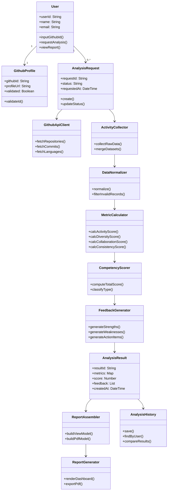

# GitHub Activity Insight


**GitHub 기반 개발자 실력 분석 및 피드백 웹 시스템**

| 정보 항목 | 내용 |
| :--- | :--- |
| Student No | 22212046 |
| Name | 안효원 |
| E-Mail | gydnjs3505@gmail.com |

**영남대학교 (Yeungnam University)**

---

### [ Revision history ]

| Revision date | Version # | Description | Author |
| :--- | :--- | :--- | :--- |
| 03/31/2026 | 1.00 | Initial analysis draft | 안효원 |
| 03/31/2026 | 1.10 | Use case/domain/UI details supplemented | 안효원 |
| 04/04/2026 | 1.20 | Use case description details added | 안효원 |
| 04/22/2026 | 1.30 | Use case diagram UML notation refined | 안효원 |

---

### Contents

1. **Introduction**
2. **Use case analysis**
3. **Domain Analysis**
4. **User Interface prototype**
5. **Glossary**
6. **References**

---

## 1. Introduction

GitHub Activity Insight는 GitHub 활동 데이터를 기반으로 개발자의 역량을 분석하고, 해석 가능한 피드백을 제공하는 웹 시스템이다. 본 문서는 시스템의 분석(Analysis) 단계 산출물로서, 핵심 유스케이스, 도메인 클래스, 사용자 인터페이스 초안을 정의한다. Conceptualization 단계에서 정의한 문제의식(정량 통계만으로는 역량 해석이 어려움)을 바탕으로, 본 단계에서는 기능 요구를 사용자 관점과 시스템 관점에서 구체화하여 이후 설계 및 구현 단계의 기준선을 마련한다.

프로젝트의 주요 특징은 다음과 같다.

- 유용성: 단순 활동량이 아닌 활동성, 기술 다양성, 협업도, 지속성을 종합 분석해 실질적 개선 방향을 제시한다.
- 중요성: 취업 준비생과 주니어 개발자가 GitHub 포트폴리오를 객관적으로 점검하고 보완할 수 있는 근거를 제공한다.
- 확장성: GitHub API 연동 모듈, 분석 모듈, 피드백 엔진, 리포트 생성기를 분리한 구조로 기능 확장이 용이하다.
- 추적 가능성: 분석 결과를 저장하고 이력을 비교할 수 있어 개선 전후 변화 확인이 가능하다.

본 분석 단계의 범위(Scope)는 다음과 같다.

- In Scope: GitHub ID 입력부터 데이터 수집, 지표 계산, 점수/피드백 생성, 결과 조회/비교/PDF 출력까지의 기능 흐름 정의
- In Scope: 핵심 도메인 클래스와 클래스 간 관계 식별, 사용자 화면 구조 및 시나리오 정의
- Out of Scope: 실제 알고리즘 파라미터 튜닝, 인프라 배포 아키텍처, 상세 DB 스키마 및 구현 코드

분석 단계 산출물의 목표는 기능 요구를 구조화하여 설계(Design) 단계에서 바로 상세 설계로 이어질 수 있도록 하는 데 있다.

---

## 2. Use case analysis

### 2.1 Use case diagram


> **다이어그램 열람 불가 시:** [UseCaseDiagram.jar](UseCaseDiagram.jar)를 PlantUML로 실행하여 원본을 확인한다.  
> 실행 방법: `java -jar plantuml.jar UseCaseDiagram.jar`

### 2.2 Use case description

**Actors**

| Actor | 유형 | 참여 Use Case |
| :--- | :--- | :--- |
| User | Primary | UC-01, UC-02, UC-06, UC-07, UC-08 |
| GitHub API | Secondary | UC-03 |
| Recruiter / Mentor | Secondary | UC-06 |

**Use Case 관계**

| From | To | 유형 | 설명 |
| :--- | :--- | :--- | :--- |
| UC-02 | UC-03 | «include» | 분석 요청 생성 시 데이터 수집 필수 실행 |
| UC-03 | UC-04 | «include» | 데이터 수집 완료 후 지표 계산 필수 실행 |
| UC-04 | UC-05 | «include» | 지표 계산 완료 후 점수/피드백 생성 필수 실행 |
| UC-07 | UC-06 | «extend» | 결과 조회 화면에서 PDF 다운로드 선택적 실행 |
| UC-08 | UC-06 | «extend» | 결과 조회 화면에서 이력 비교 선택적 실행 |

#### UC-01 GitHub ID 입력

| 항목 | 내용 |
| :--- | :--- |
| Primary Actor | User |
| Secondary Actor | (None) |
| Trigger | 사용자가 분석 시작 화면에 접근 |
| Precondition | 시스템 접속 가능 상태, Home 화면 로드 완료 |
| Main Success Scenario | S) User가 GitHub ID 분석을 시작하려 한다. |
| | 1) User가 Home 화면의 [GitHub ID 입력] 필드에 GitHub ID 입력 |
| | 2) System이 입력 형식 검증(영문/숫자/하이픈 조합) |
| | 3) System이 GitHub API를 통해 ID 존재 여부 확인 |
| | 4) System이 GithubProfile 객체 생성 및 validated=true 설정 |
| | 5) System이 분석 요청 화면으로 이동 및 [Start Analysis] 버튼 활성화 |
| Extension Scenarios | E1) 입력 형식 오류 (Step 2 실패)
| | E1.1) System이 '유효하지 않은 형식' 오류 메시지 표시
| | E1.2) System이 재입력 가이드 제공(영문/숫자/하이픈만 가능)
| | E1.3) User는 수정 후 재입력 가능
| | |
| | E2) GitHub ID 존재 안 함 (Step 3 실패)
| | E2.1) System이 'GitHub에서 찾을 수 없음' 오류 메시지 표시
| | E2.2) System이 GitHub ID 확인 링크 제공
| | E2.3) User는 ID 재확인 후 재입력
| Success Postcondition | 유효한 GithubProfile이 요청 컨텍스트에 저장되고, 다음 단계 진행 가능 |
| Failure Postcondition | 입력 오류 상태 유지, 분석 요청 단계로 진행 불가 |
| Related Information | Performance: ≤ 3 seconds (format validation + API check) |
| | Frequency: 사용자당 분석 시작 시 1회 |
| | Concurrency: 동시 입력 제한 없음

#### UC-02 분석 요청 생성

| 항목 | 내용 |
| :--- | :--- |
| Primary Actor | User |
| Secondary Actor | System (AnalysisRequest Manager) |
| Trigger | User가 [Start Analysis] 버튼 클릭 |
| Precondition | GithubProfile.validated = true, AnalysisRequest.status 중복 체크(BR-03) |
| Main Success Scenario | S) User가 분석 요청을 생성하려 한다. |
| | 1) System이 중복 RUNNING 요청 여부 확인 |
| | 2) System이 분석 요청 큐 상태 확인 |
| | 3) System이 AnalysisRequest 객체 생성(requestId 생성, status=PENDING) |
| | 4) System이 requestedAt 타임스탬프 기록 |
| | 5) System이 Progress 화면 표시 |
| | 6) System이 UC-03(데이터 수집) 비동기 태스크 큐에 등재 |
| | 7) System이 User에게 추적 ID 및 예상 완료 시간 통보 |
| Extension Scenarios | E1) 동일 사용자 RUNNING 요청 존재 (Step 1 실패)
| | E1.1) System이 '분석이 진행 중입니다' 메시지 표시
| | E1.2) System이 기존 요청의 진행률 화면 제시
| | E1.3) User는 기존 분석 완료 대기 또는 취소 선택
| | |
| | E2) 요청 큐 포화 (Step 2 실패)
| | E2.1) System이 '대기열에 등록되었습니다' 메시지 표시
| | E2.2) System이 예상 대기 시간 및 큐 위치 안내
| | E2.3) User는 대기 또는 나중에 재시도 선택
| Success Postcondition | AnalysisRequest 객체 생성, 상태: PENDING, requestId 발급, 비동기 처리 시작 |
| Failure Postcondition | 요청 생성 실패, User에게 명확한 사유 및 조치 방법 안내 |
| Related Information | Performance: ≤ 2 seconds (request creation + queue registration) |
| | Frequency: 사용자당 동시 1건 제한 |
| | Concurrency: 멀티테넌트 환경에서 큐 공유, 우선순위 관리 필요

#### UC-03 GitHub 데이터 수집

| 항목 | 내용 |
| :--- | :--- |
| Primary Actor | System (GithubApiClient + ActivityCollector) |
| Secondary Actor | GitHub API |
| Trigger | AnalysisRequest.status = PENDING로 큐 처리 시작 |
| Precondition | GitHub API 토큰 유효, 네트워크 연결 정상 |
| Main Success Scenario | S) System이 사용자의 GitHub 활동 데이터를 수집한다. |
| | 1) System이 AnalysisRequest.status를 RUNNING으로 업데이트 |
| | 2) System이 GitHub API를 통해 저장소 목록 조회(pagination 처리) |
| | 3) System이 각 저장소별 커밋 로그 조회(max 1년) |
| | 4) System이 각 저장소별 언어 통계 조회 |
| | 5) System이 협업 활동(Pull Request, Issue) 조회 |
| | 6) System이 수집 데이터 검증 및 중복 제거 |
| | 7) System이 ActivityData 객체에 원천 데이터 저장 |
| | 8) System이 진행 상태를 UI Progress 화면에 반영 |
| Extension Scenarios | E1) API Rate Limit 도달 (Step 2/3/4/5 중 발생)
| | E1.1) System이 rate limit 헤더 확인
| | E1.2) System이 exponential backoff 적용(3초 → 6초 → 12초)
| | E1.3) 최대 3회 재시도 수행
| | E1.4) 재시도 초과 시 E2로 진입
| | |
| | E2) API 오류 또는 네트워크 타임아웃 (Step 2/3/4/5 중 발생)
| | E2.1) System이 부분 데이터로 처리 진행 또는 중단 결정
| | E2.2) System이 AnalysisRequest.status = PARTIAL/FAILED로 업데이트
| | E2.3) System이 오류 로그 기록 및 User 알림 (재시도 옵션 제공)
| Success Postcondition | ActivityData 객체 생성, 원천 데이터 완전 수집, UC-04로 진행 |
| Failure Postcondition | AnalysisRequest.status = FAILED, 부분 수집 데이터 저장, 사용자에게 오류 알림 |
| Related Information | Performance: 5-30 seconds (저장소 수/커밋량에 따라 변동) |
| | Frequency: 분석 요청마다 1회 |
| | Concurrency: GitHub API 콩커런시 제한(60 req/min auth) 고려한 스케줄링

#### UC-04 지표 계산

| 항목 | 내용 |
| :--- | :--- |
| Primary Actor | System (DataNormalizer + MetricCalculator) |
| Secondary Actor | (None) |
| Trigger | ActivityData 수집 완료, status = PROCESSING |
| Precondition | ActivityData 객체 존재, 최소 기본 데이터 임계값 충족 |
| Main Success Scenario | S) System이 수집된 활동 데이터로부터 4개 핵심 지표를 계산한다. |
| | 1) System이 ActivityData 정규화(타임스탬프, 데이터 유형별 분류) |
| | 2) System이 활동성 지표 계산(커밋 빈도, 저장소 업데이트 빈도) |
| | 3) System이 다양성 지표 계산(사용 언어 수, 프로젝트 유형 다양도) |
| | 4) System이 협업도 지표 계산(PR 참여율, Issue 참여율, Fork 활동) |
| | 5) System이 지속성 지표 계산(활동 기간, 갭 분석, 연속성) |
| | 6) System이 각 지표를 0-100 정규화 |
| | 7) System이 Metrics 객체 생성, 각 지표값 저장 |
| | 8) System이 신뢰도 점수 계산(데이터 완전성 기반) |
| Extension Scenarios | E1) 데이터 일부 누락 (Step 1 검증 실패)
| | E1.1) System이 누락된 필드 식별
| | E1.2) System이 가능한 지표만 부분 계산(무시되는 지표 표시)
| | E1.3) System이 신뢰도를 'PARTIAL' 또는 'LOW'로 설정
| | E1.4) 경고 플래그 Metrics.trustLevel = 'LIMITED' 저장
| | |
| | E2) 데이터 이상치 또는 비정상 분포 (Step 2-5 중 발생)
| | E2.1) System이 이상치 필터링(예: 봇 활동 탐지)
| | E2.2) System이 조정된 값으로 지표 재계산
| | E2.3) System이 필터링 사실을 Metrics.notes에 기록
| Success Postcondition | Metrics 객체 생성, 4개 지표 계산 완료, 신뢰도 레벨 설정, UC-05로 진행 |
| Failure Postcondition | 데이터 불충분으로 지표 계산 불가, AnalysisRequest.status = FAILED |
| Related Information | Performance: 1-3 seconds (데이터량 선형 비례) |
| | Frequency: 분석 요청마다 1회 |
| | Threshold: 최소 커밋 5개, 활동 기간 7일 이상 필요(BR-05)

#### UC-05 점수 및 피드백 생성

| 항목 | 내용 |
| :--- | :--- |
| Primary Actor | System (CompetencyScorer + FeedbackGenerator) |
| Secondary Actor | Evaluation Rules Engine |
| Trigger | Metrics 산출 완료 |
| Precondition | Metrics 객체 유효, 평가 규칙 버전 로딩 완료 |
| Main Success Scenario | S) System이 지표로부터 역량 점수 및 피드백을 생성한다. |
| | 1) System이 평가 규칙 세트 로드(현재 버전) |
| | 2) System이 각 Metrics 항목에 가중치 적용(기본: 각 25%) |
| | 3) System이 종합 역량 점수 계산(0-100, BR-04 범위 준수) |
| | 4) System이 점수에 따라 Developer Type 분류(Beginner/Junior/Advanced) |
| | 5) System이 각 지표별 강점/약점 임계값 기준으로 식별 |
| | 6) System이 약점별 맞춤형 개선 액션 아이템 생성(3-5개) |
| | 7) System이 강점 강조 메시지 생성(동기 부여 목적) |
| | 8) System이 AnalysisResult 객체 생성하여 Score + Feedback 저장 |
| Extension Scenarios | E1) 평가 규칙 버전 불일치 (Step 1 실패)
| | E1.1) System이 최신 버전 규칙 로드 실패
| | E1.2) System이 기본 규칙 세트 적용(동등 가중치 25%)
| | E1.3) System이 버전 미스매치 로그 기록 및 경고 표시
| | |
| | E2) 신뢰도 부족으로 인한 피드백 품질 저하 (Step 6 생성 시)
| | E2.1) System이 Metrics.trustLevel 확인
| | E2.2) System이 신뢰도 'LOW'인 경우 보수적 피드백 생성
| | E2.3) 피드백에 "데이터 제한으로 인한 부분 분석" 경고 추가
| Success Postcondition | AnalysisResult 생성(Score 0-100, 종합 평가, 강점/약점, 개선액션), UC-06로 진행 |
| Failure Postcondition | 점수 생성 실패, 사용자에게 기술적 오류 알림 |
| Related Information | Performance: 0.5-1 second (규칙 적용 및 생성) |
| | Frequency: 분석 요청마다 1회 |
| | Customization: 향후 기관/개인별 가중치 커스터마이제이션 가능

#### UC-06 결과 조회

| 항목 | 내용 |
| :--- | :--- |
| Primary Actor | User, Recruiter/Mentor |
| Secondary Actor | ReportAssembler |
| Trigger | 사용자/검토자가 결과 페이지 URL 진입 또는 메뉴 선택 |
| Precondition | 최소 1건 이상의 완료된 AnalysisResult 존재, 사용자 권한 확인 |
| Main Success Scenario | S) 사용자가 분석 결과 대시보드를 조회한다. |
| | 1) System이 User에 대한 최신 AnalysisResult 조회 |
| | 2) System이 ReportAssembler로 ViewModel 생성 |
| | 3) System이 Result Dashboard 화면 렌더링 |
| | 4) System이 종합 역량 점수를 시각화(게이지 또는 카드) |
| | 5) System이 4개 지표(활동성/다양성/협업/지속성)를 그래프/카드로 표시 |
| | 6) System이 강점(Strengths) 섹션 렌더링(2-3개 항목) |
| | 7) System이 약점/개선영역(Improvements) 섹션 렌더링(3-5개 액션) |
| | 8) System이 메타 정보 표시(분석 일시, 신뢰도 레벨) |
| Extension Scenarios | E1) 분석 결과 없음 (Step 1 실패)
| | E1.1) System이 '분석 결과가 없습니다' 메시지 표시
| | E1.2) System이 '지금 분석 시작' 버튼 제공(Home으로 이동)
| | E1.3) User는 분석 시작 또는 이전 분석 재요청
| | |
| | E2) 신뢰도가 LOW인 결과 (Step 4-7 렌더링 시)
| | E2.1) System이 신뢰도 배지('부분 분석') 표시
| | E2.2) 각 지표 옆에 '신뢰도 낮음' 주석 추가
| | E2.3) 피드백에 '데이터 부족으로 인한 제한' 안내 문구 추가
| | |
| | E3) 권한 부족 (Step 1 권한 검증 실패)
| | E3.1) Recruiter가 타인 결과 조회 시도 시 접근 거부
| | E3.2) System이 '공유 권한이 없습니다' 메시지 표시
| Success Postcondition | Result Dashboard 렌더링 완료, 사용자가 종합 평가 및 피드백 확인 가능 |
| Failure Postcondition | 결과 未조회, User는 분석 시작 또는 관리자 문의로 유도 |
| Related Information | Performance: ≤ 2 seconds (데이터베이스 조회 및 렌더링) |
| | Frequency: 사용자당 다회 조회 가능 |
| | Caching: 72시간 내 분석 결과는 캐시 활용으로 성능 향상

#### UC-07 PDF 리포트 다운로드

| 항목 | 내용 |
| :--- | :--- |
| Primary Actor | User |
| Secondary Actor | ReportGenerator (PDF Renderer) |
| Trigger | Result Dashboard에서 [PDF 다운로드] 버튼 클릭 |
| Precondition | AnalysisResult 완료 상태, 렌더링 엔진 정상 작동 |
| Main Success Scenario | S) User가 분석 결과를 PDF로 다운로드한다. |
| | 1) System이 현재 AnalysisResult 데이터 확인 |
| | 2) System이 ReportGenerator에 PDF 렌더링 요청 |
| | 3) System이 AnalysisResult -> PDF ViewModel 변환 |
| | 4) System이 PDF 템플릿에 Score, Metrics, Feedback 바인딩 |
| | 5) System이 타임스탬프, GitHub ID, 분석 버전 정보 포함 |
| | 6) System이 PDF 문서 생성(1-3 페이지) |
| | 7) System이 파일명 설정(GithubID_Analysis_YYYYMMDD.pdf) |
| | 8) System이 브라우저 다운로드로 제공 |
| Extension Scenarios | E1) PDF 생성 실패 (Step 6 렌더링 오류)
| | E1.1) System이 '보고서 생성 중 오류 발생' 메시지 표시
| | E1.2) System이 재시도 버튼 제공
| | E1.3) 3회 실패 시 관리자에게 자동 오류 리포용
| | |
| | E2) 템플릿 데이터 불일치 (Step 4 바인딩 실패)
| | E2.1) System이 누락된 데이터 필드 감지
| | E2.2) System이 대체값 또는 '미제공' 표시 사용
| | E2.3) PDF 생성 계속 진행, 다운로드 제공
| | |
| | E3) 다운로드 실패 또는 취소 (Step 8 시스템 오류)
| | E3.1) System이 '다운로드 오류, 다시 시도' 메시지 표시
| | E3.2) 또는 이메일로 발송 옵션 제공
| Success Postcondition | PDF 다운로드 완료, 사용자가 공유/보관 가능한 문서 확보 |
| Failure Postcondition | PDF 생성/다운로드 실패, User에게 대체 수단(이메일 발송) 제시 |
| Related Information | Performance: 3-8 seconds (PDF 렌더링 시간, 크기별 가변) |
| | Frequency: 사용자당 분석당 다회 다운로드 가능 |
| | File Size: 1-3 MB (그래프 포함 시), 압축 고려

#### UC-08 분석 이력 비교

| 항목 | 내용 |
| :--- | :--- |
| Primary Actor | User |
| Secondary Actor | AnalysisHistory |
| Trigger | Result Dashboard에서 [이력 비교] 메뉴 또는 Home에서 History Compare 선택 |
| Precondition | 2건 이상의 AnalysisResult 저장, 사용자 권한 확인 |
| Main Success Scenario | S) User가 과거 분석 결과와 현재 결과를 비교하여 개선 추세를 파악한다. |
| | 1) System이 User의 AnalysisHistory에서 모든 분석 결과 목록 조회 |
| | 2) System이 History Compare 화면 표시(시점 선택 UI) |
| | 3) User가 기준 시점(예: 2026-02-20) 선택 |
| | 4) User가 비교 시점(예: 2026-03-27 최신) 선택 |
| | 5) System이 두 시점의 AnalysisResult 조회 |
| | 6) System이 Score, 4개 Metrics, Developer Type 증감 계산 |
| | 7) System이 비교 테이블(기준값, 현재값, 증감, 증감율%) 렌더링 |
| | 8) System이 개선/악화 항목을 색상 코드(초록/빨강) 하이라이트 |
| | 9) System이 스파크라인(시계열 그래프) 표시(최근 3-5개 시점) |
| | 10) System이 개선 메시지/격려 피드백 제공 |
| Extension Scenarios | E1) 비교 가능 이력 부족 (Step 1 조회 결과 < 2건)
| | E1.1) System이 '비교 가능한 이력이 부족합니다(최소 2건)' 메시지 표시
| | E1.2) System이 '새로운 분석 시작' 또는 '이전 분석 대기' 안내
| | E1.3) User는 분석 시작 또는 이전 결과 검토
| | |
| | E2) 동일 시점 중복 선택 (Step 3/4 검증)
| | E2.1) System이 '기준과 비교 시점이 다른 날짜여야 합니다' 경고
| | E2.2) User는 다른 시점 재선택
| | |
| | E3) 비교 데이터 일부 누락 (Step 6 계산 시)
| | E3.1) System이 누락 항목 식별
| | E3.2) System이 '일부 지표는 과거 데이터 부족으로 비교 불가' 표시
| | E3.3) 가능한 비교 항목만 표시
| Success Postcondition | Compare History 대시보드 렌더링, 사용자가 개선/악화 추세 파악 및 동기 부여 확보 |
| Failure Postcondition | 비교 이력 부족으로 인해 분석 시작 유도 화면으로 전환 |
| Related Information | Performance: ≤ 2 seconds (2-3건 이력 비교) |
| | Frequency: 사용자당 주 1회 추정(개선 확인 목적) |
| | Retention: 최근 12개월 이력 유지, 이후는 아카이브 처리

### 2.3 Use case relationship and priority

| 관계 유형 | 내용 |
| :--- | :--- |
| 선행 관계 | UC-01 -> UC-02 -> UC-03 -> UC-04 -> UC-05 -> UC-06 |
| 선택 관계 | UC-07, UC-08은 UC-06 완료 후 선택적으로 수행 |
| include 성격 | UC-02 -> UC-03 -> UC-04 -> UC-05는 필수 처리 흐름으로 include 관계를 갖는다 |
| extend 성격 | UC-07, UC-08은 결과 확인(UC-06) 상황에서 조건적으로 확장된다 |

| Use case | 우선순위 | 근거 |
| :--- | :--- | :--- |
| UC-01 GitHub ID 입력 | High | 전체 분석 흐름 시작점 |
| UC-02 분석 요청 생성 | High | 요청 추적 및 상태 관리의 핵심 |
| UC-03 GitHub 데이터 수집 | High | 분석 정확도의 기반 데이터 확보 |
| UC-04 지표 계산 | High | 핵심 가치(역량 해석) 산출 단계 |
| UC-05 점수/피드백 생성 | High | 서비스의 직접 산출물 |
| UC-06 결과 조회 | High | 사용자가 체감하는 핵심 기능 |
| UC-07 PDF 리포트 다운로드 | Medium | 공유/보관 편의 기능 |
| UC-08 분석 이력 비교 | Medium | 학습/개선 추세 확인 기능 |

문서 작성 형식은 12pt, 줄간격 160%를 기준으로 한다.

---

## 3. Domain analysis

### 3.1 Domain class diagram



### 3.2 Class identification and role

| 클래스 | 의미 | 역할 |
| :--- | :--- | :--- |
| User | 시스템 사용자(학생/개발자) | GitHub ID 입력, 분석 요청, 결과 조회/다운로드 수행 |
| GithubProfile | GitHub 계정 식별 정보 | 입력된 GitHub ID의 유효성 검증 및 프로필 메타 정보 보관 |
| AnalysisRequest | 분석 실행 요청 단위 | 요청 상태(PENDING/RUNNING/COMPLETED/FAILED) 추적 |
| GithubApiClient | 외부 API 연동 객체 | 저장소/커밋/언어 데이터 수집 |
| ActivityCollector | 원천 데이터 수집기 | API 응답 통합 및 데이터셋 구성 |
| DataNormalizer | 데이터 전처리 객체 | 형식 정규화, 결측/이상치 처리 |
| MetricCalculator | 지표 계산 객체 | 활동성, 다양성, 협업도, 지속성 지표 산출 |
| CompetencyScorer | 역량 점수 계산기 | 지표를 가중치 기반으로 통합해 점수화 |
| FeedbackGenerator | 피드백 생성기 | 점수와 지표를 해석해 강점/약점/개선 액션 생성 |
| AnalysisResult | 분석 결과 엔티티 | 점수, 지표, 피드백, 생성 시각을 포함한 결과 객체 |
| ReportAssembler | 출력 조합기 | 화면/PDF 출력을 위한 ViewModel 구성 |
| ReportGenerator | 결과 렌더러 | 대시보드 시각화 및 PDF 생성 |
| AnalysisHistory | 결과 이력 저장소 | 결과 저장, 조회, 시점 간 비교 기능 제공 |

### 3.3 Domain constraints and business rules

| 규칙 ID | 제약/규칙 |
| :--- | :--- |
| BR-01 | `GithubProfile.githubId`는 공백이 아닌 영문/숫자/하이픈 조합이어야 한다. |
| BR-02 | `AnalysisRequest.status`는 PENDING -> RUNNING -> COMPLETED/FAILED 상태 전이 규칙을 따른다. |
| BR-03 | 동일 사용자의 RUNNING 상태 요청은 최대 1건으로 제한한다(중복 분석 방지). |
| BR-04 | `AnalysisResult.score`는 0~100 범위를 벗어날 수 없다. |
| BR-05 | 지표 계산 입력 데이터가 임계치 미만인 경우 결과에 신뢰도 경고를 포함해야 한다. |
| BR-06 | `AnalysisHistory`에는 결과 생성 시각(`createdAt`) 기준으로 버전 이력이 저장되어야 한다. |

위 규칙은 설계 단계에서 상태머신 정의, 입력 검증 규칙, 데이터 무결성 제약으로 구체화한다.

---

## 4. User Interface prototype

### 4.1 Screen structure

1. Home/Start 화면
- GitHub ID 입력 필드
- 분석 시작 버튼
- 최근 분석 이력 바로가기

2. Analysis Progress 화면
- 요청 상태 배지(PENDING/RUNNING)
- 데이터 수집/지표 계산/피드백 생성 진행률
- 예상 완료 시간

3. Result Dashboard 화면
- 종합 역량 점수(게이지 또는 카드)
- 지표별 점수(활동성/다양성/협업도/지속성)
- 강점/약점/실행 액션 피드백
- PDF 다운로드 버튼

4. History Compare 화면
- 분석 시점 선택(기준/비교)
- 지표 증감 표 및 스파크라인
- 개선 항목 하이라이트

### 4.2 Low-fidelity UI mockup (text)

```text
[Header] GitHub Activity Insight

[Card] Analyze Your GitHub
	GitHub ID: [________________]
	[Start Analysis]

[Recent History]
	- 2026-03-20  Score: 72
	- 2026-03-27  Score: 78
	[Compare]
```

```text
[Result Dashboard]
Total Score: 81 (Advanced Junior)

Metrics
- Activity:      85
- Diversity:     76
- Collaboration: 68
- Consistency:   83

Strengths
1) 꾸준한 커밋 주기
2) 다수 프로젝트 유지

Improvements
1) PR/Issue 참여 비율 확대
2) 테스트 코드 비중 향상

[Download PDF] [Compare History]
```

### 4.3 Preliminary user manual style scenario

1. 사용자는 메인 화면에서 GitHub ID를 입력하고 Start Analysis를 클릭한다.
2. 시스템은 진행 화면에서 데이터 수집/분석 단계를 순차적으로 표시한다.
3. 분석 완료 후 결과 대시보드에서 종합 점수와 지표별 근거를 확인한다.
4. 개선 액션을 확인하고 필요 시 PDF 리포트를 다운로드한다.
5. History Compare 메뉴에서 과거 결과와 현재 결과를 비교해 개선 추세를 확인한다.

### 4.4 UI validation and feedback policy

| 화면 | 입력/동작 | 검증 규칙 | 사용자 피드백 |
| :--- | :--- | :--- | :--- |
| Home/Start | GitHub ID 입력 | 빈 값 금지, 길이/패턴 검증 | 오류 메시지와 재입력 가이드 제공 |
| Progress | 분석 상태 폴링 | 상태 전이 유효성 검증 | 단계별 진행률, 예상 시간 갱신 |
| Result Dashboard | 지표 카드 렌더링 | 결측 지표 존재 여부 확인 | 결측 시 "일부 지표 미산출" 배지 표시 |
| PDF Download | 문서 생성 요청 | 템플릿 바인딩 데이터 완전성 확인 | 실패 시 재시도 버튼 및 오류 코드 제공 |
| History Compare | 비교 시점 2개 선택 | 동일 시점 중복 선택 금지 | 유효하지 않은 선택 시 안내 메시지 표시 |

오류 메시지는 사용자가 즉시 수정 행동을 취할 수 있도록 "원인 + 해결 가이드" 형태로 작성한다.

---

## 5. Glossary

| 용어 | 정의 |
| :--- | :--- |
| GitHub API | GitHub가 제공하는 REST/GraphQL 인터페이스로 저장소, 커밋, 언어, 협업 활동 데이터를 조회하는 수단 |
| Raw Activity Data | API에서 수집한 원천 활동 데이터(저장소 목록, 커밋 로그, 언어 통계 등) |
| Metrics | 원천 데이터를 가공해 산출한 정량 지표(활동성, 다양성, 협업도, 지속성) |
| Competency Score | 다수 Metrics를 가중 결합해 계산한 종합 역량 점수 |
| Feedback | 점수/지표 해석을 통해 생성된 강점, 약점, 개선 행동 권고 |
| Analysis Request | 특정 시점의 분석 실행 단위 및 상태를 관리하는 요청 객체 |
| Analysis History | 사용자별 분석 결과의 저장 및 시계열 비교를 위한 이력 데이터 |
| Report Generator | 결과를 대시보드 또는 PDF 형태로 변환/출력하는 모듈 |
| Rate Limit | GitHub API 호출 횟수 제한 정책으로, 초과 시 일정 시간 요청이 제한되는 제약 |
| Backoff Retry | API 오류/제한 발생 시 대기 시간을 점진적으로 늘려 재시도하는 전략 |
| Pagination | 대량 API 응답을 여러 페이지로 분할해 순차적으로 조회하는 방식 |
| ViewModel | 화면 출력 목적에 맞게 가공된 데이터 구조로 UI 렌더링 입력 모델 |

---

## 6. References

1. GitHub, "REST API Documentation," GitHub Docs. Available: https://docs.github.com/en/rest (accessed: 2026-03-31).
2. GitHub, "GraphQL API Documentation," GitHub Docs. Available: https://docs.github.com/en/graphql (accessed: 2026-03-31).
3. E. Kalliamvakou et al., "The Promises and Perils of Mining GitHub Data," Empirical Software Engineering, Springer.
4. C. Bird et al., "The Promises and Perils of Mining GitHub," Proceedings of the International Working Conference on Mining Software Repositories (MSR).
5. OpenSSF, "Open Source Project Security Baseline." Available: https://baseline.openssf.org (accessed: 2026-03-31).
6. M. Fowler, "UML Distilled: A Brief Guide to the Standard Object Modeling Language," Addison-Wesley.
