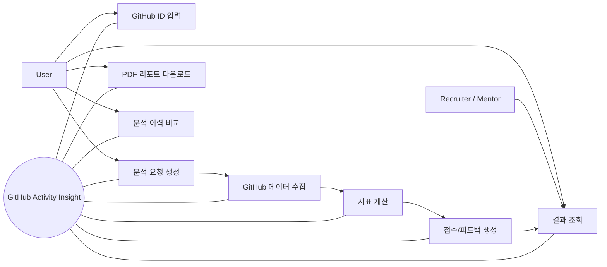
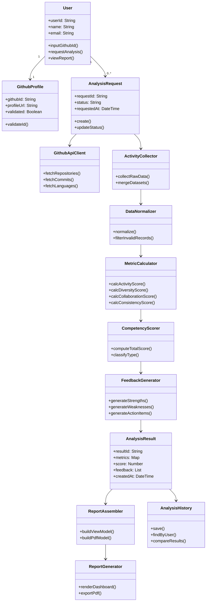

# GitHub Activity Insight


**GitHub 기반 개발자 실력 분석 및 피드백 웹 시스템**

| 정보 항목 | 내용 |
| :--- | :--- |
| Student No | 22212046 |
| Name | 안효원 |
| E-Mail | gydnjs3505@gmail.com |

**영남대학교 (Yeungnam University)**

---

### [ Revision history ]

| Revision date | Version # | Description | Author |
| :--- | :--- | :--- | :--- |
| 03/31/2026 | 1.00 | Initial analysis draft | 안효원 |
| 03/31/2026 | 1.10 | Use case/domain/UI details supplemented | 안효원 |

---

### Contents

1. **Introduction**
2. **Use case analysis**
3. **Domain Analysis**
4. **User Interface prototype**
5. **Glossary**
6. **References**

---

## 1. Introduction

GitHub Activity Insight는 GitHub 활동 데이터를 기반으로 개발자의 역량을 분석하고, 해석 가능한 피드백을 제공하는 웹 시스템이다. 본 문서는 시스템의 분석(Analysis) 단계 산출물로서, 핵심 유스케이스, 도메인 클래스, 사용자 인터페이스 초안을 정의한다. Conceptualization 단계에서 정의한 문제의식(정량 통계만으로는 역량 해석이 어려움)을 바탕으로, 본 단계에서는 기능 요구를 사용자 관점과 시스템 관점에서 구체화하여 이후 설계 및 구현 단계의 기준선을 마련한다.

프로젝트의 주요 특징은 다음과 같다.

- 유용성: 단순 활동량이 아닌 활동성, 기술 다양성, 협업도, 지속성을 종합 분석해 실질적 개선 방향을 제시한다.
- 중요성: 취업 준비생과 주니어 개발자가 GitHub 포트폴리오를 객관적으로 점검하고 보완할 수 있는 근거를 제공한다.
- 확장성: GitHub API 연동 모듈, 분석 모듈, 피드백 엔진, 리포트 생성기를 분리한 구조로 기능 확장이 용이하다.
- 추적 가능성: 분석 결과를 저장하고 이력을 비교할 수 있어 개선 전후 변화 확인이 가능하다.

본 분석 단계의 범위(Scope)는 다음과 같다.

- In Scope: GitHub ID 입력부터 데이터 수집, 지표 계산, 점수/피드백 생성, 결과 조회/비교/PDF 출력까지의 기능 흐름 정의
- In Scope: 핵심 도메인 클래스와 클래스 간 관계 식별, 사용자 화면 구조 및 시나리오 정의
- Out of Scope: 실제 알고리즘 파라미터 튜닝, 인프라 배포 아키텍처, 상세 DB 스키마 및 구현 코드

분석 단계 산출물의 목표는 기능 요구를 구조화하여 설계(Design) 단계에서 바로 상세 설계로 이어질 수 있도록 하는 데 있다.

---

## 2. Use case analysis

### 2.1 Use case diagram



### 2.2 Use case description

#### UC-01 GitHub ID 입력

| 항목 | 내용 |
| :--- | :--- |
| Primary Actor | User |
| Trigger | 사용자가 분석 시작 화면에 접근 |
| Precondition | 시스템 접속 가능 상태 |
| Main Flow | 1) User가 GitHub ID 입력 2) 시스템이 형식/존재 여부 1차 검증 3) 분석 요청 화면으로 이동 |
| Alternate Flow | 입력 형식 오류 시 재입력 요청 |
| Postcondition | 유효한 GitHub ID가 요청 컨텍스트에 저장됨 |

#### UC-02 분석 요청 생성

| 항목 | 내용 |
| :--- | :--- |
| Primary Actor | User |
| Trigger | User가 분석 시작 버튼 클릭 |
| Precondition | 유효한 GitHub ID 입력 완료 |
| Main Flow | 1) 시스템이 AnalysisRequest 생성 2) 요청 상태를 PENDING으로 설정 3) 수집 단계 실행 |
| Alternate Flow | 요청 큐 포화 시 대기열 등록 후 예상 시간 안내 |
| Postcondition | 추적 가능한 분석 요청 ID 발급 |

#### UC-03 GitHub 데이터 수집

| 항목 | 내용 |
| :--- | :--- |
| Primary Actor | System |
| Trigger | AnalysisRequest 생성 완료 |
| Precondition | GitHub API 접근 토큰/설정 유효 |
| Main Flow | 1) 저장소/커밋/언어 데이터 요청 2) 페이지네이션 처리 3) 원천 데이터 저장 |
| Alternate Flow | API rate limit 발생 시 backoff 재시도 |
| Postcondition | Raw Activity Data 확보 |

#### UC-04 지표 계산

| 항목 | 내용 |
| :--- | :--- |
| Primary Actor | System |
| Trigger | 원천 데이터 수집 완료 |
| Precondition | 정규화 가능한 데이터셋 존재 |
| Main Flow | 1) 데이터 정규화 2) 활동성/다양성/협업/지속성 지표 계산 3) 평가 엔진으로 전달 |
| Alternate Flow | 데이터 일부 누락 시 가능한 지표만 부분 계산 후 경고 표시 |
| Postcondition | Metrics 객체 생성 |

#### UC-05 점수 및 피드백 생성

| 항목 | 내용 |
| :--- | :--- |
| Primary Actor | System |
| Trigger | Metrics 산출 완료 |
| Precondition | 가중치 규칙/평가 기준 로딩 완료 |
| Main Flow | 1) 역량 점수 계산 2) 강점/약점 식별 3) 개선 액션 피드백 생성 |
| Alternate Flow | 평가 규칙 버전 불일치 시 기본 규칙 적용 |
| Postcondition | Score + Feedback 결과 생성 |

#### UC-06 결과 조회

| 항목 | 내용 |
| :--- | :--- |
| Primary Actor | User, Recruiter/Mentor |
| Trigger | 사용자/검토자가 결과 페이지 진입 |
| Precondition | 최소 1건 이상의 분석 완료 결과 존재 |
| Main Flow | 1) 요약 점수 표시 2) 지표 상세 및 근거 노출 3) 피드백 카드 제공 |
| Alternate Flow | 결과 없음 시 분석 시작 유도 화면 제공 |
| Postcondition | 해석 가능한 결과 시각화 제공 |

#### UC-07 PDF 리포트 다운로드

| 항목 | 내용 |
| :--- | :--- |
| Primary Actor | User |
| Trigger | PDF 다운로드 버튼 클릭 |
| Precondition | 결과 조회 화면 로딩 완료 |
| Main Flow | 1) 현재 결과를 템플릿에 바인딩 2) PDF 생성 3) 다운로드 제공 |
| Alternate Flow | 생성 실패 시 재시도 옵션 제공 |
| Postcondition | 공유 가능한 결과 문서 확보 |

#### UC-08 분석 이력 비교

| 항목 | 내용 |
| :--- | :--- |
| Primary Actor | User |
| Trigger | 이력 비교 기능 선택 |
| Precondition | 2건 이상의 분석 결과 저장 |
| Main Flow | 1) 기준 시점 선택 2) 지표 증감 비교 3) 개선/악화 항목 하이라이트 |
| Alternate Flow | 비교 대상 부족 시 안내 메시지 표시 |
| Postcondition | 개선 추세 파악 가능 |

### 2.3 Use case relationship and priority

| 관계 유형 | 내용 |
| :--- | :--- |
| 선행 관계 | UC-01 -> UC-02 -> UC-03 -> UC-04 -> UC-05 -> UC-06 |
| 선택 관계 | UC-07, UC-08은 UC-06 완료 후 선택적으로 수행 |
| include 성격 | UC-02는 UC-03을 포함하고, UC-03은 UC-04 처리로 이어짐 |
| extend 성격 | UC-07은 결과 공유가 필요할 때 UC-06에서 확장됨 |

| Use case | 우선순위 | 근거 |
| :--- | :--- | :--- |
| UC-01 GitHub ID 입력 | High | 전체 분석 흐름 시작점 |
| UC-02 분석 요청 생성 | High | 요청 추적 및 상태 관리의 핵심 |
| UC-03 GitHub 데이터 수집 | High | 분석 정확도의 기반 데이터 확보 |
| UC-04 지표 계산 | High | 핵심 가치(역량 해석) 산출 단계 |
| UC-05 점수/피드백 생성 | High | 서비스의 직접 산출물 |
| UC-06 결과 조회 | High | 사용자가 체감하는 핵심 기능 |
| UC-07 PDF 리포트 다운로드 | Medium | 공유/보관 편의 기능 |
| UC-08 분석 이력 비교 | Medium | 학습/개선 추세 확인 기능 |

문서 작성 형식은 12pt, 줄간격 160%를 기준으로 한다.

---

## 3. Domain analysis

### 3.1 Domain class diagram



### 3.2 Class identification and role

| 클래스 | 의미 | 역할 |
| :--- | :--- | :--- |
| User | 시스템 사용자(학생/개발자) | GitHub ID 입력, 분석 요청, 결과 조회/다운로드 수행 |
| GithubProfile | GitHub 계정 식별 정보 | 입력된 GitHub ID의 유효성 검증 및 프로필 메타 정보 보관 |
| AnalysisRequest | 분석 실행 요청 단위 | 요청 상태(PENDING/RUNNING/COMPLETED/FAILED) 추적 |
| GithubApiClient | 외부 API 연동 객체 | 저장소/커밋/언어 데이터 수집 |
| ActivityCollector | 원천 데이터 수집기 | API 응답 통합 및 데이터셋 구성 |
| DataNormalizer | 데이터 전처리 객체 | 형식 정규화, 결측/이상치 처리 |
| MetricCalculator | 지표 계산 객체 | 활동성, 다양성, 협업도, 지속성 지표 산출 |
| CompetencyScorer | 역량 점수 계산기 | 지표를 가중치 기반으로 통합해 점수화 |
| FeedbackGenerator | 피드백 생성기 | 점수와 지표를 해석해 강점/약점/개선 액션 생성 |
| AnalysisResult | 분석 결과 엔티티 | 점수, 지표, 피드백, 생성 시각을 포함한 결과 객체 |
| ReportAssembler | 출력 조합기 | 화면/PDF 출력을 위한 ViewModel 구성 |
| ReportGenerator | 결과 렌더러 | 대시보드 시각화 및 PDF 생성 |
| AnalysisHistory | 결과 이력 저장소 | 결과 저장, 조회, 시점 간 비교 기능 제공 |

### 3.3 Domain constraints and business rules

| 규칙 ID | 제약/규칙 |
| :--- | :--- |
| BR-01 | `GithubProfile.githubId`는 공백이 아닌 영문/숫자/하이픈 조합이어야 한다. |
| BR-02 | `AnalysisRequest.status`는 PENDING -> RUNNING -> COMPLETED/FAILED 상태 전이 규칙을 따른다. |
| BR-03 | 동일 사용자의 RUNNING 상태 요청은 최대 1건으로 제한한다(중복 분석 방지). |
| BR-04 | `AnalysisResult.score`는 0~100 범위를 벗어날 수 없다. |
| BR-05 | 지표 계산 입력 데이터가 임계치 미만인 경우 결과에 신뢰도 경고를 포함해야 한다. |
| BR-06 | `AnalysisHistory`에는 결과 생성 시각(`createdAt`) 기준으로 버전 이력이 저장되어야 한다. |

위 규칙은 설계 단계에서 상태머신 정의, 입력 검증 규칙, 데이터 무결성 제약으로 구체화한다.

---

## 4. User Interface prototype

### 4.1 Screen structure

1. Home/Start 화면
- GitHub ID 입력 필드
- 분석 시작 버튼
- 최근 분석 이력 바로가기

2. Analysis Progress 화면
- 요청 상태 배지(PENDING/RUNNING)
- 데이터 수집/지표 계산/피드백 생성 진행률
- 예상 완료 시간

3. Result Dashboard 화면
- 종합 역량 점수(게이지 또는 카드)
- 지표별 점수(활동성/다양성/협업도/지속성)
- 강점/약점/실행 액션 피드백
- PDF 다운로드 버튼

4. History Compare 화면
- 분석 시점 선택(기준/비교)
- 지표 증감 표 및 스파크라인
- 개선 항목 하이라이트

### 4.2 Low-fidelity UI mockup (text)

```text
[Header] GitHub Activity Insight

[Card] Analyze Your GitHub
	GitHub ID: [________________]
	[Start Analysis]

[Recent History]
	- 2026-03-20  Score: 72
	- 2026-03-27  Score: 78
	[Compare]
```

```text
[Result Dashboard]
Total Score: 81 (Advanced Junior)

Metrics
- Activity:      85
- Diversity:     76
- Collaboration: 68
- Consistency:   83

Strengths
1) 꾸준한 커밋 주기
2) 다수 프로젝트 유지

Improvements
1) PR/Issue 참여 비율 확대
2) 테스트 코드 비중 향상

[Download PDF] [Compare History]
```

### 4.3 Preliminary user manual style scenario

1. 사용자는 메인 화면에서 GitHub ID를 입력하고 Start Analysis를 클릭한다.
2. 시스템은 진행 화면에서 데이터 수집/분석 단계를 순차적으로 표시한다.
3. 분석 완료 후 결과 대시보드에서 종합 점수와 지표별 근거를 확인한다.
4. 개선 액션을 확인하고 필요 시 PDF 리포트를 다운로드한다.
5. History Compare 메뉴에서 과거 결과와 현재 결과를 비교해 개선 추세를 확인한다.

### 4.4 UI validation and feedback policy

| 화면 | 입력/동작 | 검증 규칙 | 사용자 피드백 |
| :--- | :--- | :--- | :--- |
| Home/Start | GitHub ID 입력 | 빈 값 금지, 길이/패턴 검증 | 오류 메시지와 재입력 가이드 제공 |
| Progress | 분석 상태 폴링 | 상태 전이 유효성 검증 | 단계별 진행률, 예상 시간 갱신 |
| Result Dashboard | 지표 카드 렌더링 | 결측 지표 존재 여부 확인 | 결측 시 "일부 지표 미산출" 배지 표시 |
| PDF Download | 문서 생성 요청 | 템플릿 바인딩 데이터 완전성 확인 | 실패 시 재시도 버튼 및 오류 코드 제공 |
| History Compare | 비교 시점 2개 선택 | 동일 시점 중복 선택 금지 | 유효하지 않은 선택 시 안내 메시지 표시 |

오류 메시지는 사용자가 즉시 수정 행동을 취할 수 있도록 "원인 + 해결 가이드" 형태로 작성한다.

---

## 5. Glossary

| 용어 | 정의 |
| :--- | :--- |
| GitHub API | GitHub가 제공하는 REST/GraphQL 인터페이스로 저장소, 커밋, 언어, 협업 활동 데이터를 조회하는 수단 |
| Raw Activity Data | API에서 수집한 원천 활동 데이터(저장소 목록, 커밋 로그, 언어 통계 등) |
| Metrics | 원천 데이터를 가공해 산출한 정량 지표(활동성, 다양성, 협업도, 지속성) |
| Competency Score | 다수 Metrics를 가중 결합해 계산한 종합 역량 점수 |
| Feedback | 점수/지표 해석을 통해 생성된 강점, 약점, 개선 행동 권고 |
| Analysis Request | 특정 시점의 분석 실행 단위 및 상태를 관리하는 요청 객체 |
| Analysis History | 사용자별 분석 결과의 저장 및 시계열 비교를 위한 이력 데이터 |
| Report Generator | 결과를 대시보드 또는 PDF 형태로 변환/출력하는 모듈 |
| Rate Limit | GitHub API 호출 횟수 제한 정책으로, 초과 시 일정 시간 요청이 제한되는 제약 |
| Backoff Retry | API 오류/제한 발생 시 대기 시간을 점진적으로 늘려 재시도하는 전략 |
| Pagination | 대량 API 응답을 여러 페이지로 분할해 순차적으로 조회하는 방식 |
| ViewModel | 화면 출력 목적에 맞게 가공된 데이터 구조로 UI 렌더링 입력 모델 |

---

## 6. References

1. GitHub, "REST API Documentation," GitHub Docs. Available: https://docs.github.com/en/rest (accessed: 2026-03-31).
2. GitHub, "GraphQL API Documentation," GitHub Docs. Available: https://docs.github.com/en/graphql (accessed: 2026-03-31).
3. E. Kalliamvakou et al., "The Promises and Perils of Mining GitHub Data," Empirical Software Engineering, Springer.
4. C. Bird et al., "The Promises and Perils of Mining GitHub," Proceedings of the International Working Conference on Mining Software Repositories (MSR).
5. OpenSSF, "Open Source Project Security Baseline." Available: https://baseline.openssf.org (accessed: 2026-03-31).
6. M. Fowler, "UML Distilled: A Brief Guide to the Standard Object Modeling Language," Addison-Wesley.
