# GitHub Activity Insight

GitHub 기반 개발자 실력 분석 및 피드백 웹 시스템

| 정보 항목 | 내용 |
| :--- | :--- |
| Student No | 22212046 |
| Name | 안효원 |
| E-Mail | [gydnjs3505@gmail.com](mailto:gydnjs3505@gmail.com) |

영남대학교 (Yeungnam University)

---

## Revision history

| Revision date | Version # | Description | Author |
| :--- | :--- | :--- | :--- |
| 2026-05-11 | 1.0 | Initial draft | 안효원 |
| 2026-05-11 | 1.1 | 클래스 다이어그램 초안 및 설명 추가 | 안효원 |
| 2026-05-14 | 1.2 | AnalysisService·AnalysisRepository 추가; trustLevel 속성, detectAnomalies 시그니처, ReportGenerator 의존 관계 보완 | 안효원 |
| 2026-05-22 | 1.3 | GitHub OAuth 2.0 인증 설계 추가: User, OAuthClient, AuthenticationService, Session | 안효원 |
| 2026-05-22 | 1.4 | 시퀀스 다이어그램(SD-01~SD-04) 및 AnalysisRequest 상태 머신 다이어그램 추가 | 안효원 |
| 2026-05-23 | 1.5 | 보안 강화: 전역 예외 처리, URL 인젝션 방어, 입력 검증, PostgreSQL 영속화 모델, 전 엔드포인트 인증 적용 | 안효원 |
| 2026-05-24 | 1.6 | Ubuntu 22.04+ / WSL2 환경 정렬; Section 5(구현 요구사항) 및 Section 7(References) 완성 | 안효원 |
| 2026-05-24 | 1.7 | 구현 정합: OAuth state 흐름, API 엔드포인트 경로, 비인증 요청 지원, 보안/비기능 요구사항 반영 | 안효원 |
| 2026-05-24 | 1.8 | 클래스 시그니처 전반 동기화(GithubProfile·AnalysisRequest·Metrics 등); 비동기 진행 및 상태 전이 정합 | 안효원 |
| 2026-05-26 | 1.9 | PDF 리포트(OpenPDF) 전환; GithubApiService 제거; CORS 환경변수 구성 추가 | 안효원 |
| 2026-05-27 | 2.0 | SD-05(UC-07 리포트 다운로드) 및 SD-06(UC-08 이력 비교) 시퀀스 다이어그램 추가 | 안효원 |
| 2026-05-28 | 2.1 | UC-00~UC-08 각 use case별 최소 1개 sequence diagram으로 재구성하고 설명 보강 | 안효원 |
| 2026-06-02 | 2.2 | 구현 반영: CANCELLED 상태, requestId 기반 결과/리포트 API, OAuth state 과부하 방어, 정기 정리 정책 추가 | 안효원 |
| 2026-06-03 | 2.3 | Added controller/DTO/entity/repository implementation mapping and execution verification notes | 안효원 |
| 2026-06-03 | 2.4 | Split detailed implementation requirements into a separate Implementation document | 안효원 |

---

## Contents

1. **Introduction**
2. **Class Diagram**
3. **Sequence Diagram**
4. **State Machine Diagram**
5. **Implementation requirements**
6. **Glossary**
7. **References**

---

## 1. Introduction

### 1.1 주제 선정 배경

GitHub는 개발자의 프로젝트 경험, 협업 이력, 기술 스택 변화가 모두 축적되는 대표적인 개발 플랫폼이다. 취업 준비생과 주니어 개발자는 GitHub를 포트폴리오로 활용하지만, 기존 GitHub 통계 도구는 저장소 수, 커밋 수, 사용 언어 비율 등 단순 정량 정보만 제공할 뿐, 그 수치가 의미하는 강점과 약점 또는 개선 방향까지 설명하지 못한다. 프로젝트 개발자인 나 역시 "내 GitHub 활동이 실제로 어떤 역량으로 보이는지", "무엇을 어떻게 보완해야 하는지"를 파악하기 어려운 불편함을 직접 경험하였고, 이를 해소하기 위해 본 주제를 선정하였다.

### 1.2 문제 정의

본 프로젝트가 해결하고자 하는 핵심 문제는 다음과 같다.

- **역량 해석 불가:** 기존 통계 도구는 활동량 수치만 제공하며, 활동성·기술 다양성·협업도·지속성을 종합한 역량 해석을 제공하지 않는다.
- **개선 방향 부재:** 점수나 통계만으로는 어떤 부분을 어떻게 개선해야 하는지 구체적인 행동 지침을 도출하기 어렵다.
- **평가 불투명성:** 결과의 산출 근거가 명확히 제시되지 않으면 사용자가 결과를 신뢰하기 어렵고, 실질적인 개선 행동으로 연결되지 않는다.
- **이력 추적 불가:** 포트폴리오를 개선한 이후 어느 지표가 얼마나 향상되었는지 시계열로 비교할 수 있는 수단이 없다.

### 1.3 해결 접근 방식

GitHub Activity Insight는 위 문제를 다음 방식으로 해결한다.

- **데이터 수집:** GitHub REST API를 통해 저장소, 커밋 로그, 언어 통계, Pull Request·Issue 참여 이력 등 원천 활동 데이터를 수집한다.
- **지표 계산(Metrics):** 수집 데이터를 정규화하여 활동성, 기술 다양성, 협업도, 지속성의 4개 핵심 지표를 0–100 척도로 산출한다.
- **점수 및 피드백 생성:** 지표에 가중치를 적용하여 종합 역량 점수를 계산하고, Developer Type(Beginner/Junior/Advanced)을 분류한 뒤, 약점별 맞춤형 개선 액션 아이템을 생성한다.
- **결과 저장 및 이력 비교:** 분석 결과를 데이터베이스에 저장하여 재조회·이력 비교가 가능하게 하고, OpenPDF를 사용하여 A4 PDF 리포트를 서버에서 직접 생성하여 다운로드로 제공한다.

시스템은 웹 애플리케이션, GitHub API 연동 모듈, 분석·평가 엔진, 리포트 생성기, 결과 저장소로 구성되며, 각 모듈을 분리하여 지표 산출 규칙 변경 시 핵심 코드 수정 범위를 최소화한다.

### 1.4 주 타겟층

| 대상 | 활용 목적 |
| :--- | :--- |
| 취업 준비생 / 주니어 개발자 | GitHub 포트폴리오를 객관적으로 점검하고 개선 방향을 파악 |
| 개인 개발자 | 자신의 개발 이력과 협업 활동 패턴을 정리하고 성장 추이 확인 |
| 채용 담당자 / 교육 멘토 | 지원자·교육생의 GitHub 활동을 정량 근거와 함께 참고 자료로 활용 |

### 1.5 설계 단계의 목표

본 문서는 시스템의 설계(Design) 단계 산출물로서, Analysis 단계에서 도출한 유스케이스(UC-01~UC-08)와 도메인 모델을 구체적인 소프트웨어 구조로 전환한다. 설계 단계의 목표는 다음과 같다.

- 도메인 클래스 간 관계, 속성, 오퍼레이션을 클래스 다이어그램으로 명세하여 구현 청사진을 확립한다.
- 핵심 유스케이스 시나리오에 대한 시퀀스 다이어그램으로 객체 간 협력 흐름을 정의한다.
- AnalysisRequest 생명주기(PENDING → RUNNING → COMPLETED / FAILED)를 상태 머신 다이어그램으로 명세한다.
- 구현 시 준수해야 할 기술 제약 및 비기능 요구사항을 구현 요구사항으로 정리하여 개발자가 직접 참조할 기준선을 마련한다.

### 1.6 범위(Scope)

- **In Scope:** 클래스 다이어그램, 시퀀스 다이어그램, 상태 머신 다이어그램 작성, 구현 요구사항 및 기술 제약 정의, 글로벌 예외 처리 전략, URL 인젝션 방어, 엔드포인트 인증 강화
- **Out of Scope:** 실제 알고리즘 파라미터 수치 결정, 인프라 배포 아키텍처 상세 설계, 데이터베이스 물리 스키마 및 구현 코드 작성

본 문서의 구성은 다음과 같다. 2장에서는 시스템의 정적 구조를 표현하는 클래스 다이어그램을 제시하고(OAuth 및 User 관리 클래스 포함), 3장에서는 주요 유스케이스 시나리오에 대한 시퀀스 다이어그램으로 동적 흐름을 정의한다. 4장에서는 AnalysisRequest의 상태 전이를 상태 머신 다이어그램으로 명세하며, 5장에서는 구현 시 준수해야 할 기술 요구사항, 보안 제약, 글로벌 예외 처리 전략 및 제약 조건을 정리한다.

---

## 2. Class Diagram

### 2.1 기본 데이터 타입 정의

시스템 전역에서 사용되는 기본 데이터 타입을 먼저 정의하여 각 클래스 다이어그램에서 반복을 제거한다.

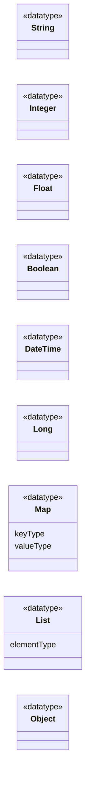
```mermaid
classDiagram
    direction LR
    
    class String {
        <<datatype>>
    }
    
    class Integer {
        <<datatype>>
    }
    
    class Float {
        <<datatype>>
    }
    
    class Boolean {
        <<datatype>>
    }
    
    class DateTime {
        <<datatype>>
    }
    
    class Long {
        <<datatype>>
    }
    
    class Map {
        <<datatype>>
        keyType
        valueType
    }
    
    class List {
        <<datatype>>
        elementType
    }
    
    class Object {
        <<datatype>>
    }
```

[그림 2-1] 기본 데이터 타입 정의

---

### 2.2 패키지 구조 및 계층도

시스템을 4개 주요 패키지(계층)로 구분하여 관심사를 분리하고 복잡도를 단계적으로 표현한다.

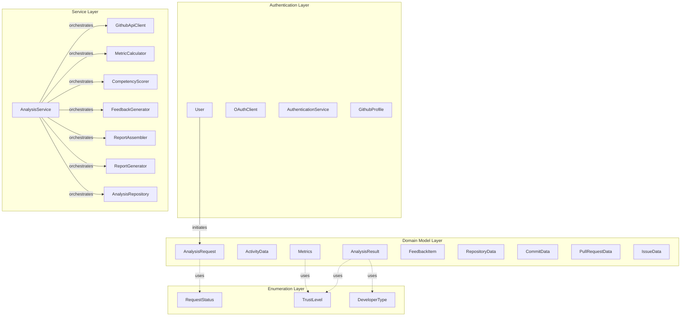
```mermaid
graph TD
    subgraph Authentication["Authentication Layer"]
        A1["User"]
        A2["OAuthClient"]
        A3["AuthenticationService"]
        A4["GithubProfile"]
    end
    
    subgraph Domain["Domain Model Layer"]
        D1["AnalysisRequest"]
        D2["ActivityData"]
        D3["Metrics"]
        D4["AnalysisResult"]
        D5["FeedbackItem"]
        D6["RepositoryData"]
        D7["CommitData"]
        D8["PullRequestData"]
        D9["IssueData"]
    end
    
    subgraph Services["Service Layer"]
        S1["GithubApiClient"]
        S2["MetricCalculator"]
        S3["CompetencyScorer"]
        S4["FeedbackGenerator"]
        S5["ReportAssembler"]
        S6["ReportGenerator"]
        S7["AnalysisService"]
        S8["AnalysisRepository"]
    end
    
    subgraph Enums["Enumeration Layer"]
        E1["RequestStatus"]
        E2["TrustLevel"]
        E3["DeveloperType"]
    end
    
    A1 -->|initiates| D1
    S7 -->|orchestrates| S1
    S7 -->|orchestrates| S2
    S7 -->|orchestrates| S3
    S7 -->|orchestrates| S4
    S7 -->|orchestrates| S5
    S7 -->|orchestrates| S6
    S7 -->|orchestrates| S8
    D1 -.->|uses| E1
    D3 -.->|uses| E2
    D4 -.->|uses| E3
    D4 -.->|uses| E2
```

[그림 2-2] 4계층 패키지 구조도

---

### 2.3 계층별 상세 클래스 다이어그램

#### 2.3.1 Authentication Layer (인증 계층)

사용자 인증 및 세션 관리를 담당하는 계층.

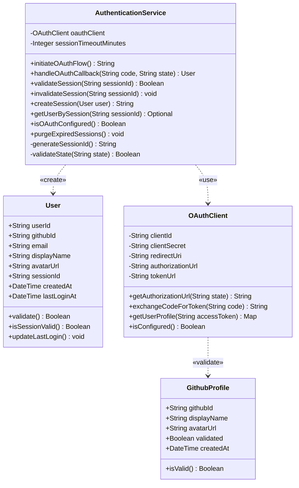
```mermaid
classDiagram
    direction TB

    class User {
        +String userId
        +String githubId
        +String email
        +String displayName
        +String avatarUrl
        +String sessionId
        +DateTime createdAt
        +DateTime lastLoginAt
        +validate() Boolean
        +isSessionValid() Boolean
        +updateLastLogin() void
    }


    class OAuthClient {
        -String clientId
        -String clientSecret
        -String redirectUri
        -String authorizationUrl
        -String tokenUrl
        +getAuthorizationUrl(String state) String
        +exchangeCodeForToken(String code) String
        +getUserProfile(String accessToken) Map
        +isConfigured() Boolean
    }

    class AuthenticationService {
        -OAuthClient oauthClient
        -Integer sessionTimeoutMinutes
        +initiateOAuthFlow() String
        +handleOAuthCallback(String code, String state) User
        +validateSession(String sessionId) Boolean
        +invalidateSession(String sessionId) void
        +createSession(User user) String
        +getUserBySession(String sessionId) Optional
        +isOAuthConfigured() Boolean
        +purgeExpiredSessions() void
        -generateSessionId() String
        -validateState(String state) Boolean
    }

    class GithubProfile {
        +String githubId
        +String displayName
        +String avatarUrl
        +Boolean validated
        +DateTime createdAt
        +isValid() Boolean
    }

    %% Authentication Layer Relationships
    AuthenticationService ..> OAuthClient : «use»
    AuthenticationService ..> User : «create»
    OAuthClient ..> GithubProfile : «validate»
```

[그림 2-3] Authentication Layer - 사용자 인증 및 세션 관리

---

#### 2.3.2 Domain Model Layer (도메인 모델 계층)

핵심 비즈니스 엔티티와 값 객체를 포함하는 계층. 분석 흐름의 각 단계별 데이터 구조를 표현한다.

##### 2.3.2.1 분석 요청 및 활동 데이터 서브계층

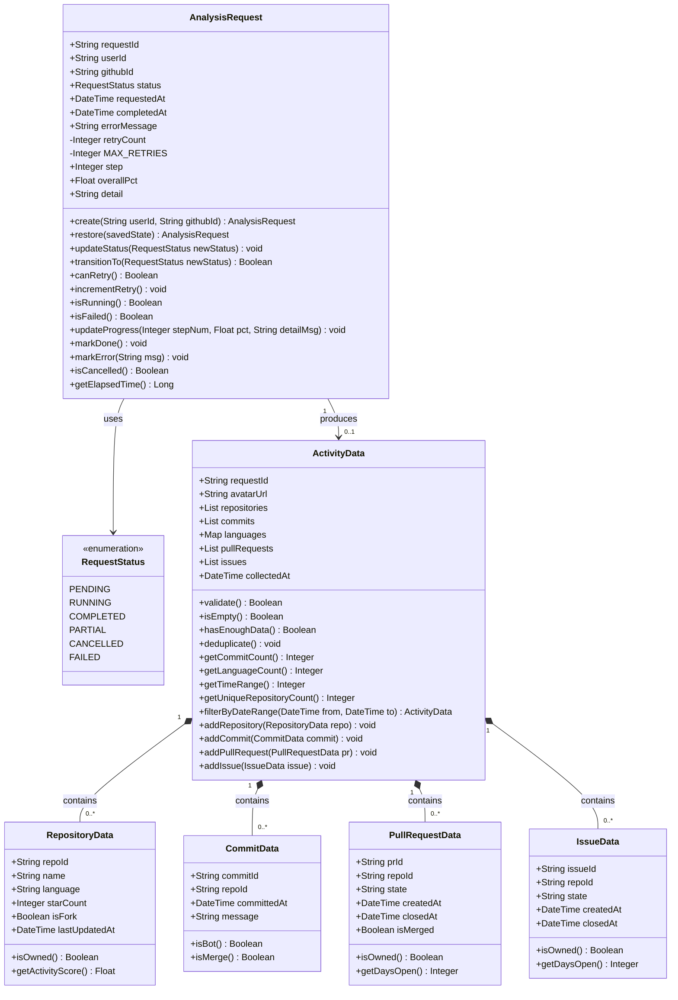
```mermaid
classDiagram
    direction TB

    class AnalysisRequest {
        +String requestId
        +String userId
        +String githubId
        +RequestStatus status
        +DateTime requestedAt
        +DateTime completedAt
        +String errorMessage
        -Integer retryCount
        -Integer MAX_RETRIES
        +Integer step
        +Float overallPct
        +String detail
        +create(String userId, String githubId) AnalysisRequest
        +restore(savedState) AnalysisRequest
        +updateStatus(RequestStatus newStatus) void
        +transitionTo(RequestStatus newStatus) Boolean
        +canRetry() Boolean
        +incrementRetry() void
        +isRunning() Boolean
        +isFailed() Boolean
        +updateProgress(Integer stepNum, Float pct, String detailMsg) void
        +markDone() void
        +markError(String msg) void
        +isCancelled() Boolean
        +getElapsedTime() Long
    }

    class RequestStatus {
        <<enumeration>>
        PENDING
        RUNNING
        COMPLETED
        PARTIAL
        CANCELLED
        FAILED
    }

    class ActivityData {
        +String requestId
        +String avatarUrl
        +List repositories
        +List commits
        +Map languages
        +List pullRequests
        +List issues
        +DateTime collectedAt
        +validate() Boolean
        +isEmpty() Boolean
        +hasEnoughData() Boolean
        +deduplicate() void
        +getCommitCount() Integer
        +getLanguageCount() Integer
        +getTimeRange() Integer
        +getUniqueRepositoryCount() Integer
        +filterByDateRange(DateTime from, DateTime to) ActivityData
        +addRepository(RepositoryData repo) void
        +addCommit(CommitData commit) void
        +addPullRequest(PullRequestData pr) void
        +addIssue(IssueData issue) void
    }

    class RepositoryData {
        +String repoId
        +String name
        +String language
        +Integer starCount
        +Boolean isFork
        +DateTime lastUpdatedAt
        +isOwned() Boolean
        +getActivityScore() Float
    }

    class CommitData {
        +String commitId
        +String repoId
        +DateTime committedAt
        +String message
        +isBot() Boolean
        +isMerge() Boolean
    }

    class PullRequestData {
        +String prId
        +String repoId
        +String state
        +DateTime createdAt
        +DateTime closedAt
        +Boolean isMerged
        +isOwned() Boolean
        +getDaysOpen() Integer
    }

    class IssueData {
        +String issueId
        +String repoId
        +String state
        +DateTime createdAt
        +DateTime closedAt
        +isOwned() Boolean
        +getDaysOpen() Integer
    }

    %% Relationships
    AnalysisRequest --> RequestStatus : uses
    AnalysisRequest "1" --> "0..1" ActivityData : produces
    ActivityData "1" *-- "0..*" RepositoryData : contains
    ActivityData "1" *-- "0..*" CommitData : contains
    ActivityData "1" *-- "0..*" PullRequestData : contains
    ActivityData "1" *-- "0..*" IssueData : contains
```

[그림 2-4] Domain Layer Part.1 - 분석 요청 및 활동 데이터

---

##### 2.3.2.2 지표 및 분석 결과 서브계층

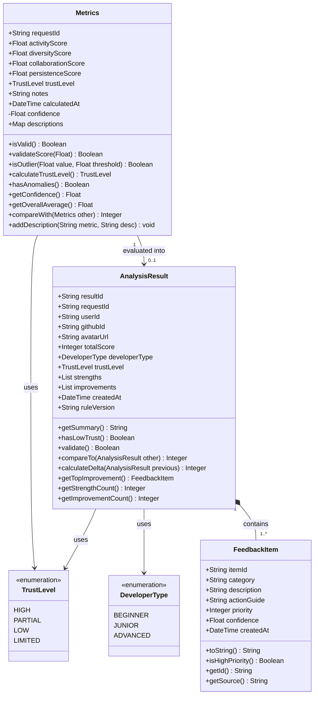
```mermaid
classDiagram
    direction TB

    class Metrics {
        +String requestId
        +Float activityScore
        +Float diversityScore
        +Float collaborationScore
        +Float persistenceScore
        +TrustLevel trustLevel
        +String notes
        +DateTime calculatedAt
        -Float confidence
        +Map descriptions
        +isValid() Boolean
        +validateScore(Float) Boolean
        +isOutlier(Float value, Float threshold) Boolean
        +calculateTrustLevel() TrustLevel
        +hasAnomalies() Boolean
        +getConfidence() Float
        +getOverallAverage() Float
        +compareWith(Metrics other) Integer
        +addDescription(String metric, String desc) void
    }

    class TrustLevel {
        <<enumeration>>
        HIGH
        PARTIAL
        LOW
        LIMITED
    }

    class AnalysisResult {
        +String resultId
        +String requestId
        +String userId
        +String githubId
        +String avatarUrl
        +Integer totalScore
        +DeveloperType developerType
        +TrustLevel trustLevel
        +List strengths
        +List improvements
        +DateTime createdAt
        +String ruleVersion
        +getSummary() String
        +hasLowTrust() Boolean
        +validate() Boolean
        +compareTo(AnalysisResult other) Integer
        +calculateDelta(AnalysisResult previous) Integer
        +getTopImprovement() FeedbackItem
        +getStrengthCount() Integer
        +getImprovementCount() Integer
    }

    class DeveloperType {
        <<enumeration>>
        BEGINNER
        JUNIOR
        ADVANCED
    }

    class FeedbackItem {
        +String itemId
        +String category
        +String description
        +String actionGuide
        +Integer priority
        +Float confidence
        +DateTime createdAt
        +toString() String
        +isHighPriority() Boolean
        +getId() String
        +getSource() String
    }

    %% Relationships
    Metrics --> TrustLevel : uses
    Metrics "1" --> "0..1" AnalysisResult : evaluated into
    AnalysisResult --> DeveloperType : uses
    AnalysisResult --> TrustLevel : uses
    AnalysisResult "1" *-- "1..*" FeedbackItem : contains
```

[그림 2-5] Domain Layer Part.2 - 지표 및 분석 결과

---

### 2.4 서비스 계층 클래스 다이어그램

#### 2.4.1 데이터 수집 서비스 (GithubApiClient)

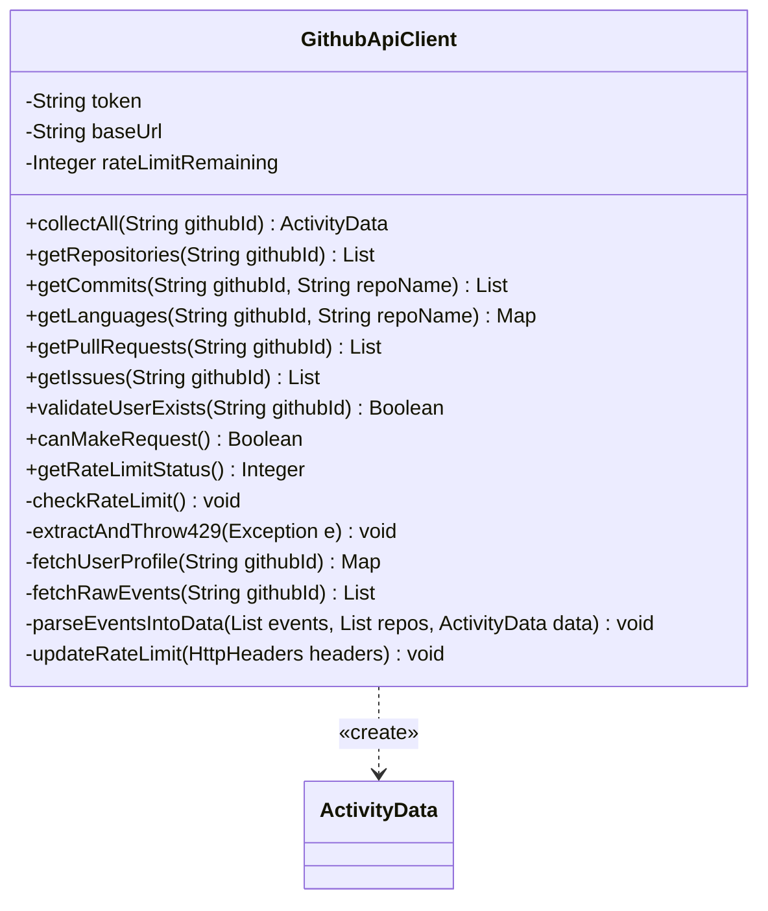
```mermaid
classDiagram
    direction TB

    class GithubApiClient {
        -String token
        -String baseUrl
        -Integer rateLimitRemaining
        +collectAll(String githubId) ActivityData
        +getRepositories(String githubId) List
        +getCommits(String githubId, String repoName) List
        +getLanguages(String githubId, String repoName) Map
        +getPullRequests(String githubId) List
        +getIssues(String githubId) List
        +validateUserExists(String githubId) Boolean
        +canMakeRequest() Boolean
        +getRateLimitStatus() Integer
        -checkRateLimit() void
        -extractAndThrow429(Exception e) void
        -fetchUserProfile(String githubId) Map
        -fetchRawEvents(String githubId) List
        -parseEventsIntoData(List events, List repos, ActivityData data) void
        -updateRateLimit(HttpHeaders headers) void
    }

    GithubApiClient ..> ActivityData : «create»
```

[그림 2-6] Service Layer - GithubApiClient (데이터 수집)

---

#### 2.4.2 지표 계산 및 평가 서비스

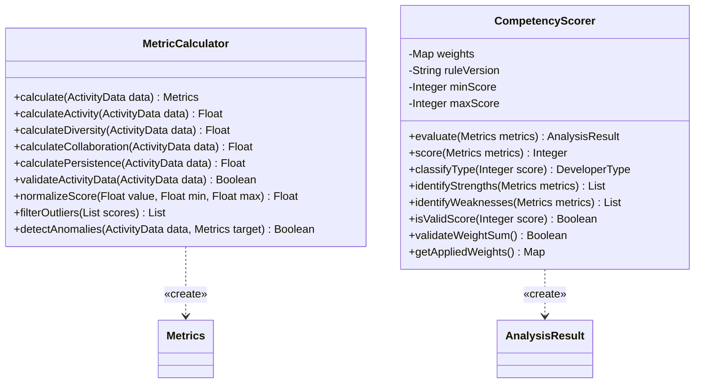
```mermaid
classDiagram
    direction TB

    class MetricCalculator {
        +calculate(ActivityData data) Metrics
        +calculateActivity(ActivityData data) Float
        +calculateDiversity(ActivityData data) Float
        +calculateCollaboration(ActivityData data) Float
        +calculatePersistence(ActivityData data) Float
        +validateActivityData(ActivityData data) Boolean
        +normalizeScore(Float value, Float min, Float max) Float
        +filterOutliers(List scores) List
        +detectAnomalies(ActivityData data, Metrics target) Boolean
    }

    class CompetencyScorer {
        -Map weights
        -String ruleVersion
        -Integer minScore
        -Integer maxScore
        +evaluate(Metrics metrics) AnalysisResult
        +score(Metrics metrics) Integer
        +classifyType(Integer score) DeveloperType
        +identifyStrengths(Metrics metrics) List
        +identifyWeaknesses(Metrics metrics) List
        +isValidScore(Integer score) Boolean
        +validateWeightSum() Boolean
        +getAppliedWeights() Map
    }

    MetricCalculator ..> Metrics : «create»
    CompetencyScorer ..> AnalysisResult : «create»
```

[그림 2-7] Service Layer - 지표 계산 및 평가

---

#### 2.4.3 피드백 및 리포트 생성 서비스

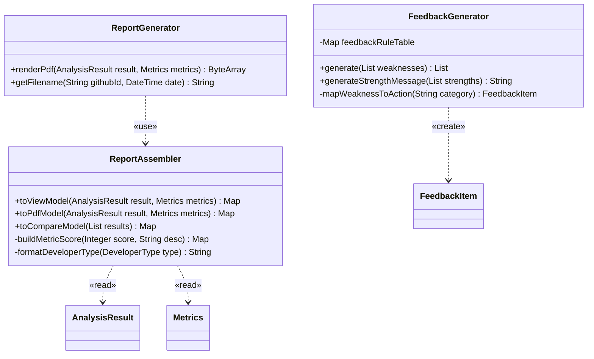
```mermaid
classDiagram
    direction TB

    class FeedbackGenerator {
        -Map feedbackRuleTable
        +generate(List weaknesses) List
        +generateStrengthMessage(List strengths) String
        -mapWeaknessToAction(String category) FeedbackItem
    }

    class ReportAssembler {
        +toViewModel(AnalysisResult result, Metrics metrics) Map
        +toPdfModel(AnalysisResult result, Metrics metrics) Map
        +toCompareModel(List results) Map
        -buildMetricScore(Integer score, String desc) Map
        -formatDeveloperType(DeveloperType type) String
    }

    class ReportGenerator {
        +renderPdf(AnalysisResult result, Metrics metrics) ByteArray
        +getFilename(String githubId, DateTime date) String
    }

    FeedbackGenerator ..> FeedbackItem : «create»
    ReportAssembler ..> AnalysisResult : «read»
    ReportAssembler ..> Metrics : «read»
    ReportGenerator ..> ReportAssembler : «use»
```

[그림 2-8] Service Layer - 피드백 및 리포트 생성

---

#### 2.4.4 오케스트레이션 및 영속화 서비스

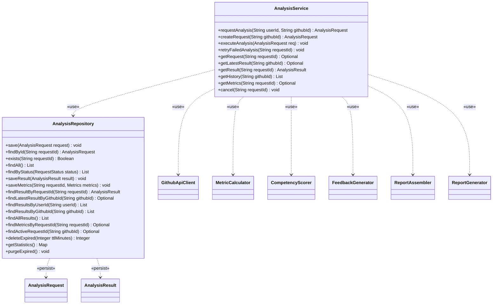
```mermaid
classDiagram
    direction TB

    class AnalysisService {
        +requestAnalysis(String userId, String githubId) AnalysisRequest
        +createRequest(String githubId) AnalysisRequest
        +executeAnalysis(AnalysisRequest req) void
        +retryFailedAnalysis(String requestId) void
        +getRequest(String requestId) Optional
        +getLatestResult(String githubId) Optional
        +getResult(String requestId) AnalysisResult
        +getHistory(String githubId) List
        +getMetrics(String requestId) Optional
        +cancel(String requestId) void
    }

    class AnalysisRepository {
        +save(AnalysisRequest request) void
        +findById(String requestId) AnalysisRequest
        +exists(String requestId) Boolean
        +findAll() List
        +findByStatus(RequestStatus status) List
        +saveResult(AnalysisResult result) void
        +saveMetrics(String requestId, Metrics metrics) void
        +findResultByRequestId(String requestId) AnalysisResult
        +findLatestResultByGithubId(String githubId) Optional
        +findResultsByUserId(String userId) List
        +findResultsByGithubId(String githubId) List
        +findAllResults() List
        +findMetricsByRequestId(String requestId) Optional
        +findActiveRequestId(String githubId) Optional
        +deleteExpired(Integer ttlMinutes) Integer
        +getStatistics() Map
        +purgeExpired() void
    }

    AnalysisService ..> GithubApiClient : «use»
    AnalysisService ..> MetricCalculator : «use»
    AnalysisService ..> CompetencyScorer : «use»
    AnalysisService ..> FeedbackGenerator : «use»
    AnalysisService ..> ReportAssembler : «use»
    AnalysisService ..> ReportGenerator : «use»
    AnalysisService ..> AnalysisRepository : «use»
    AnalysisRepository ..> AnalysisRequest : «persist»
    AnalysisRepository ..> AnalysisResult : «persist»
```

[그림 2-9] Service Layer - 오케스트레이션 및 영속화

---

### 2.5 전체 계층 통합 다이어그램 (축약 버전)

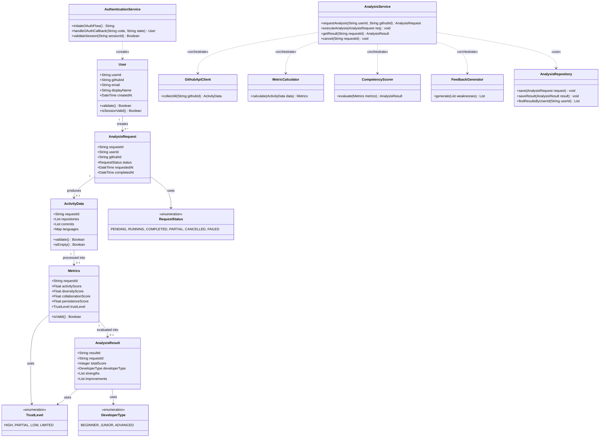
```mermaid
classDiagram
    direction TB

    %% Authentication Layer
    class User {
        +String userId
        +String githubId
        +String email
        +String displayName
        +DateTime createdAt
        +validate() Boolean
        +isSessionValid() Boolean
    }

    class AuthenticationService {
        +initiateOAuthFlow() String
        +handleOAuthCallback(String code, String state) User
        +validateSession(String sessionId) Boolean
    }

    %% Domain Layer - Key Entities
    class AnalysisRequest {
        +String requestId
        +String userId
        +String githubId
        +RequestStatus status
        +DateTime requestedAt
        +DateTime completedAt
    }

    class ActivityData {
        +String requestId
        +List repositories
        +List commits
        +Map languages
        +validate() Boolean
        +isEmpty() Boolean
    }

    class Metrics {
        +String requestId
        +Float activityScore
        +Float diversityScore
        +Float collaborationScore
        +Float persistenceScore
        +TrustLevel trustLevel
        +isValid() Boolean
    }

    class AnalysisResult {
        +String resultId
        +String requestId
        +Integer totalScore
        +DeveloperType developerType
        +List strengths
        +List improvements
    }

    %% Service Layer
    class GithubApiClient {
        +collectAll(String githubId) ActivityData
    }

    class MetricCalculator {
        +calculate(ActivityData data) Metrics
    }

    class CompetencyScorer {
        +evaluate(Metrics metrics) AnalysisResult
    }

    class FeedbackGenerator {
        +generate(List weaknesses) List
    }

    class AnalysisService {
        +requestAnalysis(String userId, String githubId) AnalysisRequest
        +executeAnalysis(AnalysisRequest req) void
        +getResult(String requestId) AnalysisResult
        +cancel(String requestId) void
    }

    class AnalysisRepository {
        +save(AnalysisRequest request) void
        +saveResult(AnalysisResult result) void
        +findResultsByUserId(String userId) List
    }

    %% Enumerations
    class RequestStatus {
        <<enumeration>>
        PENDING, RUNNING, COMPLETED, PARTIAL, CANCELLED, FAILED
    }

    class TrustLevel {
        <<enumeration>>
        HIGH, PARTIAL, LOW, LIMITED
    }

    class DeveloperType {
        <<enumeration>>
        BEGINNER, JUNIOR, ADVANCED
    }

    %% Relationships
    AuthenticationService ..> User : «create»
    User "1" --> "0..*" AnalysisRequest : creates
    
    AnalysisRequest --> RequestStatus : uses
    AnalysisRequest "1" --> "0..1" ActivityData : produces
    ActivityData "1" --> "0..1" Metrics : processed into
    Metrics --> TrustLevel : uses
    Metrics "1" --> "0..1" AnalysisResult : evaluated into
    AnalysisResult --> DeveloperType : uses
    AnalysisResult --> TrustLevel : uses
    
    AnalysisService ..> GithubApiClient : «orchestrate»
    AnalysisService ..> MetricCalculator : «orchestrate»
    AnalysisService ..> CompetencyScorer : «orchestrate»
    AnalysisService ..> FeedbackGenerator : «orchestrate»
    AnalysisService ..> AnalysisRepository : «use»
```

[그림 2-10] 전체 계층 통합 다이어그램 (축약)

---

### 2.6 클래스 상세 설명

#### 2.6.1 도메인 엔티티 클래스

도메인 엔티티 클래스는 시스템의 핵심 데이터를 보관하며, 분석 흐름의 각 단계에서 생성·갱신·참조된다.

---

##### User

클래스 개요

| 항목 | 내용 |
| :--- | :--- |
| 역할 | GitHub OAuth 2.0을 통해 인증된 사용자 정보를 저장한다. 각 사용자의 세션, 분석 이력, 권한을 관리하는 중심 엔티티. |
| 참여 UC | UC-00 (GitHub OAuth 로그인), UC-01~08 (인증된 사용자 활동) |
| 관계 | User(1) → AnalysisRequest(0..*), User(1) → AnalysisResult(0..*) |

속성

| 이름 | 가시성 | 타입 | 기본값 | 설명 |
| :--- | :---: | :--- | :--- | :--- |
| userId | + | String | UUID.generate() | 시스템 내 사용자 고유 식별자. UUID 형식. |
| githubId | + | String | - | GitHub 사용자 식별자. 프로필 조회 및 데이터 수집의 기준. |
| email | + | String | - | GitHub 등록 이메일. 알림 및 연락 목적. |
| displayName | + | String | "" | GitHub 표시 이름. UI 렌더링용. |
| avatarUrl | + | String | "" | GitHub 아바타 이미지 URL. |
| sessionId | + | String | null | 현재 유효한 세션 ID. HttpOnly 쿠키에 저장됨. |
| createdAt | + | DateTime | now() | 계정 생성 시각. |
| lastLoginAt | + | DateTime | null | 마지막 로그인 시각. |

오퍼레이션

| 이름 | 시그니처 | 반환 타입 | 설명 |
| :--- | :--- | :---: | :--- |
| validate | validate() | Boolean | 필수 필드(userId, githubId, email)가 모두 채워져 있고 형식이 유효하면 true 반환. |
| isSessionValid | isSessionValid() | Boolean | sessionId가 null이 아니고 타임아웃이 경과하지 않았으면 true 반환. |
| updateLastLogin | updateLastLogin() | void | lastLoginAt을 현재 시각으로 갱신한다. |

**추가 설명**

- **세션 관리**: sessionId는 HttpOnly 쿠키에만 저장되며, JavaScript 접근 불가 (XSS 방어)
- **데이터 격리**: 사용자별 AnalysisResult 조회 시 userId 필터 적용으로 데이터 격리 확보
- **라이프사이클**: OAuth 콜백 후 생성 → 세션 활성 동안 유지 → 로그아웃 시 세션 무효화 → 일정 TTL 후 DB에서 삭제
- **입력 검증**: 모든 사용자 입력(userId, githubId 등)에 대해 null 체크, 길이 검증, 특수 문자 제거 수행
- **글로벌 예외 처리**: 인증 과정의 모든 단계에서 예외를 캡처하여 로깅하고 사용자에게 안전한 에러 메시지 제공

---

##### OAuthClient

클래스 개요

| 항목 | 내용 |
| :--- | :--- |
| 역할 | GitHub OAuth 2.0 API 호출을 캡슐화한다. Authorization Code + state 검증 기반 인증과 토큰 관리를 담당하는 외부 인증 클라이언트. |
| 참여 UC | UC-00 (GitHub OAuth 로그인) |
| 관계 | OAuthClient ..> AuthenticationService : «use» |

속성

| 이름 | 가시성 | 타입 | 기본값 | 설명 |
| :--- | :---: | :--- | :--- | :--- |
| clientId | - | String | - | GitHub OAuth App Client ID. 환경 변수로 주입. |
| clientSecret | - | String | - | GitHub OAuth App Client Secret. 환경 변수로 주입. 외부 노출 금지. |
| redirectUri | - | String | "https://localhost:8080/auth/callback" | OAuth 인증 완료 후 리다이렉트 URI. |
| authorizationUrl | - | String | "https://github.com/login/oauth/authorize" | GitHub OAuth 인증 엔드포인트. |
| tokenUrl | - | String | "https://github.com/login/oauth/access_token" | GitHub OAuth 토큰 엔드포인트. |

오퍼레이션

| 이름 | 시그니처 | 반환 타입 | 설명 |
| :--- | :--- | :---: | :--- |
| getAuthorizationUrl | getAuthorizationUrl(String state) | String | OAuth state를 포함한 GitHub 인증 URL을 반환한다. state는 CSRF 방어용이다. |
| exchangeCodeForToken | exchangeCodeForToken(String code) | String | 인증 코드를 사용해 Access Token을 획득하여 반환한다. |
| getUserProfile | getUserProfile(String accessToken) | Map\<String, Object\> | Access Token으로 GitHub API를 호출하여 사용자 프로필 정보를 반환한다. |
| isConfigured | isConfigured() | Boolean | OAuth Client ID/Secret 환경변수 설정 여부를 반환한다. |

**추가 설명**

- **인증 플로우**: 현재 구현은 Authorization Code Flow + state(CSRF 방어) 기반이다.
- **보안 고려사항**: clientSecret은 절대 클라이언트 측에 노출되지 않으며, 서버에서만 관리. 환경 변수로 안전하게 주입
- **상태 검증**: state 파라미터는 세션당 1회용이며, CSRF 공격 방어. 모든 redirectUri 파라미터에 대해 URL 인젝션 방어
- **입력 검증**: exchangeCodeForToken 호출 시 code 포맷 검증, 특수 문자 제거
- **URL 인젝션 방어**: getAuthorizationUrl 반환값에 대해 redirectUri와 기타 파라미터의 URL 인코딩 검증

---

##### AuthenticationService

클래스 개요

| 항목 | 내용 |
| :--- | :--- |
| 역할 | OAuth 플로우 전체와 세션 관리를 오케스트레이션한다. UC-00 로그인 흐름의 중심 서비스 클래스. |
| 참여 UC | UC-00 (GitHub OAuth 로그인) |
| 관계 | AuthenticationService ..> OAuthClient : «use», AuthenticationService ..> User : «create» |

속성

| 이름 | 가시성 | 타입 | 기본값 | 설명 |
| :--- | :---: | :--- | :--- | :--- |
| oauthClient | - | OAuthClient | - | GitHub OAuth 2.0 클라이언트. 의존성 주입. |
| sessionTimeoutMinutes | - | Integer | 30 | 세션 유효 시간(분). 설정 가능. |

오퍼레이션

| 이름 | 시그니처 | 반환 타입 | 설명 |
| :--- | :--- | :---: | :--- |
| initiateOAuthFlow | initiateOAuthFlow() | String | OAuth state를 생성/저장하고 인증 URL을 반환하여 사용자를 GitHub로 리다이렉트한다. |
| handleOAuthCallback | handleOAuthCallback(String code, String state) | User | OAuth 콜백을 처리한다. 1) state 검증, 2) code로 Token 획득, 3) 사용자 프로필 조회, 4) User 저장/갱신, 5) 세션 생성 후 반환. |
| validateSession | validateSession(String sessionId) | Boolean | sessionId가 유효하고 타임아웃되지 않았으면 true 반환. 타임아웃 체크 후 lastActivityTime 갱신. |
| invalidateSession | invalidateSession(String sessionId) | void | 명시적 로그아웃 시 세션을 무효화한다. |
| createSession | createSession(User user) | String | User를 위한 새로운 세션을 생성하고 sessionId를 반환한다. lastActivityTime을 기록. |
| getUserBySession | getUserBySession(String sessionId) | Optional\<User\> | 세션 검증에 성공한 경우 해당 사용자 정보를 반환한다. |
| isOAuthConfigured | isOAuthConfigured() | Boolean | OAuth 설정 유효 여부를 반환한다. |
| purgeExpiredSessions | purgeExpiredSessions() | void | 스케줄러로 만료된 세션을 주기적으로 정리한다. |
| validateState | validateState(String state) | Boolean | state의 존재 및 만료 여부를 검증한다. |

**추가 설명**

- **세션 타임아웃**: 마지막 활동 시각 기준으로 sessionTimeoutMinutes 경과 시 자동 무효화
- **동시성 처리**: 세션 생성/검증 시 thread-safe한 Map 사용 (ConcurrentHashMap 등)
- **예외 상황**: OAuth 토큰 발급 실패 시 상세 에러 메시지 로깅 (개발자 디버깅용)

---

##### GithubProfile

클래스 개요

| 항목 | 내용 |
| :--- | :--- |
| 역할 | 분석 대상 GitHub 계정 정보를 저장하고 입력된 GitHub ID의 유효성을 관리한다. |
| 참여 UC | UC-01 (GitHub ID 입력) |
| 관계 | GithubProfile(1) → AnalysisRequest(0..*) |

속성

| 이름 | 가시성 | 타입 | 기본값 | 설명 |
| :--- | :---: | :--- | :--- | :--- |
| githubId | + | String | - | GitHub 계정 식별자. 영문·숫자·하이픈 형식. 시스템 전체 식별 키. |
| displayName | + | String | "" | GitHub 프로필 표시 이름. API 조회 결과로 설정. |
| avatarUrl | + | String | "" | GitHub 아바타 이미지 URL. |
| validated | + | Boolean | false | GitHub API를 통한 계정 존재 확인 여부. true일 때만 AnalysisRequest 생성 허용. |
| createdAt | + | DateTime | now() | 객체 생성 시각. |

오퍼레이션

| 이름 | 시그니처 | 반환 타입 | 설명 |
| :--- | :--- | :---: | :--- |
| isValid | isValid() | Boolean | validated=true이고 githubId 형식(영문·숫자·하이픈)이 유효하면 true 반환. |

**추가 설명**

- **검증 규칙**: githubId는 1~39자, 영문/숫자/하이픈만 허용. 숫자 또는 하이픈으로 시작/종료 불가
- **검증 책임 분리**: GithubProfile은 형식/상태(validated)만 표현하며, 실존 여부 검증은 GithubController/GithubApiClient에서 수행
- **캐싱 고려**: 1시간 내 동일 githubId의 중복 검증은 캐시된 결과 사용

##### AnalysisRequest

클래스 개요

| 항목 | 내용 |
| :--- | :--- |
| 역할 | 분석 요청의 생명주기를 추적하는 중심 엔티티. PENDING → RUNNING → COMPLETED/FAILED 상태 전이를 관리한다. |
| 참여 UC | UC-02 (분석 요청 생성), UC-03~05 (상태 전이) |
| 관계 | GithubProfile(1) → AnalysisRequest(0..*), AnalysisRequest(1) → ActivityData(0..1) |

속성

| 이름 | 가시성 | 타입 | 기본값 | 설명 |
| :--- | :---: | :--- | :--- | :--- |
| requestId | + | String | UUID.generate() | 요청 고유 식별자. UUID 형식으로 자동 생성. |
| userId | + | String | - | 분석을 요청한 인증된 사용자 ID. 데이터 격리 및 권한 관리에 사용. |
| githubId | + | String | - | 분석 대상 GitHub ID. GithubProfile 연결 키. |
| status | + | RequestStatus | PENDING | 현재 처리 상태. |
| requestedAt | + | DateTime | now() | 요청 생성 시각. |
| completedAt | + | DateTime | null | 완료 또는 실패 확정 시각. |
| errorMessage | + | String | null | 실패 시 오류 원인 메시지. |
| retryCount | - | Integer | 0 | 현재까지의 재시도 횟수. 최대값 3. |

오퍼레이션

| 이름 | 시그니처 | 반환 타입 | 설명 |
| :--- | :--- | :---: | :--- |
| create | create(String userId, String githubId) | AnalysisRequest | userId와 githubId를 받아 requestId를 발급하고 status=PENDING으로 초기화한 인스턴스를 반환한다. 정적 팩토리 메서드. |
| updateStatus | updateStatus(RequestStatus newStatus) | void | 상태를 전이하고 COMPLETED·FAILED·PARTIAL·CANCELLED 전이 시 completedAt을 기록한다. |
| transitionTo | transitionTo(RequestStatus newStatus) | Boolean | 상태 전이의 유효성(PENDING→RUNNING, RUNNING→COMPLETED/FAILED/CANCELLED 등)을 검증한 뒤 전이 가능하면 true, 불가능하면 false 반환. |
| canRetry | canRetry() | Boolean | retryCount < 3이고 isFailed()이면 true 반환. |
| incrementRetry | incrementRetry() | void | retryCount를 1 증가시킨다. |
| isRunning | isRunning() | Boolean | status가 PENDING 또는 RUNNING이면 true 반환. |
| isFailed | isFailed() | Boolean | status가 FAILED이면 true 반환. |
| getElapsedTime | getElapsedTime() | Long | requestedAt에서 completedAt(또는 현재)까지의 밀리초 단위 경과 시간. |

**추가 설명**

- **상태 전이 규칙**: PENDING → RUNNING → (COMPLETED|PARTIAL|CANCELLED|FAILED). 역방향 전이는 허용되지 않음
- **재시도 전략**: FAILED 상태에서만 재시도 가능. 3회 초과 시 canRetry()=false로 최종 실패 처리
- **데이터 격리**: userId 필터로 사용자별 요청 격리. 타 사용자의 요청 조회 불가
- **감사 추적**: requestedAt, completedAt, errorMessage로 분석 과정의 완전한 추적 가능

---

##### ActivityData

클래스 개요

| 항목 | 내용 |
| :--- | :--- |
| 역할 | GitHub API에서 수집된 원천 활동 데이터를 통합 보관한다. 지표 계산의 입력 데이터 구조. |
| 참여 UC | UC-03 (GitHub 데이터 수집), UC-04 (지표 계산 입력) |
| 관계 | AnalysisRequest(1) → ActivityData(0..1), ActivityData(1) *-- RepositoryData/CommitData/PullRequestData/IssueData(0..*), ActivityData(1) → Metrics(0..1) |

속성

| 이름 | 가시성 | 타입 | 기본값 | 설명 |
| :--- | :---: | :--- | :--- | :--- |
| requestId | + | String | - | 연결된 AnalysisRequest 식별자. |
| avatarUrl | + | String | "" | 분석 대상 프로필 아바타 URL. |
| repositories | + | List\<RepositoryData\> | [] | 조회된 저장소 목록. |
| commits | + | List\<CommitData\> | [] | 저장소별 커밋 이력(최대 1년). |
| languages | + | Map\<String, Long\> | {} | 언어명 → 바이트 수 매핑. |
| pullRequests | + | List\<PullRequestData\> | [] | PR 참여 이력. |
| issues | + | List\<IssueData\> | [] | Issue 참여 이력. |
| collectedAt | + | DateTime | null | 수집 완료 시각. |

오퍼레이션

| 이름 | 시그니처 | 반환 타입 | 설명 |
| :--- | :--- | :---: | :--- |
| validate | validate() | Boolean | 최소 저장소 수(1개 이상), 커밋 수(1건 이상) 임계값 충족 여부를 반환한다. |
| isEmpty | isEmpty() | Boolean | repositories·commits·pullRequests·issues 모두 비어있으면 true 반환. |
| hasEnoughData | hasEnoughData() | Boolean | 기본 분석 임계값(저장소 ≥1, 커밋 ≥1, 언어 ≥1)을 충족하면 true 반환. |
| deduplicate | deduplicate() | void | commitId·repoId 기준 중복 항목을 제거한다. |
| getCommitCount | getCommitCount() | Integer | commits 리스트 전체 크기를 반환한다. |
| getLanguageCount | getLanguageCount() | Integer | languages 맵의 키 수(언어 종류 수)를 반환한다. |
| getTimeRange | getTimeRange() | Integer | 최초 커밋부터 최종 커밋까지의 활동 기간(월 단위)을 반환한다. |
| getUniqueRepositoryCount | getUniqueRepositoryCount() | Integer | Fork 제외 독립 저장소 수를 반환한다. |
| filterByDateRange | filterByDateRange(DateTime from, DateTime to) | ActivityData | 지정된 기간 내 데이터만 포함한 새 ActivityData 객체를 반환한다. |
| addRepository | addRepository(RepositoryData repo) | void | repositories 목록에 저장소를 추가한다. |
| addCommit | addCommit(CommitData commit) | void | commits 목록에 커밋을 추가한다. |
| addPullRequest | addPullRequest(PullRequestData pr) | void | pullRequests 목록에 PR 이벤트를 추가한다. |
| addIssue | addIssue(IssueData issue) | void | issues 목록에 이슈 이벤트를 추가한다. |

**추가 설명**

- **데이터 수집 범위**: 
  - 커밋: 최근 1년(최대 30,000건)
  - PR/Issue: 전체 이력(단, 최근 5년 기준)
  - 언어: 주 저장소의 언어별 바이트 통계
- **중복 제거 시점**: GithubApiClient.collectAll() 직후에 자동 실행. 재호출 시에도 재실행
- **검증 규칙**: hasEnoughData()는 analyze 가능성 사전 판단용. validate()보다 느슨한 기준 적용
- **메모리 관리**: 대규모 사용자(커밋 10만+)의 경우 페이지네이션 기반 스트리밍 처리 고려

##### RepositoryData

클래스 개요

| 항목 | 내용 |
| :--- | :--- |
| 역할 | 개별 저장소의 메타데이터를 보관한다. ActivityData의 컴포지션 구성요소. |
| 참여 UC | UC-03 (수집 대상), UC-04 (다양성·지속성 지표 계산 입력) |
| 관계 | ActivityData(1) *-- RepositoryData(0..*) |

속성

| 이름 | 가시성 | 타입 | 기본값 | 설명 |
| :--- | :---: | :--- | :--- | :--- |
| repoId | + | String | - | 저장소 고유 식별자(owner/reponame 형식). |
| name | + | String | - | 저장소 이름. |
| language | + | String | null | 주요 언어. GitHub API 반환값 사용. |
| starCount | + | Integer | 0 | 스타 수. 프로젝트 활용도 참고 지표. |
| isFork | + | Boolean | false | Fork 여부. 독립 프로젝트 수 산정에 사용. |
| lastUpdatedAt | + | DateTime | - | 마지막 커밋·업데이트 시각. 지속성 지표 계산에 활용. |

오퍼레이션

| 이름 | 시그니처 | 반환 타입 | 설명 |
| :--- | :--- | :---: | :--- |
| isOwned | isOwned() | Boolean | isFork이 false이면 true. 독립 프로젝트 판정. |
| getActivityScore | getActivityScore() | Float | starCount·커밋 빈도·활동 최신도를 조합한 활동 점수(0–1). |

---

##### CommitData

클래스 개요

| 항목 | 내용 |
| :--- | :--- |
| 역할 | 개별 커밋 정보를 보관한다. 활동성·지속성 지표 계산의 기본 단위. |
| 참여 UC | UC-03 (수집 대상), UC-04 (활동성·지속성 지표 계산 입력) |
| 관계 | ActivityData(1) *-- CommitData(0..*) |

속성

| 이름 | 가시성 | 타입 | 기본값 | 설명 |
| :--- | :---: | :--- | :--- | :--- |
| commitId | + | String | - | 커밋 SHA 식별자. 중복 제거 기준 키. |
| repoId | + | String | - | 소속 저장소 식별자. |
| committedAt | + | DateTime | - | 커밋 작성 시각. 빈도·갭 분석에 사용. |
| message | + | String | "" | 커밋 메시지. 봇 커밋 이상치 탐지에 활용. |

오퍼레이션

| 이름 | 시그니처 | 반환 타입 | 설명 |
| :--- | :--- | :---: | :--- |
| isBot | isBot() | Boolean | 메시지에 "[bot]", "automated", "Merge pull request" 등 패턴이 있으면 true 반환. |
| isMerge | isMerge() | Boolean | 메시지가 "Merge" 또는 "merge"로 시작하면 true. |

---

##### PullRequestData

클래스 개요

| 항목 | 내용 |
| :--- | :--- |
| 역할 | PR 참여 이력을 보관한다. 협업도 지표 계산에 사용. |
| 참여 UC | UC-03 (수집 대상), UC-04 (협업도 지표 계산 입력) |
| 관계 | ActivityData(1) *-- PullRequestData(0..*) |

속성

| 이름 | 가시성 | 타입 | 기본값 | 설명 |
| :--- | :---: | :--- | :--- | :--- |
| prId | + | String | - | PR 고유 식별자. |
| repoId | + | String | - | 소속 저장소 식별자. |
| state | + | String | - | PR 상태(open / closed / merged). |
| createdAt | + | DateTime | - | PR 생성 시각. |
| closedAt | + | DateTime | null | PR 종료 시각. |
| isMerged | + | Boolean | false | 병합 여부. 협업 기여 품질 판단에 활용. |

오퍼레이션

| 이름 | 시그니처 | 반환 타입 | 설명 |
| :--- | :--- | :---: | :--- |
| isOwned | isOwned() | Boolean | 본인 PR 여부. repoId로 fork 상태 확인 후 판정. |
| getDaysOpen | getDaysOpen() | Integer | 생성부터 종료(또는 현재)까지의 개방 일수. |

---

##### IssueData

클래스 개요

| 항목 | 내용 |
| :--- | :--- |
| 역할 | Issue 참여 이력을 보관한다. 협업도 지표 계산에 사용. |
| 참여 UC | UC-03 (수집 대상), UC-04 (협업도 지표 계산 입력) |
| 관계 | ActivityData(1) *-- IssueData(0..*) |

속성

| 이름 | 가시성 | 타입 | 기본값 | 설명 |
| :--- | :---: | :--- | :--- | :--- |
| issueId | + | String | - | Issue 고유 식별자. |
| repoId | + | String | - | 소속 저장소 식별자. |
| state | + | String | - | Issue 상태(open / closed). |
| createdAt | + | DateTime | - | Issue 생성 시각. |
| closedAt | + | DateTime | null | Issue 종료 시각. |

오퍼레이션

| 이름 | 시그니처 | 반환 타입 | 설명 |
| :--- | :--- | :---: | :--- |
| isOwned | isOwned() | Boolean | 본인 issue 여부. repoId로 fork 상태 확인 후 판정. |
| getDaysOpen | getDaysOpen() | Integer | 생성부터 종료(또는 현재)까지의 개방 일수. |

---

##### Metrics

클래스 개요

| 항목 | 내용 |
| :--- | :--- |
| 역할 | ActivityData로부터 산출된 4개 핵심 지표를 0–100 척도로 보관하며 신뢰도 레벨을 함께 관리한다. |
| 참여 UC | UC-04 (지표 계산 결과), UC-05 (점수·피드백 생성 입력) |
| 관계 | ActivityData(1) → Metrics(0..1), Metrics(1) → AnalysisResult(0..1) |

속성

| 이름 | 가시성 | 타입 | 기본값 | 설명 |
| :--- | :---: | :--- | :--- | :--- |
| requestId | + | String | - | 연결된 AnalysisRequest 식별자. |
| activityScore | + | Float | 0.0 | 활동성 지표. 커밋 빈도·저장소 업데이트 빈도 기반(0–100). |
| diversityScore | + | Float | 0.0 | 기술 다양성 지표. 언어 수·프로젝트 유형 다양도 기반(0–100). |
| collaborationScore | + | Float | 0.0 | 협업도 지표. PR·Issue 참여율·Fork 활동 기반(0–100). |
| persistenceScore | + | Float | 0.0 | 지속성 지표. 활동 기간·갭 분석·연속성 기반(0–100). |
| trustLevel | + | TrustLevel | HIGH | 데이터 완전성 기반 신뢰도. |
| notes | + | String | "" | 이상치 필터링 적용 여부 및 부분 계산 항목 메모. |
| calculatedAt | + | DateTime | null | 지표 계산 완료 시각. |
| descriptions | + | Map\<String, String\> | {} | 지표별 상세 설명(activity/diversity/collab/persist) 저장. |

오퍼레이션

| 이름 | 시그니처 | 반환 타입 | 설명 |
| :--- | :--- | :---: | :--- |
| isValid | isValid() | Boolean | 4개 지표가 모두 0.0 이상 100.0 이하 유효 범위인지 확인하여 반환한다. |
| validateScore | validateScore(Float score) | Boolean | 점수가 0.0–100.0 범위 내인지 검증. 범위 벗어남 시 false. |
| isOutlier | isOutlier(Float value, Float threshold) | Boolean | 값이 중앙값±threshold 범위 밖이면 이상치로 판정하여 true 반환. |
| calculateTrustLevel | calculateTrustLevel() | TrustLevel | 데이터 완전성·이상치 필터링 상태에 따라 trustLevel을 재계산하여 반환. 현재 trustLevel을 갱신하지는 않음. |
| hasAnomalies | hasAnomalies() | Boolean | notes에 anomaly/bot/outlier 키워드가 있으면 true 반환. |
| getConfidence | getConfidence() | Float | 신뢰도 점수(0.0–1.0). trustLevel별 가중치 적용. |
| getOverallAverage | getOverallAverage() | Float | 4개 지표의 단순 평균값 (activity+diversity+collaboration+persistence)/4 를 반환한다. |
| compareWith | compareWith(Metrics other) | Integer | 자신과 other 간의 점수 차이를 반환. 양수는 자신이 높음. |
| addDescription | addDescription(String metric, String desc) | void | 지표 키(activity/diversity/collab/persist)에 대한 설명 문자열을 저장한다. |

**추가 설명**

- **신뢰도 기준**:
  - HIGH: 모든 필수 데이터 완전(저장소 ≥3, 커밋 ≥10, 기간 ≥6개월)
  - PARTIAL: 데이터 누락 있으나 최소 기준 충족
  - LOW: 주요 데이터 부족(저장소 1개, 커밋 1-2건)
  - LIMITED: 이상치 필터링 적용으로 신뢰도 감소
- **이상치 탐지**: 봇 커밋(commitMessage 패턴 매칭), 동일 메시지 반복(≥20회) 자동 필터링
- **점수 범위 검증**: 모든 점수는 0.0~100.0 범위. 범위 밖은 정규화 후 재계산

---

##### AnalysisResult

클래스 개요

| 항목 | 내용 |
| :--- | :--- |
| 역할 | 분석의 최종 산출물. 종합 역량 점수, 개발자 유형, 강점/개선 항목을 저장한다. |
| 참여 UC | UC-05 (생성), UC-06 (결과 조회), UC-07 (리포트 다운로드), UC-08 (이력 비교) |
| 관계 | Metrics(1) → AnalysisResult(0..1), AnalysisResult(1) *-- FeedbackItem(1..*) |

속성

| 이름 | 가시성 | 타입 | 기본값 | 설명 |
| :--- | :---: | :--- | :--- | :--- |
| resultId | + | String | UUID.generate() | 결과 고유 식별자. |
| requestId | + | String | - | 연결된 AnalysisRequest 식별자. |
| userId | + | String | - | 분석을 요청한 인증된 사용자 ID. 데이터 격리 및 권한 관리에 사용. |
| githubId | + | String | - | 분석 대상 GitHub ID. |
| avatarUrl | + | String | "" | 분석 대상 프로필 아바타 URL. |
| totalScore | + | Integer | 0 | 종합 역량 점수(0–100). 4개 지표 가중 평균. |
| developerType | + | DeveloperType | - | 점수 구간 기반 개발자 유형. |
| trustLevel | + | TrustLevel | - | Metrics에서 복사된 신뢰도 레벨. Metrics 객체 참조 없이 hasLowTrust() 판단에 사용. |
| strengths | + | List\<String\> | [] | 강점으로 식별된 지표 카테고리 목록(2–3개). |
| improvements | + | List\<FeedbackItem\> | [] | 약점별 맞춤형 개선 액션 목록(3–5개). |
| createdAt | + | DateTime | now() | 결과 생성 시각. |
| ruleVersion | + | String | "1.0" | 적용된 평가 규칙 버전. 이력 비교 시 버전 차이 식별에 사용. |

오퍼레이션

| 이름 | 시그니처 | 반환 타입 | 설명 |
| :--- | :--- | :---: | :--- |
| getSummary | getSummary() | String | developerType + totalScore를 결합한 한 줄 요약 문자열(예: "Junior Developer – 62/100")을 반환한다. |
| hasLowTrust | hasLowTrust() | Boolean | 자신의 trustLevel 속성이 LOW 또는 LIMITED이면 true 반환. 대시보드 경고 표시에 사용. |
| validate | validate() | Boolean | totalScore와 4개 지표의 가중 합이 일치하는지, strengths·improvements가 비어있지 않은지 검증. |
| compareTo | compareTo(AnalysisResult other) | Integer | 다른 결과와 totalScore 비교. 이전 결과와의 진도 확인에 사용. |
| calculateDelta | calculateDelta(AnalysisResult previous) | Integer | 이전 결과 대비 점수 변화량(this.totalScore - previous.totalScore). |
| getTopImprovement | getTopImprovement() | FeedbackItem | improvements 목록 중 priority가 가장 높은 항목(최우선) 반환. |
| getStrengthCount | getStrengthCount() | Integer | strengths 리스트의 크기. |
| getImprovementCount | getImprovementCount() | Integer | improvements 리스트의 크기. |

**추가 설명**

- **점수 계산 공식**: totalScore = (activity×0.25 + diversity×0.25 + collaboration×0.25 + persistence×0.25)
- **타입 분류**: 0–39 = BEGINNER, 40–69 = JUNIOR, 70–100 = ADVANCED
- **이력 비교**: ruleVersion이 다르면 trends 계산 시 주의. 규칙 변경 시 비교 불가 표시
- **DB 저장 시점**: AnalysisService.executeAnalysis() 완료 직후에 AnalysisRepository.saveResult() 호출

##### FeedbackItem

클래스 개요

| 항목 | 내용 |
| :--- | :--- |
| 역할 | 개별 개선 액션 아이템을 표현한다. AnalysisResult.improvements 목록의 구성요소. |
| 참여 UC | UC-05 (FeedbackGenerator 생성), UC-06 (결과 조회 표시) |
| 관계 | AnalysisResult(1) *-- FeedbackItem(1..*) |

속성

| 이름 | 가시성 | 타입 | 기본값 | 설명 |
| :--- | :---: | :--- | :--- | :--- |
| itemId | + | String | UUID.generate() | 피드백 항목 고유 식별자. |
| category | + | String | - | 지표 카테고리(activity / diversity / collaboration / persistence). |
| description | + | String | - | 약점 내용 설명. |
| actionGuide | + | String | - | 구체적인 개선 행동 지침. |
| priority | + | Integer | 1 | 개선 우선순위(1 = 최우선, 숫자가 클수록 낮은 우선순위). 1–5 범위. |
| confidence | + | Float | 0.5 | 이 피드백의 신뢰도(0.0–1.0). 점수 편차가 크면 낮음. |
| createdAt | + | DateTime | now() | 피드백 항목 생성 시각. |

오퍼레이션

| 이름 | 시그니처 | 반환 타입 | 설명 |
| :--- | :--- | :---: | :--- |
| toString | toString() | String | "[priority] [category] actionGuide" 형식의 문자열을 반환한다. 로그·디버깅 목적. |
| isHighPriority | isHighPriority() | Boolean | priority ≤ 2이면 true. 우선 표시할 항목 필터링에 사용. |
| getId | getId() | String | itemId 반환. |
| getSource | getSource() | String | "FeedbackGenerator v{version}" 형식의 출처 정보. |

---

#### 2.6.2 서비스 클래스

서비스 클래스는 도메인 엔티티를 생성·변환·처리하는 로직을 담당하며 직접 데이터를 보관하지 않는다.

---

##### GithubApiClient

클래스 개요

| 항목 | 내용 |
| :--- | :--- |
| 역할 | GitHub REST API 호출을 캡슐화한다. Rate Limit 상태를 추적하고(429 포함) 원천 활동 데이터를 수집한다. |
| 참여 UC | UC-03 (GitHub 데이터 수집) |
| 관계 | GithubApiClient ..> ActivityData : «create» |

속성

| 이름 | 가시성 | 타입 | 기본값 | 설명 |
| :--- | :---: | :--- | :--- | :--- |
| token | - | String | - | GitHub API 인증 토큰. 외부 노출 금지. 환경 변수로 주입. |
| baseUrl | - | String | "<https://api.github.com>" | API 기본 URL. |
| rateLimitRemaining | - | Integer | 5000 | 현재 잔여 API 요청 가능 횟수. 응답 헤더에서 갱신. |

오퍼레이션

| 이름 | 시그니처 | 반환 타입 | 설명 |
| :--- | :--- | :---: | :--- |
| collectAll | collectAll(String githubId) | ActivityData | 사용자 프로필·저장소·이벤트를 수집하고(parseEventsIntoData), deduplicate() 및 collectedAt 기록 후 ActivityData를 반환한다. |
| getRepositories | getRepositories(String githubId) | List\<RepositoryData\> | 저장소 목록을 pagination 처리하여 반환한다. 입력 매개변수 유효성 검증(null, 빈 문자열, 특수 문자)을 수행한다. |
| getCommits | getCommits(String githubId, String repoName) | List\<CommitData\> | 특정 저장소의 커밋 로그(최대 1년 범위)를 반환한다. GitHub API 응답 검증으로 필수 필드 존재 여부를 확인한다. |
| getLanguages | getLanguages(String githubId, String repoName) | Map\<String, Long\> | 저장소의 언어별 바이트 통계를 반환한다. 응답 데이터 검증 및 null 필드 처리. |
| getPullRequests | getPullRequests(String githubId) | List\<PullRequestData\> | PR 참여 이력을 반환한다. 검색 쿼리에 대한 URL 인젝션 방어 적용. |
| getIssues | getIssues(String githubId) | List\<IssueData\> | Issue 참여 이력을 반환한다. 검색 쿼리에 대한 URL 인젝션 방어 적용. |
| validateUserExists | validateUserExists(String githubId) | Boolean | GitHub API 호출로 사용자 존재 여부 확인. 입력값 유효성 검증 후 API 호출. 존재하면 true, 404 응답이면 false, 기타 에러 시 적절한 예외와 로그 처리. |
| canMakeRequest | canMakeRequest() | Boolean | rateLimitRemaining > 0 이거나 reset 시각이 지난 경우 true를 반환한다. |
| getRateLimitStatus | getRateLimitStatus() | Integer | 현재 남은 API 요청 가능 횟수를 반환한다. |
| checkRateLimit | checkRateLimit() | void | 요청 전 Rate Limit 상태를 점검하고 초과 시 예외를 발생시킨다. |
| extractAndThrow429 | extractAndThrow429(Exception e) | void | 429 응답에서 `X-RateLimit-Reset`을 추출해 다음 가능 시각을 계산하고 예외를 변환한다. |
| fetchUserProfile | fetchUserProfile(String githubId) | Map\<String, Object\> | 사용자 프로필(avatar 포함) 수집을 위한 내부 호출 메서드. |
| fetchRawEvents | fetchRawEvents(String githubId) | List\<Map\<String, Object\>\> | GitHub 이벤트 원본 목록을 조회하는 내부 메서드. |
| parseEventsIntoData | parseEventsIntoData(List events, List repos, ActivityData data) | void | Push/PR/Issue 이벤트를 ActivityData 모델로 변환한다. |

---

##### MetricCalculator

클래스 개요

| 항목 | 내용 |
| :--- | :--- |
| 역할 | ActivityData를 입력받아 4개 핵심 지표를 계산하고 Metrics 객체를 생성한다. |
| 참여 UC | UC-04 (지표 계산) |
| 관계 | MetricCalculator ..> Metrics : «create» |

속성

해당 없음 (상태를 보관하지 않는 순수 계산 클래스).

오퍼레이션

| 이름 | 시그니처 | 반환 타입 | 설명 |
| :--- | :--- | :---: | :--- |
| calculate | calculate(ActivityData data) | Metrics | calculateActivity·calculateDiversity·calculateCollaboration·calculatePersistence를 순서대로 호출하여 Metrics를 생성하고, detectAnomalies 결과를 Metrics.notes에 기록한 뒤 반환한다. |
| calculateActivity | calculateActivity(ActivityData data) | Float | 커밋 빈도(주당 평균 커밋 수)·저장소 업데이트 빈도를 기반으로 활동성 점수(0–100)를 계산한다. |
| calculateDiversity | calculateDiversity(ActivityData data) | Float | 사용 언어 수·Fork 제외 프로젝트 유형 다양도를 기반으로 기술 다양성 점수(0–100)를 계산한다. |
| calculateCollaboration | calculateCollaboration(ActivityData data) | Float | PR 병합 비율·Issue 참여율·Fork 활동 비율을 기반으로 협업도 점수(0–100)를 계산한다. |
| calculatePersistence | calculatePersistence(ActivityData data) | Float | 전체 활동 기간(월 수)·최대 공백 기간·연속 활동 주 수를 기반으로 지속성 점수(0–100)를 계산한다. |
| validateActivityData | validateActivityData(ActivityData data) | Boolean | 입력 데이터가 null이거나 isEmpty()이면 false. 필수 필드 존재 확인. |
| normalizeScore | normalizeScore(Float value, Float min, Float max) | Float | (value - min) / (max - min) * 100 공식으로 원시 값을 0–100 범위로 선형 정규화한다. |
| filterOutliers | filterOutliers(List\<Float\> scores) | List\<Float\> | 중앙값±2σ 범위를 벗어난 값들을 제거한 리스트 반환. |
| detectAnomalies | detectAnomalies(ActivityData data, Metrics target) | Boolean | 커밋 메시지 패턴(예: "[bot]", 동일 메시지 반복)으로 봇 커밋을 탐지한다. 탐지 시 target.notes에 기록하고 true 반환. |

---

##### CompetencyScorer

클래스 개요

| 항목 | 내용 |
| :--- | :--- |
| 역할 | Metrics를 입력받아 종합 역량 점수를 계산하고 Developer Type 분류 및 강점/약점을 식별한다. |
| 참여 UC | UC-05 (점수 및 피드백 생성) |
| 관계 | CompetencyScorer ..> AnalysisResult : «create» |

속성

| 이름 | 가시성 | 타입 | 기본값 | 설명 |
| :--- | :---: | :--- | :--- | :--- |
| weights | - | Map\<String, Float\> | {activity:0.25, diversity:0.25, collaboration:0.25, persistence:0.25} | 각 지표별 가중치. |
| ruleVersion | - | String | "1.0" | 현재 적용 중인 평가 규칙 버전. |

오퍼레이션

| 이름 | 시그니처 | 반환 타입 | 설명 |
| :--- | :--- | :---: | :--- |
| evaluate | evaluate(Metrics metrics) | AnalysisResult | score·classifyType·identifyStrengths를 순서대로 호출하여 AnalysisResult를 조립하고, Metrics의 trustLevel을 result.trustLevel에 복사한 뒤 improvements를 빈 리스트로 초기화하여 반환한다. improvements 실제 값은 AnalysisService에서 FeedbackGenerator.generate()로 설정된다. |
| score | score(Metrics metrics) | Integer | 4개 지표에 weights를 적용한 가중 평균으로 종합 점수(0–100 정수)를 계산한다. |
| classifyType | classifyType(Integer score) | DeveloperType | 0–39 → BEGINNER, 40–69 → JUNIOR, 70–100 → ADVANCED로 분류하여 반환한다. |
| identifyStrengths | identifyStrengths(Metrics metrics) | List\<String\> | 각 지표 중 70.0 이상인 카테고리를 강점 목록으로 반환한다. |
| identifyWeaknesses | identifyWeaknesses(Metrics metrics) | List\<String\> | 각 지표 중 40.0 미만인 카테고리를 약점 목록으로 반환한다. |

---

##### FeedbackGenerator

클래스 개요

| 항목 | 내용 |
| :--- | :--- |
| 역할 | 약점 지표 목록으로부터 맞춤형 FeedbackItem 목록을 생성한다. |
| 참여 UC | UC-05 (피드백 생성) |
| 관계 | FeedbackGenerator ..> FeedbackItem : «create» |

속성

해당 없음 (상태를 보관하지 않는 순수 생성 클래스).

오퍼레이션

| 이름 | 시그니처 | 반환 타입 | 설명 |
| :--- | :--- | :---: | :--- |
| generate | generate(List\<String\> weaknesses) | List\<FeedbackItem\> | 약점 카테고리 목록을 입력받아 카테고리별 FeedbackItem(3–5개)을 생성하여 반환한다. |
| generateStrengthMessage | generateStrengthMessage(List\<String\> strengths) | String | 강점 목록을 요약한 긍정적 피드백 메시지 문자열을 반환한다. |
| mapWeaknessToAction | mapWeaknessToAction(String category) | FeedbackItem | 지표 카테고리를 규칙 테이블에서 조회하여 구체적인 FeedbackItem(description + actionGuide)으로 변환한다. |

---

##### ReportAssembler

클래스 개요

| 항목 | 내용 |
| :--- | :--- |
| 역할 | AnalysisResult와 Metrics를 UI 렌더링 또는 PDF 리포트 생성용 ViewModel로 변환한다. |
| 참여 UC | UC-06 (결과 조회), UC-07 (리포트 다운로드), UC-08 (이력 비교) |
| 관계 | ReportAssembler ..> AnalysisResult : «read», ReportAssembler ..> Metrics : «read», ReportGenerator ..> ReportAssembler : «use» |

속성

해당 없음 (변환 전용 클래스).

오퍼레이션

| 이름 | 시그니처 | 반환 타입 | 설명 |
| :--- | :--- | :---: | :--- |
| toViewModel | toViewModel(AnalysisResult result, Metrics metrics) | Map\<String, Object\> | 결과 대시보드 렌더링용 ViewModel(점수, 지표, 피드백, 신뢰도 배지 포함)을 반환한다. |
| toPdfModel | toPdfModel(AnalysisResult result, Metrics metrics) | Map\<String, Object\> | PDF 리포트 생성용 모델(ruleVersion, requestId 포함)을 반환한다. |
| toCompareModel | toCompareModel(List\<AnalysisResult\> results) | Map\<String, Object\> | 복수의 AnalysisResult를 시계열 비교 뷰용 모델로 변환한다. UC-08 지원. |

---

##### ReportGenerator

클래스 개요

| 항목 | 내용 |
| :--- | :--- |
| 역할 | AnalysisResult/Metrics를 OpenPDF를 사용하여 A4 PDF 바이트로 렌더링한다. NanumGothic 폰트를 임베딩하여 한글을 지원한다. |
| 참여 UC | UC-07 (리포트 다운로드) |
| 관계 | ReportGenerator ..> ReportAssembler : «use» |

속성

해당 없음 (렌더링 전용 클래스).

오퍼레이션

| 이름 | 시그니처 | 반환 타입 | 설명 |
| :--- | :--- | :---: | :--- |
| renderPdf | renderPdf(AnalysisResult result, Metrics metrics) | byte[] | ReportAssembler.toPdfModel 결과를 OpenPDF로 A4 PDF 문서(종합 점수, 지표 테이블, 강점, 개선 제안 포함)로 생성하여 바이트 배열로 반환한다. |
| getFilename | getFilename(String githubId, DateTime date) | String | `report_{githubId}_{yyyyMMdd_HHmmss}.pdf` 형식의 파일명 문자열을 반환한다. |

---

##### AnalysisService

클래스 개요

| 항목 | 내용 |
| :--- | :--- |
| 역할 | 분석 파이프라인 전체를 오케스트레이션하는 최상위 서비스 클래스. GithubApiClient → MetricCalculator → CompetencyScorer → FeedbackGenerator 호출 순서를 관리하고 AnalysisRepository를 통해 상태를 영속화한다. |
| 참여 UC | UC-01~UC-08 전 범위 |
| 관계 | AnalysisService ..> GithubApiClient : «use», AnalysisService ..> MetricCalculator : «use», AnalysisService ..> CompetencyScorer : «use», AnalysisService ..> FeedbackGenerator : «use», AnalysisService ..> ReportAssembler : «use», AnalysisService ..> ReportGenerator : «use», AnalysisService ..> AnalysisRepository : «use» |

속성

해당 없음 (오케스트레이션 전용 클래스; 상태는 AnalysisRepository에 위임).

오퍼레이션

| 이름 | 시그니처 | 반환 타입 | 설명 |
| :--- | :--- | :---: | :--- |
| requestAnalysis | requestAnalysis(String userId, String githubId) | AnalysisRequest | githubId 유효성 확인 후 AnalysisRequest(status=PENDING)를 생성하여 AnalysisRepository에 저장하고 반환한다. userId는 비로그인 요청에서 null을 허용한다. |
| createRequest | createRequest(String githubId) | AnalysisRequest | 비로그인 사용자를 위한 요청 생성 진입점이다. 내부적으로 requestAnalysis(null, githubId)를 호출한다. |
| executeAnalysis | executeAnalysis(AnalysisRequest req) | void | 전달받은 요청 객체를 RUNNING으로 전이한 뒤 단계별 진행률(step/overallPct/detail)을 갱신하면서 GithubApiClient.collectAll() → MetricCalculator.calculate() → CompetencyScorer.evaluate() → FeedbackGenerator.generate() 순으로 호출하여 결과를 저장한다. |
| getRequest | getRequest(String requestId) | Optional\<AnalysisRequest\> | requestId에 해당하는 요청 정보를 Optional로 반환한다. |
| getLatestResult | getLatestResult(String githubId) | Optional\<AnalysisResult\> | githubId 기준 최신 분석 결과를 반환한다. |
| getResult | getResult(String requestId) | AnalysisResult | AnalysisRepository.findResultByRequestId()로 결과를 조회하여 반환한다. 사용자 인증 검증 후 데이터 격리 확인 필수. UC-06 지원. |
| getHistory | getHistory(String githubId) | List\<AnalysisResult\> | githubId 기준 분석 이력을 반환한다. |
| getMetrics | getMetrics(String requestId) | Optional\<Metrics\> | requestId에 해당하는 지표 데이터를 조회한다. |
| cancel | cancel(String requestId) | void | 실행 중 요청을 취소(오류 상태로 마킹)한다. |

**추가 설명**

- **파이프라인 플로우**:
    1. requestAnalysis(): AnalysisRequest 생성 (DB 저장, 상태=PENDING)
    2. AnalysisAsyncRunner(@Async): executeAnalysis(req) 비동기 실행
    3. 각 단계에서 진행률(step/overallPct/detail) 갱신
    4. 실패 시 markError() 후 status=FAILED 저장
    5. 성공 시 markDone() 후 결과 저장
- **동시성 제어**: 동일 githubId에 대해 활성 요청(PENDING/RUNNING)이 있으면 기존 요청을 재사용한다.
- **재시도 처리**: retryFailedAnalysis()는 canRetry() 조건에서 retryCount 증가 후 비동기 재실행한다.

---

##### AnalysisRepository

클래스 개요

| 항목 | 내용 |
| :--- | :--- |
| 역할 | AnalysisRequest와 AnalysisResult의 영속화 및 조회를 담당하는 리포지토리 클래스. 데이터베이스 접근 로직을 캡슐화하여 서비스 계층을 저장소 기술과 분리한다. |
| 참여 UC | UC-02 (요청 저장), UC-03~05 (상태 갱신), UC-06 (결과 조회), UC-08 (이력 조회) |
| 관계 | AnalysisRepository ..> AnalysisRequest : «persist», AnalysisRepository ..> AnalysisResult : «persist» |

속성

해당 없음 (영속화 전용 클래스; DB 연결 설정은 외부 프레임워크에 위임).

오퍼레이션

| 이름 | 시그니처 | 반환 타입 | 설명 |
| :--- | :--- | :---: | :--- |
| save | save(AnalysisRequest request) | void | AnalysisRequest를 저장 또는 갱신한다. status 변경 시 completedAt을 함께 반영한다. |
| findById | findById(String requestId) | AnalysisRequest | requestId로 AnalysisRequest를 조회하여 반환한다. 없을 경우 예외를 던진다. |
| exists | exists(String requestId) | Boolean | requestId 존재 여부를 반환한다. |
| findAll | findAll() | List\<AnalysisRequest\> | 모든 AnalysisRequest를 반환한다. (관리자용) |
| findByStatus | findByStatus(RequestStatus status) | List\<AnalysisRequest\> | 특정 상태의 요청들을 반환한다. (스케줄러용 - PENDING 항목 조회 등) |
| saveResult | saveResult(AnalysisResult result) | void | AnalysisResult를 저장한다. |
| saveMetrics | saveMetrics(String requestId, Metrics metrics) | void | requestId 기준으로 Metrics를 저장한다. |
| findResultByRequestId | findResultByRequestId(String requestId) | AnalysisResult | requestId에 해당하는 AnalysisResult를 반환한다. 없을 경우 예외를 던진다. |
| findLatestResultByGithubId | findLatestResultByGithubId(String githubId) | Optional\<AnalysisResult\> | githubId 기준 최신 결과 1건을 조회한다. |
| findResultsByUserId | findResultsByUserId(String userId) | List\<AnalysisResult\> | 해당 userId의 모든 AnalysisResult를 createdAt 내림차순으로 반환한다. 이력 비교(UC-08)에 사용. |
| findResultsByGithubId | findResultsByGithubId(String githubId) | List\<AnalysisResult\> | githubId 기준 이력 목록을 최신순으로 반환한다. |
| findAllResults | findAllResults() | List\<AnalysisResult\> | 모든 AnalysisResult를 반환한다. (관리자·분석용) |
| findMetricsByRequestId | findMetricsByRequestId(String requestId) | Optional\<Metrics\> | requestId 기준 Metrics를 조회한다. |
| findActiveRequestId | findActiveRequestId(String githubId) | Optional\<String\> | githubId 기준 활성 요청(PENDING/RUNNING)의 requestId를 반환한다. |
| deleteExpired | deleteExpired(Integer ttlMinutes) | Integer | createdAt이 ttlMinutes분 이상 된 결과를 삭제하고 삭제 건수를 반환한다. (정기 정리용) |
| getStatistics | getStatistics() | Map\<String, Object\> | 전체 통계(총 분석 건수, 평균 점수, 타입 분포 등)를 반환한다. (대시보드용) |
| purgeExpired | purgeExpired() | void | 스케줄러(1시간 주기)로 오래된 request/result 및 멈춘 running 요청을 정리한다. |

**추가 설명**

- **데이터 격리**: findResultsByUserId() 호출 시 userId 파라미터로 필터링. 타 사용자 데이터 노출 방지
- **인덱싱 전략**:
  - AnalysisRequest: (userId, requestId) 복합 인덱스
  - AnalysisResult: (userId, createdAt DESC) 복합 인덱스 (이력 조회 최적화)
- **트랜잭션 관리**: save(request) 후 체계적으로 상태 갱신. 부분 실패 시 rollback
- **TTL 정책**: 스케줄러 purgeExpired()에서 요청 24시간, 멈춘 RUNNING 2시간, 결과 72시간 기준으로 정리한다.
- **배치 성능**: findByStatus()는 커서 기반 페이지네이션 지원 (대량 데이터 처리 시 메모리 절감)

#### 2.6.3 열거형 (Enumeration)

[표 2-17] Enumeration 목록

| 열거형 | 값 | 가시성 | 설명 |
| :--- | :--- | :---: | :--- |
| RequestStatus | PENDING | + | 분석 요청 생성 완료, 처리 대기 중 |
| RequestStatus | RUNNING | + | 데이터 수집 또는 분석 처리 진행 중 |
| RequestStatus | COMPLETED | + | 분석 정상 완료 |
| RequestStatus | PARTIAL | + | 일부 데이터 누락 또는 오류로 부분 완료 |
| RequestStatus | CANCELLED | + | 사용자가 진행 중 분석을 취소 |
| RequestStatus | FAILED | + | 분석 실패, 재시도 초과 또는 치명적 오류 |
| TrustLevel | HIGH | + | 데이터 완전성 90% 이상, 높은 신뢰도 |
| TrustLevel | PARTIAL | + | 일부 데이터 누락, 부분 신뢰도 |
| TrustLevel | LOW | + | 주요 데이터 부족, 낮은 신뢰도 |
| TrustLevel | LIMITED | + | 이상치 필터링 또는 임계값 미달로 제한적 신뢰도 |
| DeveloperType | BEGINNER | + | 종합 점수 0–39 구간 |
| DeveloperType | JUNIOR | + | 종합 점수 40–69 구간 |
| DeveloperType | ADVANCED | + | 종합 점수 70–100 구간 |

---

## 3. Sequence Diagram

### 3.1 개요

본 장에서는 Analysis 단계에서 정의한 UC-00~UC-08 각각에 대해 최소 1개 이상의 시퀀스 다이어그램을 제시한다. 각 다이어그램은 단일 use case의 주 흐름을 중심으로 구성하되, include 관계인 UC-01→UC-05는 앞 단계의 결과를 다음 단계의 입력으로 넘기는 구조가 드러나도록 연결하였다. 참여 객체는 [2.3–2.4절](#23-계층별-상세-클래스-다이어그램)에서 정의한 클래스와 실제 구현 엔드포인트를 기준으로 배치하였다.

[표 3-1] 시퀀스 다이어그램 목록

| 다이어그램 ID | 대응 UC | 제목 |
| :--- | :--- | :--- |
| SD-01 | UC-00 | GitHub OAuth 2.0 로그인 |
| SD-02 | UC-01 | GitHub ID 입력 및 유효성 확인 |
| SD-03 | UC-02 | 분석 요청 생성 |
| SD-04 | UC-03 | GitHub 데이터 수집 |
| SD-05 | UC-04 | 지표 계산 |
| SD-06 | UC-05 | 점수 및 피드백 생성 |
| SD-07 | UC-06 | 결과 조회 |
| SD-08 | UC-07 | 리포트 다운로드 (PDF) |
| SD-09 | UC-08 | 분석 이력 비교 |

---

### 3.2 SD-01: UC-00 GitHub OAuth 2.0 로그인

사용자가 [GitHub로 로그인] 버튼을 클릭한 시점부터 OAuth 인증을 완료하고 세션 쿠키가 발급되어 Home 화면으로 복귀하는 시점까지의 흐름이다. `AuthenticationService`는 state 값을 생성·검증하여 CSRF를 방어하고, `OAuthClient`를 통해 GitHub OAuth API와 토큰 교환 및 사용자 프로필 조회를 수행한다.

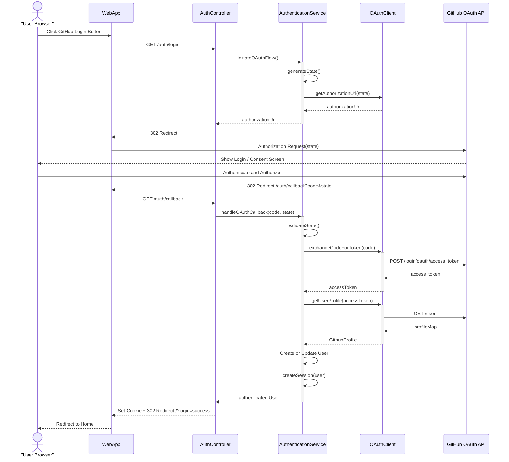
```mermaid
sequenceDiagram
    actor User as "User Browser"
    participant WebApp as WebApp
    participant AuthCtrl as AuthController
    participant AuthSvc as AuthenticationService
    participant OAuthCli as OAuthClient
    participant GitHub as GitHub OAuth API

    User->>WebApp: Click GitHub Login Button
    WebApp->>AuthCtrl: GET /auth/login
    AuthCtrl->>+AuthSvc: initiateOAuthFlow()
    AuthSvc->>AuthSvc: generateState()
    AuthSvc->>OAuthCli: getAuthorizationUrl(state)
    OAuthCli-->>AuthSvc: authorizationUrl
    AuthSvc-->>-AuthCtrl: authorizationUrl
    AuthCtrl-->>WebApp: 302 Redirect

    WebApp->>GitHub: Authorization Request(state)
    GitHub-->>User: Show Login / Consent Screen
    User->>GitHub: Authenticate and Authorize
    GitHub-->>WebApp: 302 Redirect /auth/callback?code&state

    WebApp->>AuthCtrl: GET /auth/callback
    AuthCtrl->>+AuthSvc: handleOAuthCallback(code, state)
    AuthSvc->>AuthSvc: validateState()
    AuthSvc->>+OAuthCli: exchangeCodeForToken(code)
    OAuthCli->>GitHub: POST /login/oauth/access_token
    GitHub-->>OAuthCli: access_token
    OAuthCli-->>-AuthSvc: accessToken
    AuthSvc->>+OAuthCli: getUserProfile(accessToken)
    OAuthCli->>GitHub: GET /user
    GitHub-->>OAuthCli: profileMap
    OAuthCli-->>-AuthSvc: GithubProfile
    AuthSvc->>AuthSvc: Create or Update User
    AuthSvc->>AuthSvc: createSession(user)
    AuthSvc-->>-AuthCtrl: authenticated User
    AuthCtrl-->>WebApp: Set-Cookie + 302 Redirect /?login=success
    WebApp-->>User: Redirect to Home
```

[그림 3-1] SD-01: GitHub OAuth 2.0 로그인 시퀀스

---

### 3.3 SD-02: UC-01 GitHub ID 입력 및 유효성 확인

사용자가 분석 대상 GitHub ID를 입력할 때 WebApp이 먼저 형식 검사를 수행하고, 서버 측에서는 `GithubController`와 `GithubApiClient`를 통해 실제 GitHub 사용자 존재 여부를 확인하는 흐름이다. 이 단계의 성공 결과는 UC-02 분석 요청 생성의 선행 조건으로 사용된다.

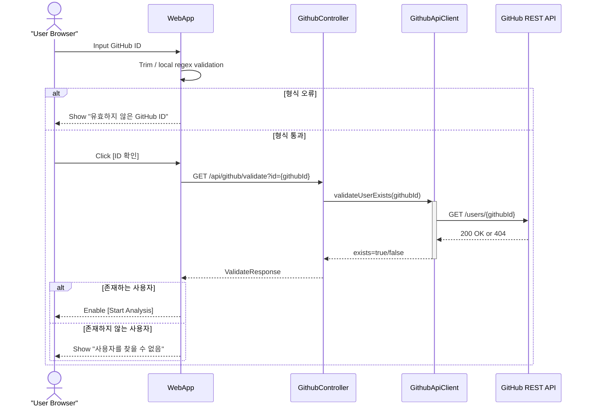
```mermaid
sequenceDiagram
    actor User as "User Browser"
    participant WebApp as WebApp
    participant GithubCtrl as GithubController
    participant GithubClient as GithubApiClient
    participant GitHubAPI as GitHub REST API

    User->>WebApp: Input GitHub ID
    WebApp->>WebApp: Trim / local regex validation

    alt 형식 오류
        WebApp-->>User: Show "유효하지 않은 GitHub ID"
    else 형식 통과
        User->>WebApp: Click [ID 확인]
        WebApp->>GithubCtrl: GET /api/github/validate?id={githubId}
        GithubCtrl->>+GithubClient: validateUserExists(githubId)
        GithubClient->>GitHubAPI: GET /users/{githubId}
        GitHubAPI-->>GithubClient: 200 OK or 404
        GithubClient-->>-GithubCtrl: exists=true/false
        GithubCtrl-->>WebApp: ValidateResponse

        alt 존재하는 사용자
            WebApp-->>User: Enable [Start Analysis]
        else 존재하지 않는 사용자
            WebApp-->>User: Show "사용자를 찾을 수 없음"
        end
    end
```

[그림 3-2] SD-02: GitHub ID 입력 및 유효성 확인 시퀀스

---

### 3.4 SD-03: UC-02 분석 요청 생성

유효한 GitHub ID가 확보된 후 사용자가 [Start Analysis] 버튼을 눌렀을 때 `AnalysisRequest`가 생성되고 저장되며, 비동기 분석 태스크가 등록되는 흐름이다. 인증 세션이 존재하면 `userId`를 요청에 연결하고, 없으면 비로그인 요청으로 생성한다.

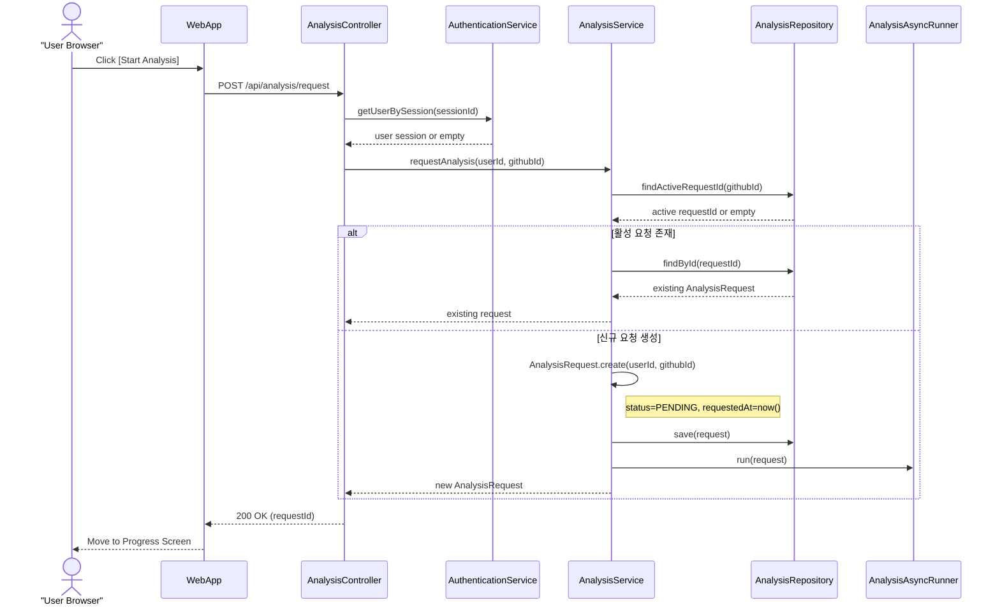
```mermaid
sequenceDiagram
    actor User as "User Browser"
    participant WebApp as WebApp
    participant AnalysisCtrl as AnalysisController
    participant AuthSvc as AuthenticationService
    participant AnalysisSvc as AnalysisService
    participant Repo as AnalysisRepository
    participant AsyncRunner as AnalysisAsyncRunner

    User->>WebApp: Click [Start Analysis]
    WebApp->>AnalysisCtrl: POST /api/analysis/request
    AnalysisCtrl->>AuthSvc: getUserBySession(sessionId)
    AuthSvc-->>AnalysisCtrl: user session or empty

    AnalysisCtrl->>AnalysisSvc: requestAnalysis(userId, githubId)
    AnalysisSvc->>Repo: findActiveRequestId(githubId)
    Repo-->>AnalysisSvc: active requestId or empty

    alt 활성 요청 존재
        AnalysisSvc->>Repo: findById(requestId)
        Repo-->>AnalysisSvc: existing AnalysisRequest
        AnalysisSvc-->>AnalysisCtrl: existing request
    else 신규 요청 생성
        AnalysisSvc->>AnalysisSvc: AnalysisRequest.create(userId, githubId)
        Note right of AnalysisSvc: status=PENDING, requestedAt=now()
        AnalysisSvc->>Repo: save(request)
        AnalysisSvc->>AsyncRunner: run(request)
        AnalysisSvc-->>AnalysisCtrl: new AnalysisRequest
    end

    AnalysisCtrl-->>WebApp: 200 OK (requestId)
    WebApp-->>User: Move to Progress Screen
```

[그림 3-3] SD-03: 분석 요청 생성 시퀀스

---

### 3.5 SD-04: UC-03 GitHub 데이터 수집

`AnalysisAsyncRunner`가 `AnalysisService.executeAnalysis()`를 비동기로 호출한 뒤, `GithubApiClient`가 GitHub REST API로부터 프로필·저장소·이벤트를 수집하여 `ActivityData`를 조립하는 흐름이다. 수집 단계가 끝나면 `AnalysisRequest.step=1` 진행률이 완료 상태로 갱신된다.

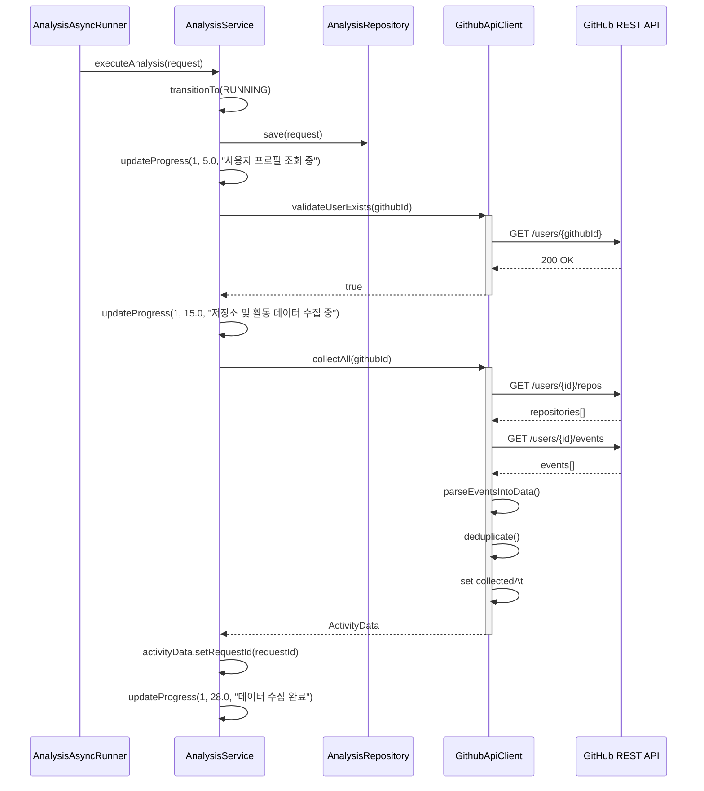
```mermaid
sequenceDiagram
    participant AsyncRunner as AnalysisAsyncRunner
    participant AnalysisSvc as AnalysisService
    participant Repo as AnalysisRepository
    participant GithubClient as GithubApiClient
    participant GitHubAPI as GitHub REST API

    AsyncRunner->>AnalysisSvc: executeAnalysis(request)
    AnalysisSvc->>AnalysisSvc: transitionTo(RUNNING)
    AnalysisSvc->>Repo: save(request)
    AnalysisSvc->>AnalysisSvc: updateProgress(1, 5.0, "사용자 프로필 조회 중")

    AnalysisSvc->>+GithubClient: validateUserExists(githubId)
    GithubClient->>GitHubAPI: GET /users/{githubId}
    GitHubAPI-->>GithubClient: 200 OK
    GithubClient-->>-AnalysisSvc: true

    AnalysisSvc->>AnalysisSvc: updateProgress(1, 15.0, "저장소 및 활동 데이터 수집 중")
    AnalysisSvc->>+GithubClient: collectAll(githubId)
    GithubClient->>GitHubAPI: GET /users/{id}/repos
    GitHubAPI-->>GithubClient: repositories[]
    GithubClient->>GitHubAPI: GET /users/{id}/events
    GitHubAPI-->>GithubClient: events[]
    GithubClient->>GithubClient: parseEventsIntoData()
    GithubClient->>GithubClient: deduplicate()
    GithubClient->>GithubClient: set collectedAt
    GithubClient-->>-AnalysisSvc: ActivityData

    AnalysisSvc->>AnalysisSvc: activityData.setRequestId(requestId)
    AnalysisSvc->>AnalysisSvc: updateProgress(1, 28.0, "데이터 수집 완료")
```

[그림 3-4] SD-04: GitHub 데이터 수집 시퀀스

---

### 3.6 SD-05: UC-04 지표 계산

수집된 `ActivityData`를 바탕으로 `MetricCalculator`가 4개 핵심 지표와 신뢰도 레벨을 계산하고, 계산 결과를 `Metrics`로 저장하는 흐름이다. UC-03의 출력이 UC-04의 직접 입력이 되며, 계산 완료 후 요청 진행률은 step 2 완료 상태로 갱신된다.

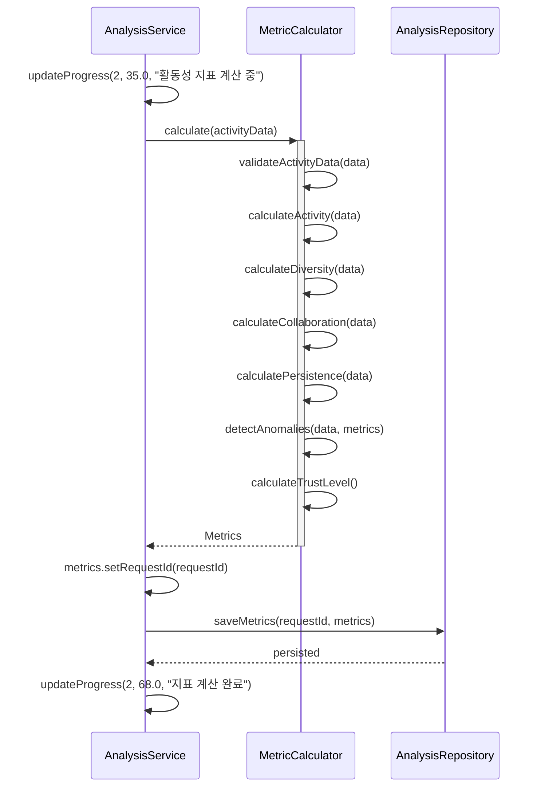
```mermaid
sequenceDiagram
    participant AnalysisSvc as AnalysisService
    participant MetricCalc as MetricCalculator
    participant Repo as AnalysisRepository

    AnalysisSvc->>AnalysisSvc: updateProgress(2, 35.0, "활동성 지표 계산 중")
    AnalysisSvc->>+MetricCalc: calculate(activityData)
    MetricCalc->>MetricCalc: validateActivityData(data)
    MetricCalc->>MetricCalc: calculateActivity(data)
    MetricCalc->>MetricCalc: calculateDiversity(data)
    MetricCalc->>MetricCalc: calculateCollaboration(data)
    MetricCalc->>MetricCalc: calculatePersistence(data)
    MetricCalc->>MetricCalc: detectAnomalies(data, metrics)
    MetricCalc->>MetricCalc: calculateTrustLevel()
    MetricCalc-->>-AnalysisSvc: Metrics

    AnalysisSvc->>AnalysisSvc: metrics.setRequestId(requestId)
    AnalysisSvc->>Repo: saveMetrics(requestId, metrics)
    Repo-->>AnalysisSvc: persisted
    AnalysisSvc->>AnalysisSvc: updateProgress(2, 68.0, "지표 계산 완료")
```

[그림 3-5] SD-05: 지표 계산 시퀀스

---

### 3.7 SD-06: UC-05 점수 및 피드백 생성

`Metrics`가 준비되면 `CompetencyScorer`가 총점을 계산하고 개발자 유형·강점을 식별하며, `FeedbackGenerator`가 약점 기반 개선 항목을 생성한다. 생성된 `AnalysisResult`는 저장소에 영속화되고 `AnalysisRequest`는 COMPLETED로 전이된다.

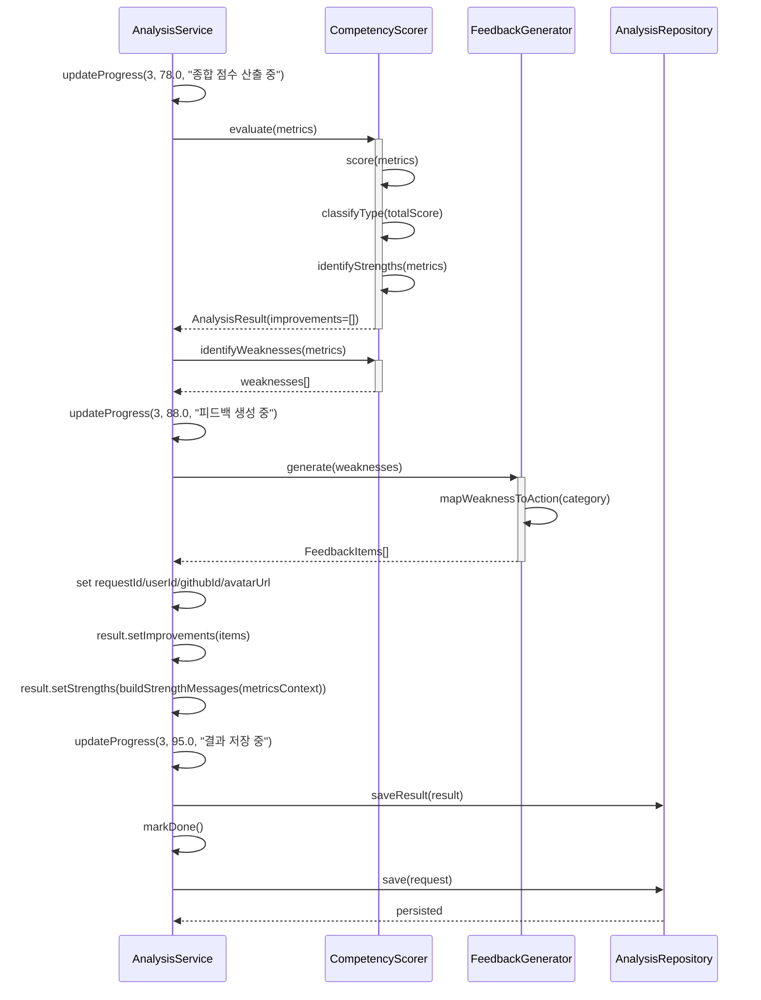
```mermaid
sequenceDiagram
    participant AnalysisSvc as AnalysisService
    participant Scorer as CompetencyScorer
    participant FeedbackGen as FeedbackGenerator
    participant Repo as AnalysisRepository

    AnalysisSvc->>AnalysisSvc: updateProgress(3, 78.0, "종합 점수 산출 중")
    AnalysisSvc->>+Scorer: evaluate(metrics)
    Scorer->>Scorer: score(metrics)
    Scorer->>Scorer: classifyType(totalScore)
    Scorer->>Scorer: identifyStrengths(metrics)
    Scorer-->>-AnalysisSvc: AnalysisResult(improvements=[])

    AnalysisSvc->>+Scorer: identifyWeaknesses(metrics)
    Scorer-->>-AnalysisSvc: weaknesses[]
    AnalysisSvc->>AnalysisSvc: updateProgress(3, 88.0, "피드백 생성 중")

    AnalysisSvc->>+FeedbackGen: generate(weaknesses)
    FeedbackGen->>FeedbackGen: mapWeaknessToAction(category)
    FeedbackGen-->>-AnalysisSvc: FeedbackItems[]

    AnalysisSvc->>AnalysisSvc: set requestId/userId/githubId/avatarUrl
    AnalysisSvc->>AnalysisSvc: result.setImprovements(items)
    AnalysisSvc->>AnalysisSvc: result.setStrengths(buildStrengthMessages(metricsContext))
    AnalysisSvc->>AnalysisSvc: updateProgress(3, 95.0, "결과 저장 중")
    AnalysisSvc->>Repo: saveResult(result)
    AnalysisSvc->>AnalysisSvc: markDone()
    AnalysisSvc->>Repo: save(request)
    Repo-->>AnalysisSvc: persisted
```

[그림 3-6] SD-06: 점수 및 피드백 생성 시퀀스

---

### 3.8 SD-07: UC-06 결과 조회

분석 완료 후 사용자가 결과 화면에 진입하면 `AnalysisController`가 인증 세션과 소유권을 검증한 뒤 최신 `AnalysisResult`와 `Metrics`를 조회하고, `ReportAssembler`가 대시보드 렌더링용 ViewModel로 변환하는 흐름이다. 이 과정에서 trustLevel 경고와 정렬된 피드백 목록이 함께 준비된다.

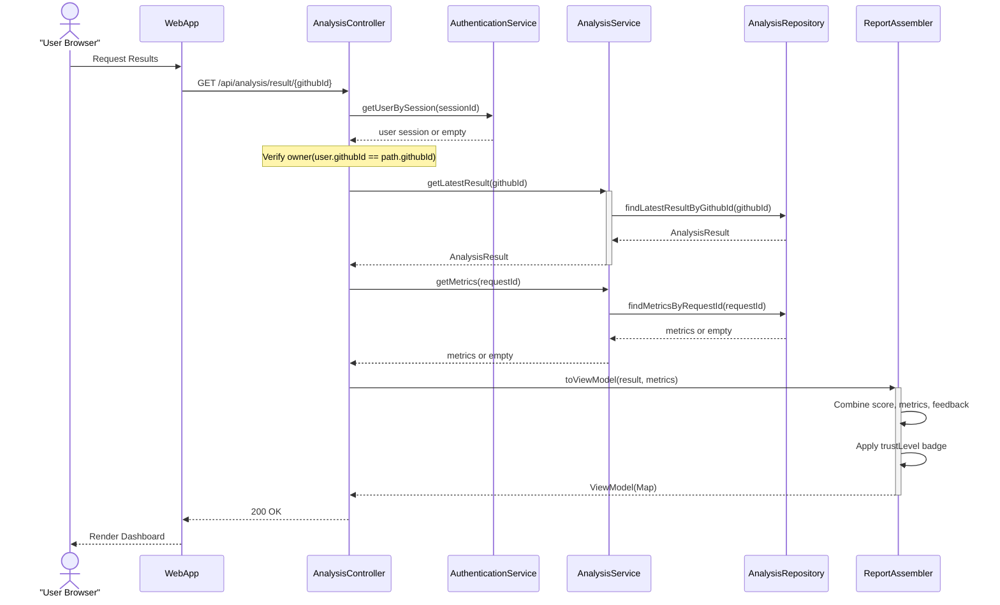
```mermaid
sequenceDiagram
    actor User as "User Browser"
    participant WebApp as WebApp
    participant AnalysisCtrl as AnalysisController
    participant AuthSvc as AuthenticationService
    participant AnalysisSvc as AnalysisService
    participant Repo as AnalysisRepository
    participant Assembler as ReportAssembler

    User->>WebApp: Request Results
    WebApp->>AnalysisCtrl: GET /api/analysis/result/{githubId}
    AnalysisCtrl->>AuthSvc: getUserBySession(sessionId)
    AuthSvc-->>AnalysisCtrl: user session or empty
    Note over AnalysisCtrl: Verify owner(user.githubId == path.githubId)

    AnalysisCtrl->>+AnalysisSvc: getLatestResult(githubId)
    AnalysisSvc->>Repo: findLatestResultByGithubId(githubId)
    Repo-->>AnalysisSvc: AnalysisResult
    AnalysisSvc-->>-AnalysisCtrl: AnalysisResult

    AnalysisCtrl->>AnalysisSvc: getMetrics(requestId)
    AnalysisSvc->>Repo: findMetricsByRequestId(requestId)
    Repo-->>AnalysisSvc: metrics or empty
    AnalysisSvc-->>AnalysisCtrl: metrics or empty

    AnalysisCtrl->>+Assembler: toViewModel(result, metrics)
    Assembler->>Assembler: Combine score, metrics, feedback
    Assembler->>Assembler: Apply trustLevel badge
    Assembler-->>-AnalysisCtrl: ViewModel(Map)

    AnalysisCtrl-->>WebApp: 200 OK
    WebApp-->>User: Render Dashboard
```

[그림 3-7] SD-07: 결과 조회 시퀀스

---

### 3.9 SD-08: UC-07 리포트 다운로드

결과 조회 이후 사용자가 [리포트 다운로드]를 선택하면 서버가 최신 결과와 지표를 재조회한 뒤 `ReportGenerator`로 PDF 바이트 배열을 생성하고, 첨부 파일 헤더와 함께 응답하는 흐름이다. 본 설계는 OpenPDF 기반 서버 사이드 렌더링을 전제로 한다.

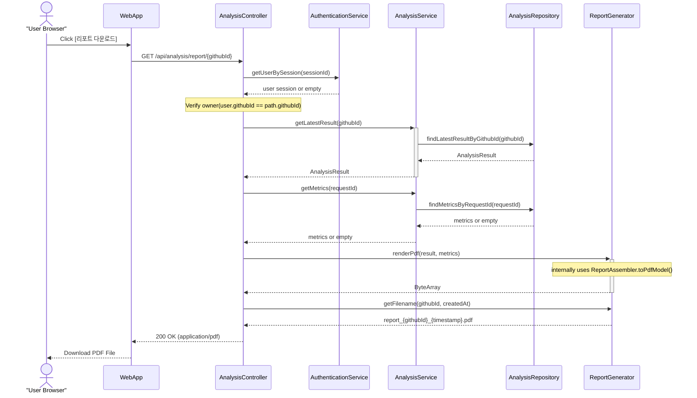
```mermaid
sequenceDiagram
    actor User as "User Browser"
    participant WebApp as WebApp
    participant AnalysisCtrl as AnalysisController
    participant AuthSvc as AuthenticationService
    participant AnalysisSvc as AnalysisService
    participant Repo as AnalysisRepository
    participant Generator as ReportGenerator

    User->>WebApp: Click [리포트 다운로드]
    WebApp->>AnalysisCtrl: GET /api/analysis/report/{githubId}
    AnalysisCtrl->>AuthSvc: getUserBySession(sessionId)
    AuthSvc-->>AnalysisCtrl: user session or empty
    Note over AnalysisCtrl: Verify owner(user.githubId == path.githubId)

    AnalysisCtrl->>+AnalysisSvc: getLatestResult(githubId)
    AnalysisSvc->>Repo: findLatestResultByGithubId(githubId)
    Repo-->>AnalysisSvc: AnalysisResult
    AnalysisSvc-->>-AnalysisCtrl: AnalysisResult

    AnalysisCtrl->>AnalysisSvc: getMetrics(requestId)
    AnalysisSvc->>Repo: findMetricsByRequestId(requestId)
    Repo-->>AnalysisSvc: metrics or empty
    AnalysisSvc-->>AnalysisCtrl: metrics or empty

    AnalysisCtrl->>+Generator: renderPdf(result, metrics)
    Note over Generator: internally uses ReportAssembler.toPdfModel()
    Generator-->>-AnalysisCtrl: ByteArray
    AnalysisCtrl->>Generator: getFilename(githubId, createdAt)
    Generator-->>AnalysisCtrl: report_{githubId}_{timestamp}.pdf

    AnalysisCtrl-->>WebApp: 200 OK (application/pdf)
    WebApp-->>User: Download PDF File
```

[그림 3-8] SD-08: 리포트 다운로드 시퀀스

---

### 3.10 SD-09: UC-08 분석 이력 비교

사용자가 동일 GitHub ID의 과거 분석 결과를 비교하려고 할 때 이력 목록을 조회하고, WebApp이 시점별 결과를 선택하여 비교 화면을 구성하는 흐름이다. 현재 구현 기준으로 서버는 이력 목록과 각 항목의 ViewModel을 반환하고, 비교용 시각화는 클라이언트가 이를 바탕으로 구성한다.

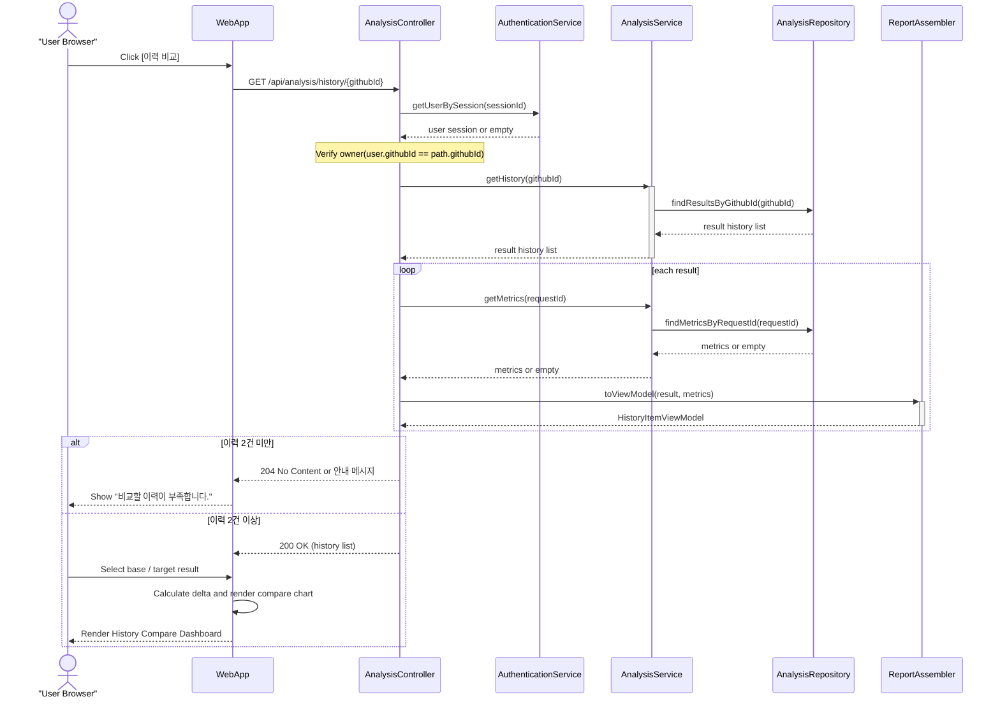
```mermaid
sequenceDiagram
    actor User as "User Browser"
    participant WebApp as WebApp
    participant AnalysisCtrl as AnalysisController
    participant AuthSvc as AuthenticationService
    participant AnalysisSvc as AnalysisService
    participant Repo as AnalysisRepository
    participant Assembler as ReportAssembler

    User->>WebApp: Click [이력 비교]
    WebApp->>AnalysisCtrl: GET /api/analysis/history/{githubId}
    AnalysisCtrl->>AuthSvc: getUserBySession(sessionId)
    AuthSvc-->>AnalysisCtrl: user session or empty
    Note over AnalysisCtrl: Verify owner(user.githubId == path.githubId)

    AnalysisCtrl->>+AnalysisSvc: getHistory(githubId)
    AnalysisSvc->>Repo: findResultsByGithubId(githubId)
    Repo-->>AnalysisSvc: result history list
    AnalysisSvc-->>-AnalysisCtrl: result history list

    loop each result
        AnalysisCtrl->>AnalysisSvc: getMetrics(requestId)
        AnalysisSvc->>Repo: findMetricsByRequestId(requestId)
        Repo-->>AnalysisSvc: metrics or empty
        AnalysisSvc-->>AnalysisCtrl: metrics or empty
        AnalysisCtrl->>+Assembler: toViewModel(result, metrics)
        Assembler-->>-AnalysisCtrl: HistoryItemViewModel
    end

    alt 이력 2건 미만
        AnalysisCtrl-->>WebApp: 204 No Content or 안내 메시지
        WebApp-->>User: Show "비교할 이력이 부족합니다."
    else 이력 2건 이상
        AnalysisCtrl-->>WebApp: 200 OK (history list)
        User->>WebApp: Select base / target result
        WebApp->>WebApp: Calculate delta and render compare chart
        WebApp-->>User: Render History Compare Dashboard
    end
```

[그림 3-9] SD-09: 분석 이력 비교 시퀀스

---

## 4. State Machine Diagram

### 4.1 개요

본 장에서는 AnalysisRequest의 생명주기를 상태 머신 다이어그램으로 명세한다. 각 상태는 [2.6.1 AnalysisRequest](#analysisrequest)에서 정의한 RequestStatus 열거형 값에 대응하며, 상태 전이는 AnalysisService의 오퍼레이션(executeAnalysis, retryFailedAnalysis, cancel)에서 구현된다.

---

### 4.2 AnalysisRequest 상태 머신 다이어그램

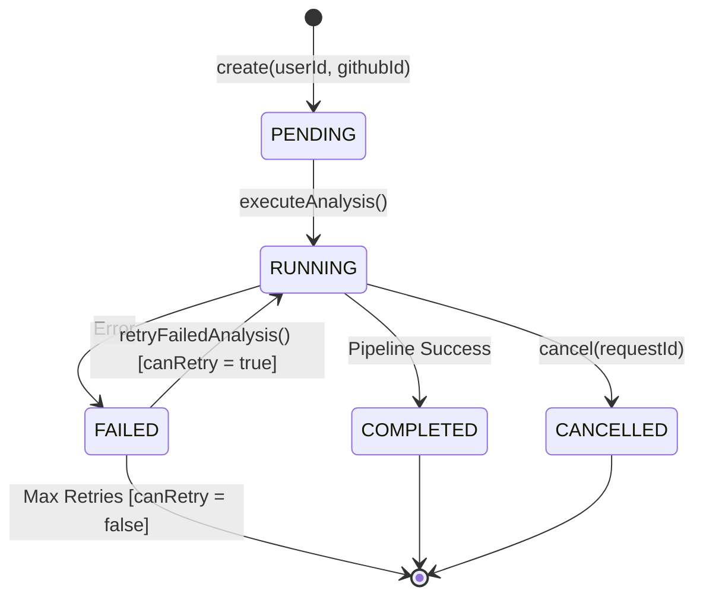
```mermaid
stateDiagram-v2
    [*] --> PENDING: create(userId, githubId)

    PENDING --> RUNNING: executeAnalysis()

    RUNNING --> COMPLETED: Pipeline Success
    RUNNING --> FAILED: Error
    RUNNING --> CANCELLED: cancel(requestId)

    FAILED --> RUNNING: retryFailedAnalysis() [canRetry = true]
    FAILED --> [*]: Max Retries [canRetry = false]

    COMPLETED --> [*]
    CANCELLED --> [*]
```

[그림 4-1] AnalysisRequest 상태 머신 다이어그램

---

### 4.3 상태 설명

[표 4-1] 상태 설명

| 상태 | RequestStatus | 설명 | 진입 조건 | 종료 조건 |
| :--- | :--- | :--- | :--- | :--- |
| 초기 | — | 객체 미생성 상태 | — | create() 호출 |
| 대기 | PENDING | 분석 요청 생성 완료, 큐 대기 중 | create() 성공, DB 저장 완료 | executeAnalysis() 호출 |
| 실행 중 | RUNNING | 데이터 수집·지표 계산·점수 생성 진행 중 | executeAnalysis() 시작 | 성공(COMPLETED) 또는 오류(FAILED) |
| 완료 | COMPLETED | 분석 파이프라인 전 단계 정상 완료, 신뢰도 HIGH | 모든 단계 성공 | 최종 상태 |
| 부분 완료 | PARTIAL | 열거형에 정의된 확장용 상태(현재 기본 파이프라인에서는 미사용) | 향후 부분 성공 경로 추가 시 | 최종 상태 |
| 취소 | CANCELLED | 사용자가 진행 중 분석을 취소한 상태 | cancel(requestId) 및 소유권 검증 성공 | 최종 상태 |
| 실패 | FAILED | 치명적 오류로 분석 불가 (retryCount < 3이면 재시도 가능) | GitHub API 오류, 타임아웃, 검증 실패 | retryFailedAnalysis() 또는 최종 실패 |
| 최종 실패 | FAILED | 재시도 횟수 초과, 더 이상 재시도 불가 | canRetry() = false (retryCount ≥ 3) | 최종 상태 |

---

### 4.4 상태 전이 규칙

[표 4-2] 상태 전이 규칙

| From | To | 트리거 | 가드 조건 | 수행 동작 |
| :--- | :--- | :--- | :--- | :--- |
| [초기] | PENDING | create(userId, githubId) | GithubProfile.validated = true | requestId 발급, requestedAt 기록, DB 저장 |
| PENDING | RUNNING | executeAnalysis() 비동기 실행 시작 | 동일 userId의 RUNNING 요청 없음 (BR-03) | status = RUNNING 갱신 |
| RUNNING | COMPLETED | 파이프라인 전 단계 성공 | AnalysisResult 저장 완료 | completedAt 기록, status = COMPLETED |
| RUNNING | CANCELLED | cancel(requestId) | 요청 소유자 또는 동일 GitHub ID 사용자 | errorMessage 기록, completedAt 기록, status = CANCELLED |
| RUNNING | FAILED | 오류 발생 | GitHub API 오류 / 타임아웃 / 검증 실패 | errorMessage 기록, completedAt 기록, status = FAILED |
| FAILED | RUNNING | retryFailedAnalysis() | canRetry() = true (retryCount < 3) | incrementRetry(), status = RUNNING |
| FAILED | [최종] | — | canRetry() = false (retryCount ≥ 3) | 최종 실패 확정, 더 이상 재시도 없음 |
| COMPLETED | [최종] | 결과 저장 완료 | — | — |
| PARTIAL | [최종] | 결과 저장 완료 | — | — |
| CANCELLED | [최종] | 사용자 취소 완료 | — | — |

**전이 제약 사항:**
- 역방향 전이 불가: COMPLETED/PARTIAL/CANCELLED → 이전 상태로의 전이 없음
- 동일 githubId의 PENDING 또는 RUNNING 상태 요청이 이미 존재하는 경우 신규 PENDING 생성 불가 (BR-03)
- PARTIAL 상태는 열거형에 정의되어 있으나 현재 executeAnalysis 기본 경로에서는 사용하지 않는다(향후 확장 reserved).

---

## 5. Implementation requirements

### 5.1 실행 환경 및 기술 스택

| 항목 | 요구사항 |
| :--- | :--- |
| OS | Ubuntu 22.04+ 또는 WSL2 (Ubuntu) |
| Java | 17 이상 (LTS) |
| Build Tool | Maven 3.8 이상 |
| Framework | Spring Boot 3.x |
| Database (개발) | H2 (임베디드, file:./data/insight) |
| Database (운영) | PostgreSQL 12 이상 |
| 정적 파일 서빙 | Spring Boot 내장 Tomcat (`file:web/` 경로) |
| 패키지 관리 | Maven Central (네트워크 접근 필요) |

상세 보안 요구사항, 비기능 요구사항, 데이터베이스 구성, 환경 변수, 구현 API, 운영 보정 사항, 실행 검증 결과는 별도 구현 산출물인 [[Implementation]22212046_안효원.md]([Implementation]22212046_안효원.md)에서 관리한다.

---

## 6. Glossary

[표 6-1] 설계 단계 용어집

| 용어 | 정의 |
| :--- | :--- |
| AnalysisRequest | 분석 요청의 생명주기를 추적하는 엔티티. PENDING → RUNNING → COMPLETED/FAILED 상태 전이 관리. |
| ActivityData | GitHub API에서 수집한 원천 활동 데이터를 통합 보관하는 구조. 지표 계산의 입력. |
| Metrics | ActivityData로부터 산출된 4개 핵심 지표(활동성/다양성/협업도/지속성)를 0–100 척도로 표현. |
| AnalysisResult | 분석의 최종 산출물. 종합 점수, 개발자 유형, 강점/약점, 피드백 목록 포함. |
| TrustLevel | 분석 결과 신뢰도. HIGH / PARTIAL / LOW / LIMITED 중 하나. |
| DeveloperType | 점수 기반 개발자 분류. BEGINNER(0–39) / JUNIOR(40–69) / ADVANCED(70–100). |
| RequestStatus | AnalysisRequest의 상태. PENDING / RUNNING / COMPLETED / PARTIAL / CANCELLED / FAILED. |
| Request ID | AnalysisRequest를 식별하는 고유 ID. 진행률 조회, requestId 기준 결과 조회, requestId 기준 PDF 다운로드, 분석 취소에 사용한다. |
| User (인증된 사용자) | GitHub OAuth 2.0으로 인증된 사용자. userId, githubId, sessionId 등 관리. |
| OAuthClient | GitHub OAuth 2.0 API 호출 캡슐화 클래스. Authorization Code + state 검증 플로우 구현. |
| AuthenticationService | 사용자 인증 및 세션 관리 오케스트레이션 클래스. OAuth state 단일 사용, 10분 만료, pending state 500개 제한을 적용한다. |
| GithubApiClient | GitHub REST API 호출을 캡슐화. Rate Limit 및 재시도 로직 내장. |
| MetricCalculator | ActivityData로부터 4개 지표를 산출하는 계산 클래스. |
| CompetencyScorer | Metrics를 종합 점수로 변환 및 Developer Type 분류. |
| FeedbackGenerator | 약점 목록으로부터 맞춤형 FeedbackItem 생성. |
| ReportAssembler | AnalysisResult를 UI/리포트(PDF) 렌더링용 모델(Map)로 변환. |
| ReportGenerator | 리포트 모델을 OpenPDF로 A4 PDF 바이트로 렌더링하고 다운로드 파일명을 생성. |
| AnalysisService | 분석 파이프라인 전체 오케스트레이션. |
| AnalysisRepository | AnalysisRequest와 AnalysisResult 영속화 및 조회, 최근 이력 제한, 만료 데이터 정기 정리를 담당. |
| Cancelled Request | 사용자가 진행 중 분석을 취소하여 RequestStatus.CANCELLED로 종료된 요청. |
| Retention Cleanup | 오래된 요청, 결과, 지표를 스케줄러로 정리하여 저장소 크기와 조회 성능을 관리하는 운영 정책. |

---

## 7. References

1. GitHub, "REST API Documentation," GitHub Docs. Available: <https://docs.github.com/en/rest> (accessed: 2026-05-11).
2. GitHub, "GraphQL API Documentation," GitHub Docs. Available: <https://docs.github.com/en/graphql> (accessed: 2026-05-11).
3. E. Kalliamvakou et al., "The Promises and Perils of Mining GitHub Data," Empirical Software Engineering, Springer.
4. C. Bird et al., "The Promises and Perils of Mining GitHub," Proceedings of the International Working Conference on Mining Software Repositories (MSR).
5. OpenSSF, "Open Source Project Security Baseline." Available: <https://baseline.openssf.org> (accessed: 2026-05-11).
6. M. Fowler, "UML Distilled: A Brief Guide to the Standard Object Modeling Language," 3rd ed., Addison-Wesley, 2004.
7. VMware (Pivotal), "Spring Boot Reference Documentation." Available: <https://docs.spring.io/spring-boot/docs/current/reference/html/> (accessed: 2026-05-11).
8. D. Hardt (Ed.), "The OAuth 2.0 Authorization Framework," RFC 6749, IETF, 2012. Available: <https://tools.ietf.org/html/rfc6749>.
9. N. Sakimura et al., "Proof Key for Code Exchange by OAuth Public Clients," RFC 7636, IETF, 2015. Available: <https://tools.ietf.org/html/rfc7636>.
