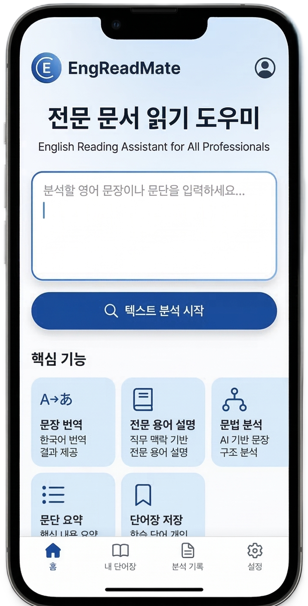
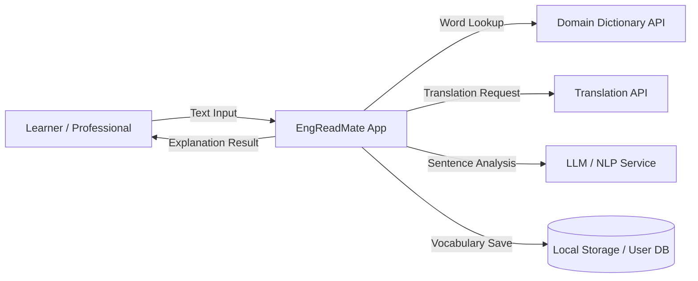

# EngReadMate

영어로 학습하는 모든 직종을 위한 전문 문서 읽기 도우미 앱

## 제출 정보

| 항목 | 내용 |
| :--- | :--- |
| Student No. | 22212046 |
| Name | 안효원 |
| E-mail | gydnjs3505@gmail.com |

---

## Revision History

| Revision Date | Version # | Description | Author |
| :--- | :--- | :--- | :--- |
| 03/13/2026 | 0.01 | Initial draft | 안효원 |
| 03/13/2026 | 0.10 | Architecture and MVP added | 안효원 |
| 03/15/2026 | 0.20 | Full conceptualization document | 안효원 |

---

## Contents

1. Business Purpose
2. System Context Diagram
3. Use Case List
4. Concept of Operation
5. Problem Statement
6. Glossary
7. References

---

## 1. Business Purpose

### Project Background

공학, 의학, 경영, 법학 등 다양한 분야의 전문 문서는 영어로 제공되는 비중이 높다. W3Techs 최신 집계에 따르면 콘텐츠 언어가 확인되는 웹사이트 중 영어 사용 비율은 49.5%로 가장 높다. 전공자와 실무자는 직무 지식 습득을 위해 영어 원문 자료를 직접 읽어야 하는 상황이 많지만, 긴 문장 구조 분석, 반복적인 단어 검색, 문단 전체 의미 파악에서 어려움을 경험한다. 따라서 영어 전문 문서를 읽을 때 직무 맥락에 맞는 설명을 제공하는 앱 도구가 필요하다.

### Motivation

영어 원문 학습은 직무 역량 강화에 필수적이지만, 언어 장벽으로 인해 학습 효율이 저하된다. EF EPI 2025 기준 한국의 영어 숙련도는 123개 국가/지역 중 48위(점수 522, Moderate)로, 영어 기반 전문 문서를 빠르게 소화하기에는 여전히 학습 보조가 필요한 환경임을 보여준다. 단순 번역 도구는 분야별 문맥을 충분히 반영하지 못해 전문 용어를 부정확하게 처리하는 경우가 많다. 이 프로젝트는 특정 직군이 아닌, 영어 기반 학습이 필요한 다양한 직종을 지원하기 위한 읽기 보조 앱의 필요성에서 시작되었다.

### Goal

영어 전문 문서를 쉽게 이해할 수 있도록 지원하고, 직무 맥락 기반 단어 설명 및 문장 분석 기능을 제공하며, 다양한 직종 학습자의 영어 원문 학습 효율을 향상시키는 앱 기반 도우미를 개발한다.

### Target Market

- 영어 전문 문서를 읽는 대학(원)생 및 연구자
- 영어 기반 업무 자료를 다루는 실무자(개발, 기획, 마케팅, 재무, 의료, 법무 등)
- 영어 원문 학습이 필요한 자격증 및 직무 전환 준비 학습자

---

## 2. System Context Diagram

시스템은 사용자와 여러 외부 서비스 사이에서 텍스트 분석을 수행하는 앱 시스템 역할을 한다.

| 구성 요소 | 설명 |
| :--- | :--- |
| Learner / Professional | 시스템의 주 사용자. 영어 전문 문서를 읽는 학습자 및 실무자 |
| EngReadMate App | 텍스트 입력을 받아 분석 결과를 제공하는 핵심 앱 |
| Domain Dictionary API | 분야별 전문 용어의 정의 및 설명을 제공하는 외부 사전 API |
| Translation API | 영어 문장을 한국어로 번역하는 외부 번역 서비스 |
| LLM / NLP Service | 문장 구조 분석 및 의미 설명을 수행하는 AI 언어 모델 서비스 |
| Local Storage / User DB | 저장 단어 및 사용자 학습 데이터를 저장하는 저장소 |

---

## 3. Use Case List

### 1) Input Text

| 항목 | 내용 |
| :--- | :--- |
| Actor | User |
| Description | 사용자가 분석할 영어 문장 또는 문단을 앱에 입력한다. |

### 2) Word Meaning

| 항목 | 내용 |
| :--- | :--- |
| Actor | User |
| Description | 사용자가 특정 단어를 선택하면 분야별 사전 API를 통해 의미를 조회한다. |

### 3) Sentence Translation

| 항목 | 내용 |
| :--- | :--- |
| Actor | User |
| Description | 사용자가 문장 번역을 요청하면 번역 API를 통해 한국어 번역 결과를 제공한다. |

### 4) Sentence Analysis

| 항목 | 내용 |
| :--- | :--- |
| Actor | User |
| Description | 사용자가 문장 구조 분석을 요청하면 AI 모델이 문장 성분 및 의미를 설명한다. |

### 5) Paragraph Summary

| 항목 | 내용 |
| :--- | :--- |
| Actor | User |
| Description | 사용자가 문단 요약을 요청하면 AI 모델이 핵심 내용을 요약하여 제공한다. |

### 6) Vocabulary Save

| 항목 | 내용 |
| :--- | :--- |
| Actor | User |
| Description | 사용자가 학습한 단어를 개인 단어장에 저장하여 나중에 복습할 수 있다. |

---

## 4. Concept of Operation

### 1) Input Text

| 항목 | 내용 |
| :--- | :--- |
| Purpose | 분석할 영어 문장 또는 문단을 앱에 입력한다. |
| Approach | 사용자가 앱 인터페이스의 텍스트 입력창에 영어 문장을 붙여넣거나 직접 입력한 후 분석 요청 버튼을 클릭한다. App Core Module은 입력 텍스트를 수신하여 Text Processing Module로 전달한다. |
| Dynamics | 사용자가 텍스트 입력 후 분석 요청 시 |
| Goals | 텍스트 입력 및 내부 처리 모듈 전달 기능 구현 |

### 2) Word Explanation

| 항목 | 내용 |
| :--- | :--- |
| Purpose | 전문 용어의 정확한 의미를 직무 맥락에서 제공한다. |
| Approach | 사용자가 텍스트 내 특정 단어를 클릭하면 앱이 Domain Dictionary API에 해당 단어를 조회하여 분야별 정의와 예시를 반환한다. |
| Dynamics | 사용자가 단어를 클릭하는 시점 |
| Goals | 전문 용어에 대한 즉각적인 설명 제공 기능 구현 |

### 3) Sentence Translation

| 항목 | 내용 |
| :--- | :--- |
| Purpose | 영어 문장을 한국어로 번역하여 이해를 돕는다. |
| Approach | 사용자가 번역 버튼을 클릭하면 선택된 문장이 Translation API로 전달되고, 번역 결과가 앱 결과 화면에 표시된다. |
| Dynamics | 사용자가 번역 버튼을 클릭하는 시점 |
| Goals | 번역 API 연동 및 결과 표시 기능 구현 |

### 4) Sentence Analysis

| 항목 | 내용 |
| :--- | :--- |
| Purpose | 영어 문장의 구조를 분석하여 이해를 지원한다. |
| Approach | 사용자가 문장 분석을 요청하면 AI Analysis Module이 LLM을 통해 문장 성분(주어, 동사, 목적어 등)과 문법 구조를 설명한 결과를 반환한다. |
| Dynamics | 사용자가 문장 분석 버튼을 클릭하는 시점 |
| Goals | AI 기반 문장 구조 분석 및 설명 기능 구현 |

### 5) Paragraph Summary

| 항목 | 내용 |
| :--- | :--- |
| Purpose | 긴 문단의 핵심 내용을 요약하여 빠른 이해를 돕는다. |
| Approach | 사용자가 문단 요약을 요청하면 AI Analysis Module이 문단 전체를 LLM에 전달하여 3~5줄 내외의 요약문을 생성하고 반환한다. |
| Dynamics | 사용자가 요약 버튼을 클릭하는 시점 |
| Goals | 문단 요약 기능 구현 |

### 6) Vocabulary Save

| 항목 | 내용 |
| :--- | :--- |
| Purpose | 학습한 단어를 저장하여 복습할 수 있도록 한다. |
| Approach | 사용자가 단어 설명 결과 화면에서 저장 버튼을 클릭하면 해당 단어와 정의가 로컬 저장소 또는 사용자 DB에 저장되고, 개인 단어장에서 목록으로 확인할 수 있다. |
| Dynamics | 사용자가 단어 저장 버튼을 클릭하는 시점 |
| Goals | 단어 저장 및 단어장 조회 기능 구현 |

---

## 5. Problem Statement

### 시스템 구조

본 시스템은 앱 클라이언트, 앱 서비스 계층, 외부 AI/사전/번역 서비스를 연동하는 구조로 설계한다. 내부적으로는 입력 텍스트를 처리하는 모듈과 AI 분석 모듈을 분리하여 기능 확장성과 유지보수성을 확보한다.

### 기술적 과제 및 제약 사항

1. 전문 용어 번역 정확도 문제: 일반 번역 API는 분야별 전문 용어를 부정확하게 번역할 가능성이 있어 직무 문맥 기반 보정 로직이 필요하다.
2. 긴 문장 구조 분석의 복잡성: 전문 문서는 복합 종속절, 수동태, 축약 표현이 많아 일반적인 NLP 분석보다 높은 난이도를 요구한다.
3. 외부 API 의존성: Translation API, Dictionary API, LLM API 등 여러 외부 서비스에 의존하므로 서비스 장애 시 대체 처리 방안이 필요하다.
4. 응답 속도 문제: LLM 기반 분석은 응답 시간이 길어질 수 있으며 사용자 경험을 위해 적절한 로딩 처리 및 최적화가 필요하다.
5. API 비용 문제: OpenAI 등 LLM API는 호출량에 따라 비용이 발생하므로 효율적인 API 호출 전략이 필요하다.
6. 보안 및 접근 제어: 사용자 단어장 데이터는 인증된 사용자만 접근 가능해야 하며 개인정보 및 학습 데이터 보호가 필요하다.
7. 운영 확장성: 초기에는 단어/문장 중심 분석을 제공하고 이후 PDF 업로드 및 개인화 학습 기능까지 확장 가능한 모듈형 구조가 요구된다.

---

## 6. Glossary

| Term | Description |
| :--- | :--- |
| NLP | Natural Language Processing. 자연어 처리 기술로 컴퓨터가 인간의 언어를 이해하고 분석하는 AI 기술 |
| LLM | Large Language Model. GPT 등 대규모 텍스트 데이터로 학습된 대형 언어 모델 |
| Technical Document | 공학, 의학, 경영, 법학 등 분야별 전문 영어 문서(교재, 가이드, 논문, 보고서 등) |
| API | Application Programming Interface. 외부 서비스와 데이터를 주고받기 위한 인터페이스 |
| Sentence Parsing | 문장을 주어, 동사, 목적어 등의 문법 성분으로 분해하여 구조를 분석하는 작업 |
| Vocabulary | 사용자가 저장한 학습 단어 목록 |
| MVP | Minimum Viable Product. 핵심 기능만 포함한 최소 실행 가능 제품 |
| App Architecture | 프레젠테이션(App UI), 비즈니스 로직(App Service), 데이터(Storage) 계층으로 분리된 구조 |

---

## 7. References

1. Jurafsky, D. and Martin, J. H., Speech and Language Processing (3rd ed. draft), Stanford University
2. Kleppmann, M., Designing Data-Intensive Applications, O'Reilly Media, 2017
3. OpenAI, OpenAI API Documentation, https://platform.openai.com/docs
4. Google, Cloud Translation API Documentation, https://cloud.google.com/translate/docs
5. DeepL, DeepL API Documentation, https://www.deepl.com/docs-api
6. Free Dictionary API, https://dictionaryapi.dev
7. W3Techs, Usage statistics of content languages for websites, https://w3techs.com/technologies/overview/content_language
8. EF English Proficiency Index 2025, Global Ranking of Countries and Regions, https://www.ef.com/wwen/epi/
